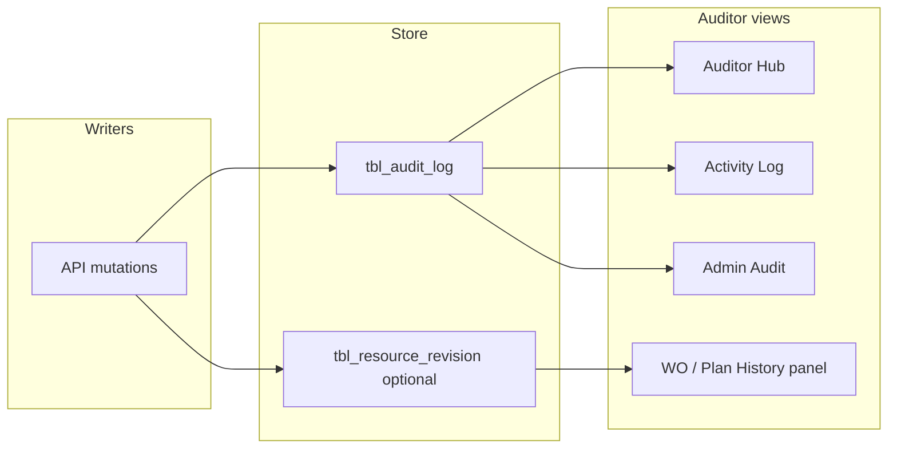

# Auditor-friendly view & Revision history — แผน Phase 7

อ้างอิง: [MEETING-MINUTES.md](MEETING-MINUTES.md) วาระที่ 4 (Audit Readiness) · [WORK-PHASES.md](../WORK-PHASES.md) Phase 7 · [14-administrator.md](../parity-pending/14-administrator.md) §4.7

---

## 1) เป้าหมาย (ลูกค้า / Auditor)

| ความต้องการ | ความหมายสำหรับ Pepsi PM |
|-------------|-------------------------|
| **Auditor Dashboard** | มองภาพรวม “ใครทำอะไร เมื่อไหร่ กับงาน/Line ไหน” โดยไม่ต้องเป็น DBA |
| **Activity log** | คน · งาน · ทรัพยากร · Line · เวลา (ครั้งที่ 2 §Logging) |
| **Maintenance Plan Revision History** | ย้อนดูการเปลี่ยนแผน/มอบหมายช่าง/ย้ายวันใน Calendar — SAP ไม่เก็บ comment/log ครบ |
| **Task commenting** | ความคิดเห็นบน WO/Confirm แทน log ใน SAP (ชดเชย) — **แผนนี้ไม่รวม comment DB ใหม่** (แยก scope) |

---

## 2) สิ่งที่มีแล้วใน PM-Pepsi-App

### 2.1 ชั้นข้อมูล

| ชั้น | ตาราง/API | หมายเหตุ |
|------|-----------|----------|
| Audit trail | `app.tbl_audit_log` | `before_json` / `after_json` · migration `050` |
| Login legacy | `app.tbworkcenter_userlog` | in/out เทียบ PHP |
| แผนมอบหมาย | `app.tbplangingwork` | **ไม่มี** revision table — แค่สถานะปัจจุบัน |
| IW37N / Confirm | `tbiw37n`, `tbcofirm`, views | ไม่มี row-level history แยก |

### 2.2 UI / API ที่ใช้ audit แล้ว

| หน้า | Route | Permission | สถานะ |
|------|-------|------------|--------|
| Audit (Admin) | `/admin/audit` | `admin.audit.read` | กรอง วันที่/actor/action/resource · diff · export CSV · cleanup |
| **Auditor Hub** (Phase A) | `/reports/audit` | **`reports.read`** (Planner รวม) | KPI 7 วัน · PM/WO เดือนนี้ · Utilization · Order Frame · Revision 7 วัน |
| Activity log (รายงาน) | `/activity-log` | `reports.read` | รวม audit + userlog · คน/Line/WO/เวลา |
| Security | `/admin/security` | `admin.security.read` | failed login · RBAC denied |
| Week-to-Week | `/reports` | reports | KPI ไม่ใช่ audit โดยตรง |

### 2.3 Action ที่บันทึก audit แล้ว (ตัวอย่าง)

- **Auth:** login/logout/deny (middleware)
- **IW37N:** import/write/delete
- **Integration:** `integration.iw37n.in`, `integration.confirm.in`
- **Confirmation:** import, close, mass_close, QC
- **Work orders:** team batch, หลาย mutation ใน `work-orders.ts`
- **Planning:** `planning.assign`
- **Scheduling:** มี `voidAudit` บางจุด (ตรวจครบ route ใน Phase A)
- **Manhours:** write/delete/import
- **Master data:** middleware `audit-master-data.ts` (create/update/delete/import)
- **Admin:** users, roles, menu, branding, settings, backup, announcements

### 2.4 ช่องว่างหลัก (Gap)

1. **ไม่มี “Auditor Dashboard” รวมศูนย์** — ผู้ audit ต้องสลับ `/activity-log` กับ `/admin/audit`
2. **Revision history แผนงาน** — ย้ายช่าง/เปลี่ยนวันใน Calendar ไม่ได้เก็บเป็น timeline ต่อ WO
3. **Coverage ไม่ครบ 100%** — calendar DnD, backlog patch, บาง confirm path อาจยังไม่ `voidAudit`
4. **before/after ไม่เป็นมาตรฐาน** — ฟิลด์ JSON ต่างกันต่อ action → ยากต่อการ export แบบคอลัมน์คงที่
5. **Retention / ลบ log** — มี cleanup ใน Admin; ต้องกำหนดนโยบายกับลูกค้า (365 วัน ใน spec 14-admin)

---

## 3) แนวทางสถาปัตยกรรม



**หลักการ**

- **ชั้นที่ 1 (ทำก่อน):** ใช้ `tbl_audit_log` เป็นหลัก — ไม่สร้างตารางใหม่
- **ชั้นที่ 2 (revision):** เพิ่ม `tbl_resource_revision` เฉพาะ domain ที่ต้อง timeline ชัด (แผน + calendar)
- **ชั้นที่ 3 (comment):** ตาราง comment แยก — นอกแผนนี้ unless ลูกค้ายืนยัน

---

## 4) แผนงานแบ่งเฟส

### Phase A — Auditor Hub (P2, ~3–5 วัน) — **แนะนำทำก่อน go-live audit**

| # | งาน | รายละเอียด |
|---|-----|------------|
| A1 | หน้า **`/reports/audit`** หรือ **`/audit`** | KPI การ์ด: imports 7 วัน, mass confirm, denied RBAC, top actors |
| A2 | ลิงก์เดียว | จาก Hub → Activity log · Admin audit · Security · WO ที่ filter จาก `resource_id` |
| A3 | Saved filters | preset “สัปดาห์นี้ / IW37N / Confirm / Planning” map → `actionPrefix` ที่มีใน `AUDIT_ACTION_GROUPS` |
| A4 | Export ชุดเดียว | ปุ่ม “ส่งออกชุดตรวจ” = CSV activity + CSV audit (zip หรือ 2 ไฟล์) |
| A5 | Permission | **`reports.read`** — Planner ดู Hub + Activity log ได้ (ยืนยันแล้ว) · Admin audit/diff ยัง `admin.audit.read` |

**ไม่ต้อง migration**

### Phase B — ปิดช่อง audit coverage (~2–4 วัน)

| Domain | ตรวจ / เพิ่ม `voidAudit` |
|--------|-------------------------|
| Calendar / scheduling | ย้าย plan date, DnD event |
| Backlog | patch priority / assign |
| Confirm | single close, image upload, QC approve/reject |
| Profile / password | change password (มีบางส่วนแล้ว) |

มาตรฐาน payload:

```ts
// แนะนำใน audit after/before สำหรับ WO/plan
{ idiw37, wkorder, wkctr, functionalloc, bscstart?, action: 'move'|'assign'|'unassign' }
```

อัปเดต `activityActionLabel()` ให้ครบ prefix ใหม่

### Phase C — Maintenance Plan Revision History (~5–8 วัน)

**Migration ใหม่ (ร่าง):**

```sql
CREATE TABLE app.tbl_resource_revision (
  id            bigserial PRIMARY KEY,
  resource_type varchar(32) NOT NULL,  -- 'plan_assign' | 'calendar_event' | 'work_order'
  resource_id   varchar(64) NOT NULL,  -- idiw37 หรือ composite key
  revision_no   int NOT NULL,
  actor_id      varchar(64),
  actor_role    varchar(32),
  change_kind   varchar(32) NOT NULL,  -- assign | unassign | reschedule | team_change
  before_json   jsonb,
  after_json    jsonb,
  created_at    timestamptz NOT NULL DEFAULT now()
);
CREATE INDEX idx_revision_resource ON app.tbl_resource_revision (resource_type, resource_id, created_at DESC);
```

| # | งาน |
|---|-----|
| C1 | Helper `recordRevision(pool, ctx, input)` เรียกคู่กับ `auditLog` |
| C2 | Hook ใน `planning.assign`, scheduling move, `work-orders.team` |
| C3 | API `GET /api/v1/work-orders/:idiw37/revisions` |
| C4 | UI แท็บ **ประวัติ** ใน WO detail / Calendar side panel — timeline เรียงเวลา |
| C5 | Backfill (optional) — ไม่บังคับ; เริ่มนับจาก deploy |

**หมายเหตุ:** ไม่แทน SAP revision — เป็น **internal PM trail** เท่านั้น

### Phase D — Auditor polish (P2+, optional)

| # | งาน |
|---|-----|
| D1 | แสดง diff แบบ field-level (ไม่ใช่ JSON ทั้งก้อน) สำหรับ action ที่รู้ schema |
| D2 | Correlation id ต่อ batch (import, mass confirm) — คอลัมน์ `message` หรือ `after.batchId` |
| D3 | Read-only role **`auditor`** ใน RBAC — เห็น reports + audit ไม่เห็น write admin |
| D4 | PDF/print-friendly report รายสัปดาห์สำหรับ internal audit |

---

## 5) แมปความต้องการประชุม → เฟส

| รายการประชุม | เฟส | สถานะหลังทำ |
|--------------|-----|-------------|
| Auditor Dashboard | A | Hub + KPI |
| Activity Logs ครบฟิลด์ | มีแล้ว + A ลิงก์ | [~] → [x] หลัง A |
| Maintenance Plan Revision History | C (lite) | [~] — `095_tbl_resource_revision` · Hub + assign/move hooks · WO tab ค้าง |
| Task Commenting | — | แยก epic |

---

## 6) UAT ที่ Auditor ใช้ยืนยัน

1. Login บัญชี auditor (หรือ admin) → เปิด Hub → เห็น import และ assign ในช่วง 7 วัน
2. จ่ายงานช่าง 1 WO → Activity log แสดง Line + WO + ชื่อช่าง
3. ย้ายวันใน Calendar → revision timeline แสดง before/after วัน
4. Mass confirm → audit 1 แถวต่อ batch (หรือสรุป count ใน after)
5. Export CSV → เปิดใน Excel ได้ · ไม่มี secret ใน JSON (ใช้ `sanitizeAuditPayload` แล้ว)
6. ผู้ไม่มีสิทธิ์ → 403 และมีแถว `rbac.deny` ใน Security

---

## 7) คำถามยืนยัน scope กับลูกค้า

| # | คำถาม | คำตอบ (ยืนยัน) |
|---|--------|----------------|
| 1 | Planner ดู Auditor Hub / Activity log? | **ได้** — สิทธิ์ `reports.read` (role Planner `U` มีใน migration 046) |
| 2 | Revision ย้อนหลังก่อน go-live? | *ยังเปิด* — แนะนำเริ่มนับจาก deploy (Phase C) |
| 3 | Retention audit | **365 วัน** — `audit.retention_days` ใน `050_tbl_audit_log.sql` · API บล็อกลบภายใน retention |
| 4 | Comment บน WO | *ยังเปิด* — แยก epic |

**Implement แล้ว:** `GET /api/v1/reports/audit-hub` (รวม `planWo`, `recentRevisions`) · `/reports/audit` · migration `095_tbl_resource_revision` · `recordRevision` ที่ `planning.assign` + `planning.write` (ย้ายแผน)

---

## 8) ลำดับแนะนำใน WORK-PHASES

```
[ ] Phase A Auditor Hub     ← ถ้าขอ “auditor-friendly” เร็ว
[ ] Phase B audit coverage  ← คู่ขนานได้
[ ] Phase C revision table  ← ถ้ายืนยัน Maintenance Plan Revision History
[ ] Phase D polish          ← หลัง go-live
```

อัปเดต checklist หลักเมื่อแต่ละเฟสปิด UAT:

- `WORK-PHASES.md` บรรทัด Auditor → `[~]` หลัง A · `[x]` หลัง A+C
- `MEETING-MINUTES.md` § Audit Readiness

---

## 9) ไฟล์อ้างอิงใน repo

| ส่วน | Path |
|------|------|
| Audit service | `PM-Pepsi-App/backend/src/services/admin-audit.ts` |
| Activity log | `PM-Pepsi-App/backend/src/services/activity-log.ts` |
| Admin Audit UI | `PM-Pepsi-App/frontend/src/features/admin/audit/AdminAuditPage.tsx` |
| Activity UI | `PM-Pepsi-App/frontend/src/features/reports/ActivityLogPage.tsx` |
| Action labels | `PM-Pepsi-App/backend/src/lib/activity-log-enrich.ts` |
