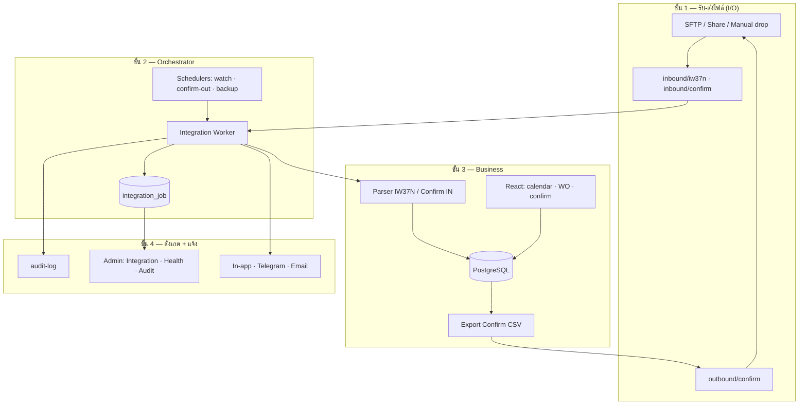
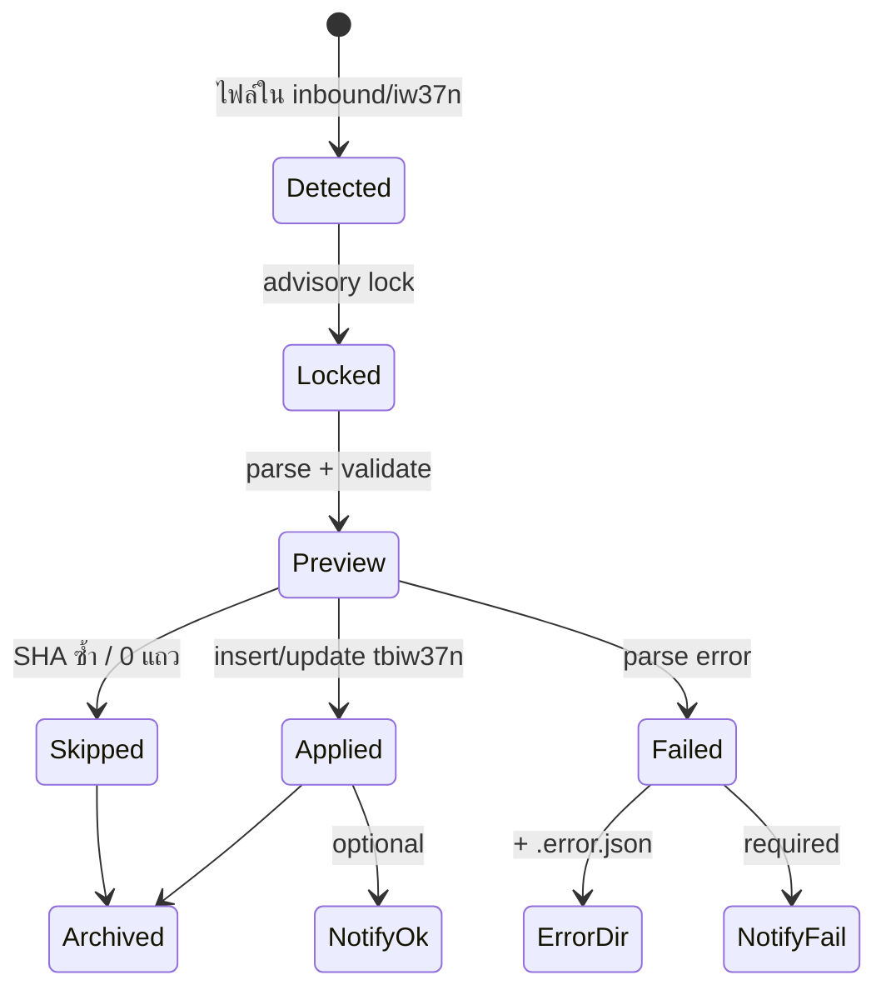

# ออกแบบระบบ PM-Pepsi-App แบบ Auto (Automation)

อัปเดต: 2026-05-22  
อ้างอิง: [`15-sap-csv-integration.md`](../parity-pending/15-sap-csv-integration.md) · [`SAP-SCHEDULE-AND-WORK-HOURS.md`](SAP-SCHEDULE-AND-WORK-HOURS.md) · [`WORK-PHASES.md`](../WORK-PHASES.md)

---

## 1) “Auto” ในโครงการนี้หมายถึงอะไร

ไม่ใช่ SAP API real-time — ยังเป็น **สัญญาไฟล์ CSV/XLSX** + **งานตามเวลา (scheduler)** + **คนกดเมื่อจำเป็น**

| เป้าหมาย | คำอธิบาย |
|----------|----------|
| **ลดงานมือซ้ำ** | ไฟล์จาก SAP เข้า DB เอง · ส่ง Confirm กลับ SAP เป็นไฟล์ในโฟลเดอร์ · ไม่ต้องเปิดหน้าอัปโหลดทุกครั้ง |
| **รู้ผลทันที** | Job สำเร็จ/ล้ม · แจ้ง Admin · หน้า `/integration` เป็นศูนย์สถานะ |
| **ปลอดภัย** | Idempotent (SHA256) · lock ไม่รัน job ซ้อน · audit ทุกขั้น |
| **ยืดหยุ่น** | อัปโหลดมือได้ตลอด · ไม่ผูกแค่รอบ SAP 07:00/19:00 |

---

## 2) สถานะวันนี้ (มีแล้ว vs ยังไม่มี)

### มีแล้วในโค้ด

| ชั้น | สิ่งที่ทำงาน | ไฟล์/จุดเปิด |
|------|-------------|-------------|
| **Inbound auto** | สแกน `inbound/iw37n` + `inbound/confirm` → import → archive/error | `integration-watch.ts` |
| **Scheduler** | ทุก 1 นาทีเช็ค interval (ค่าเริ่มต้น 10 นาที) แล้วรัน scan | `integration-scheduler.ts` · เปิดเมื่อ `INTEGRATION_WATCH_SCHEDULER≠0` ใน `index.ts` |
| **Job log** | `integration_job` สถานะ running/done/failed | migration `075` |
| **Manual + preview** | อัปโหลด IW37N preview ก่อน commit | `/integration`, `/iw37n` |
| **Export on-demand** | ดาวน์โหลด Confirm CSV/XLSX | `GET /confirmation/export.csv` |
| **Backup auto** | pg_dump ตาม cron ใน Admin | `admin-backup.ts` · `BACKUP_SCHEDULER` |
| **Bulk ในแอป** | batch ทีม · mass confirm ≤44 | Phase 3 (ไม่ใช่ไฟล์ SAP) |

### ยังไม่มี (ช่องว่าง automation)

| ช่องว่าง | ผลกระทบ |
|---------|----------|
| **CONFIRM_OUT → โฟลเดอร์ outbound อัตโนมัติ** | SAP ต้องมากดดาวน์โหลดจาก UI เอง |
| **SFTP / network share** | ยัง copy ไฟล์มือเข้า `inbound/` |
| **แจ้งเตือนเมื่อ job fail** | ต้องเปิด `/integration` ดูเอง |
| **Health gate ก่อน import** | ไฟล์ซ้ำ/WO ไม่ตรง factory → skip ทั้งก้อน (Phase 2 UAT) |
| **Auto หลัง mass confirm** | export + QC approve ยังเป็นขั้นตอนแยก |
| **Telegram / email** | อยู่ Phase 8 |

---

## 3) สถาปัตยกรรมเป้าหมาย — 4 ชั้น



**หลักการ:** ชั้น 2 ไม่รู้รายละเอียด SAP — รู้แค่ “มีไฟล์ชนิด X → เรียก service Y → ย้าย archive/error”

---

## 4) Pipeline รายประเภท

### 4.1 IW37N_IN (SAP → PM) — **Auto หลัก**



| ขั้น | Auto วันนี้ | ปรับปรุงแนะนำ |
|------|------------|----------------|
| ตรวจไฟล์ใหม่ | ✅ watch | เพิ่ม “stable file” (รอเขียนจบ 30s) ก่อน parse |
| แยก IW37N vs Confirm | ✅ โฟลเดอร์คนละอัน | ตั้งชื่อไฟล์ผิดโฟลเดอร์ → sidecar แจ้ง |
| หลังสำเร็จ | ❌ | invalidate cache / banner “ข้อมูล SAP อัปเดต ณ …” บน calendar |
| แจ้ง Admin | ❌ | job fail → notification + ลิงก์ batch report |

**เวลาแนะนำ production**

- Watch: ทุก **5–10 นาที** (ตั้ง `integration.watch_interval_minutes`)
- รอบ SAP ~07:00 / ~19:00: ตั้ง **scan พิเศษ** 07:05 และ 19:05 (cron แยก — ดู §6)

### 4.2 CONFIRM_IN (SAP → PM)

- เหมือน IW37N แต่โฟลเดอร์ `inbound/confirm`
- **ข้อกำหนด:** ต้องมี IW37N ชุดเดียวกันก่อน (WO ตรง) — worker ควร log ชัด `skipped: no matching wkorder`

### 4.3 CONFIRM_OUT (PM → SAP) — **Auto ที่ควรทำถัดไป**

| โหมด | เมื่อไหร่ | ผลลัพธ์ |
|------|----------|---------|
| **On-demand** | ปุ่มใน `/integration` / `/confirmation` | มีแล้ว — download |
| **Scheduled** | ทุกวัน 18:00 หรือหลังรอบปิดงาน | เขียน `outbound/confirm/CONFIRM_OUT_*.csv` + archive |
| **Event** | หลัง mass confirm ครบ + QC approve batch | สร้างไฟล์เดียว + audit `integration.confirm.out` |

**API ที่แนะนำเพิ่ม**

```
POST /api/v1/integration/confirm/export/run   # เขียนลง outbound/
GET  /api/v1/integration/confirm/export/latest
```

Scheduler ใหม่: `startConfirmOutScheduler(pool)` — คล้าย backup cron

### 4.4 งานในแอป (ไม่ใช่ไฟล์)

| งาน | Auto ได้แค่ไหน | หมายเหตุ |
|------|----------------|----------|
| Assign Team A/B ทั้งหน้า | กึ่งอัตโนมัติ (คนเลือกแล้วกด Save ครั้งเดียว) | ไม่ต้อง auto จาก SAP |
| Mass confirm 44 | กึ่งอัตโนมัติ | หลัง success → **trigger CONFIRM_OUT event** |
| Eng Utilization | คำนวณจาก DB realtime | ไม่ import Excel ซ้ำ |
| DB backup | ✅ cron Admin | แยกจาก SAP |

---

## 5) ศูนย์ควบคุม (Control plane)

### 5.1 หน้า `/integration` (ขยาย)

| แท็บ | วันนี้ | Auto เพิ่ม |
|------|--------|------------|
| IW37N | อัปโหลด + batch | สถานะ watch ถัดไป · ไฟล์ค้างใน inbound |
| Confirm OUT | ดาวน์โหลด | ปุ่ม Generate to folder · ไฟล์ล่าสุดใน outbound |
| Jobs | Run scan · ประวัติ | กรอง fail · retry (phase 2) |
| **Automation** (ใหม่) | — | เปิด/ปิด watch · interval · cron CONFIRM_OUT · Telegram |

### 5.2 Admin Settings (`tbl_setting`)

| Key | ค่า | มีแล้ว |
|-----|-----|--------|
| `integration.watch_enabled` | true/false | ✅ |
| `integration.watch_interval_minutes` | 5–60 | ✅ |
| `integration.confirm_out_enabled` | true/false | แนะนำเพิ่ม |
| `integration.confirm_out_cron` | `0 18 * * *` | แนะนำเพิ่ม |
| `integration.notify_on_fail` | true/false | แนะนำเพิ่ม |
| `integration.sap_peak_scan` | `05 7,19 * * *` | optional — scan พิเศษหลังรอบ SAP |

### 5.3 สิทธิ์

- รัน watch / export โฟลเดอร์: `integration.admin` หรือ `iw37n.import` + `confirmation.read`
- ดูสถานะอย่างเดียว: `iw37n.read`

---

## 6) แผนดำเนินการ (ผูก WORK-PHASES)

```text
[A] Foundation (ทำแล้ว ~80%)
    Integration hub · watch · job table · parser ALV
         ↓
[B] Reliable data (Phase 2 — บล็อกอยู่ตรงนี้)
    UAT import · factory 7151 · คู่ IW37N+Confirm
         ↓
[C] Closed loop SAP file (Auto รอบ 1)
    CONFIRM_OUT → outbound อัตโนมัติ · stable-file · แจ้ง fail
         ↓
[D] Production I/O (Deploy)
    SFTP ↔ inbound/outbound · Docker · Tailscale
         ↓
[E] Smart ops (Auto รอบ 2)
    Post-import banner · Telegram · retry job · health dashboard
```

| รหัส | งาน | Effort | ขึ้นกับ |
|------|-----|--------|---------|
| **B.1** | ผ่าน Phase 2 UAT | ทีม + ข้อมูลลูกค้า | — |
| **C.1** | `writeConfirmOutToOutbound()` + API | S | confirmation export มีแล้ว |
| **C.2** | `confirm-out-scheduler.ts` | S | C.1 |
| **C.3** | หลัง mass confirm → queue export | M | Phase 3 mass confirm |
| **C.4** | Stable-file wait ก่อน parse | S | — |
| **D.1** | SFTPgo / WinSCP script → inbound | M | server doc |
| **E.1** | Notification service (in-app + Telegram) | M | Phase 8 |
| **E.2** | Integration retry สำหรับไฟล์ใน error/ | M | — |

**ไม่แนะนำทำก่อน B.1:** auto ที่ดึงไฟล์ซ้ำหรือ export ว่างจะทำให้ SAP ได้ไฟล์ผิด — ต้องมีข้อมูลจริงใน DB ก่อน

---

## 7) การ deploy แบบ auto (Production)

```text
[Windows Server / Linux VM]
  pm-api.service          ← INTEGRATION_WATCH_SCHEDULER=1
  pm-integration-watch?   ← optional แยก process ถ้าไม่ผูก API
  Task Scheduler / cron
    - 07:05, 19:05       ← optional peak scan
    - backup 02:00        ← มีแล้วใน Admin

[SFTP หรือ SMB share]
  /sap-to-pm/iw37n/   → symlink inbound/iw37n
  /pm-to-sap/confirm/ ← symlink outbound/confirm

[Tailscale]  — ดู DOCKER_AND_TAILSCALE.md
```

**ตัวแปรสภาพแวดล้อม**

| ตัวแปร | ค่า prod |
|--------|----------|
| `INTEGRATION_WATCH_SCHEDULER` | `1` |
| `INTEGRATION_ROOT` | path โฟลเดอร์ integration (ถ้าไม่ใช้ default ใต้ backend/data) |
| `BACKUP_SCHEDULER` | `1` |

---

## 8) การจัดการความล้มเหลว

| เหตุการณ์ | พฤติกรรมที่ต้องการ |
|-----------|-------------------|
| ไฟล์ parse ไม่ได้ | ย้าย `error/` + `.error.json` + audit fail + แจ้ง Admin |
| SHA ซ้ำ | skip · archive · ไม่ถือว่า fail |
| Job ค้าง running | `failStaleIntegrationJobs` (มีแล้ว) |
| Confirm ไม่มี WO | skip แถว · สรุปใน job summary |
| API ล้มระหว่าง import | ไม่ corrupt — transaction ต่อ batch |

**Dashboard สั้นๆ บน Admin Console**

- Job ล่าสุด 5 รายการ (สำเร็จ/ล้ม)
- ไฟล์ค้างใน inbound (count)
- ไฟล์ outbound ล่าสุด (ชื่อ + เวลา)

---

## 9) สรุปคำตอบ “จะทำ auto ยังไง”

1. **วันนี้** — เปิด watch ให้ครบ: ตั้ง `integration.watch_enabled` · วางไฟล์ SAP ใน `inbound/` · ให้ `pm-api` รันด้วย scheduler (ไม่ตั้ง `INTEGRATION_WATCH_SCHEDULER=0`)
2. **สัปดาห์ถัดไป (หลัง Phase 2 ผ่าน)** — เพิ่ม **CONFIRM_OUT ลงโฟลเดอร์อัตโนมัติ** + cron หลังเลิกงาน
3. **ก่อน go-live** — SFTP/share + แจ้งเตือน job fail + ศูนย์ `/integration` แท็บ Automation
4. **ไม่ auto ทุกอย่าง** — mass confirm, assign ทีม, QC รูป ยังต้องมีคนตัดสินใจ (ตามประชุมลูกค้า)

---

## 10) เอกสารที่เกี่ยวข้อง

| เอกสาร | เรื่อง |
|--------|--------|
| [`AUTOMATION-PHASES.md`](AUTOMATION-PHASES.md) | **Phase A0–A5 + checklist** (ติ๊กงานรายขั้น) |
| [`15-sap-csv-integration.md`](../parity-pending/15-sap-csv-integration.md) | สัญญาไฟล์ · โฟลเดอร์ · API |
| [`SAP-SCHEDULE-AND-WORK-HOURS.md`](SAP-SCHEDULE-AND-WORK-HOURS.md) | 07:00/19:00 vs เวลาคน |
| [`WORK-PHASES.md`](../WORK-PHASES.md) | Phase 0–8 แอปรวม |
| `backend/data/integration/README.md` | path dev |
