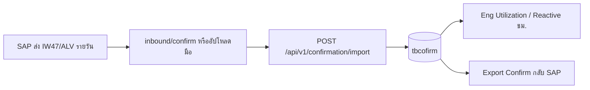

# IW47 Daily 12May2026.xlsx — ใช้ทำอะไร

ไฟล์: [`new file/IW47 Daily 12May2026.xlsx`](../../new%20file/IW47%20Daily%2012May2026.xlsx)

## สรุปสั้น

นี่คือ **รายงานยืนยันงาน (PM Order Confirmation) ที่ SAP ส่งออกมารายวัน** ไม่ใช่ IW37N (รายการ WO เปิด) และไม่ใช่กราฟ Eng Utilization โดยตรง

| หัวข้อ | รายละเอียด |
|--------|------------|
| ชื่อ SAP | มักมาจาก transaction กลุ่ม **IW47** / รายการ Confirm รายวัน |
| รูปแบบไฟล์ | **SAP ALV** — แถว 1 มี `Dynamic List Display` |
| วันที่ในตัวอย่าง | **13.05.2026** (โพสต์วัน) — ชื่อไฟล์บอก 12 May = วันที่ดึงรายงาน |
| จำนวนแถว | ~90+ รายการ confirm |

## คอลัมน์หลัก (แถว header แถวที่ 4)

| คอลัมน์ใน Excel | ความหมาย | ในระบบ PM |
|-----------------|----------|-----------|
| Confirm. | เลข confirmation SAP | `tbcofirm.confirmation` |
| Postg date | วันที่โพสต์ | ใช้ parse วันเวลาปิดงาน |
| Order | เลข WO | จับคู่ `tbiw37n.wkorder` |
| OrdCat | ประเภท เช่น ZB05 | งาน Reactive |
| WkCtrAct | Work center ช่าง | `wkctr` |
| Act. work / Un. | งานจริง + หน่วย (MIN) | `timewk` / `unitc` |
| HR | ชั่วโมง HR | สรุป manhour |
| Functional Loc. | สายการผลิต เช่น PI-TH-7151 | กรองโรงงาน 7151 |

## ใช้ในระบบอย่างไร (flow จริง)

1. **นำเข้า (CONFIRM IN)**  
   - หน้า **`/confirmation`** → Import Excel  
   - หรือ **`/integration`** → สแกนโฟลเดอร์ `inbound/confirm`  
   - Parser: `confirmation-import.ts` โหมด **`sap_alv`** (ตรวจ `Dynamic List Display`)

2. **หลัง import สำเร็จ**  
   - ข้อมูลอยู่ `app.tbcofirm`  
   - ช่วยให้ปิดงาน / export / สรุป **%Reactive** ใน **Eng Utilization** (`/summary-weekly`)  
   - ต้องมี **IW37N ชุดเดียวกัน** ใน `tbiw37n` ก่อน — ไม่งั้นแถวจะ skip (WO ไม่พบ)

3. **ส่งกลับ SAP (CONFIRM OUT)**  
   - `GET /api/v1/confirmation/export.xlsx` / `.csv`  
   - เฉพาะ WO สถานะ CRTD/REL ใน `view_exportconfirm`

## ต่างจากไฟล์อื่นใน `new file/`

| ไฟล์ | ใช้ทำ |
|------|--------|
| **Eng Utilization 2026.xlsx** | แม่แบบ **กราฟ/ตาราง %PM %Reactive** → หน้า `/summary-weekly` |
| **IW47 Daily 12May2026.xlsx** | แม่แบบ **ข้อมูล confirm รายวันจาก SAP** → import → `tbcofirm` |
| **IW37N*.xlsx** (โฟลเดอร์อื่น) | รายการ WO เปิด → `/iw37n` → `tbiw37n` |

## UAT แนะนำ (ไฟล์นี้)

1. Import **`IW37N`** ช่วงเดียวกับ WO ในไฟล์ (พ.ค. 2026 / 7151)  
2. Import **`IW47 Daily 12May2026.xlsx`** ที่ `/confirmation`  
3. ตรวจ inserted > 0 ในตารางผล import  
4. เปิด Eng Utilization → **รายวัน (เมื่อวาน)** หรือช่วง 13.05.2026 → ดู Reactive ชม. ขึ้น  
5. Export confirm CSV มีแถว

## อ้างอิงโค้ด

- [`confirmation-import.ts`](../../PM-Pepsi-App/backend/src/services/confirmation-import.ts)  
- [`15-sap-csv-integration.md`](../parity-pending/15-sap-csv-integration.md)  
- [`SAP-SAMPLE-PROBE.md`](SAP-SAMPLE-PROBE.md)
