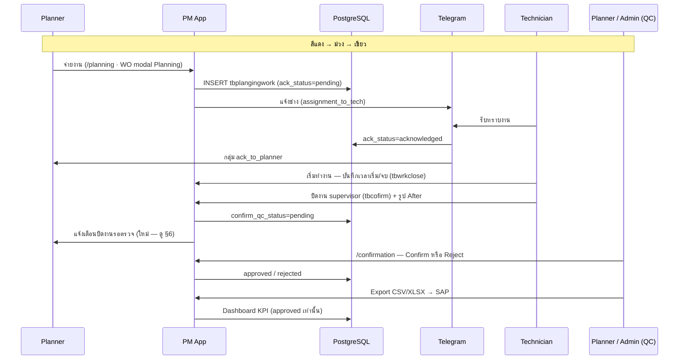

# Flow Planner — Pipeline สี · ช่าง · Confirm · Report

**วันที่:** 9 มิ.ย. 2026  
**สถานะ:** P1–P5 implement แล้ว (2026-06-09) — รอ migration 112 + UAT  
**อ้างอิง:** สไลด์ลูกค้า (สีแดง/ม่วง/เขียว) · [`TELEGRAM-ASSIGNMENT-FLOW.md`](TELEGRAM-ASSIGNMENT-FLOW.md) · [`CONFIRM-QC-FLOW.md`](CONFIRM-QC-FLOW.md) · [`CLOSE-WO-TAB-DESIGN.md`](CLOSE-WO-TAB-DESIGN.md)

---

## 1) สองชุดสี — ห้ามปนกัน

| ชุด | หน้าหลัก | ความหมาย |
|-----|----------|----------|
| **A. ปฏิทินแผน SAP** | `/calendar` | แดง=เลยกำหนด · ส้ม=มี WO · น้ำเงิน=ประมาณการ · เขียว=ปิด SAP — ดู [`CALENDAR-DISPLAY.md`](CALENDAR-DISPLAY.md) |
| **B. Pipeline จ่ายงาน** | `/planning` · `/plan-calendar` · Dashboard Planner | แดง=ยังไม่จ่าย · ม่วง=จ่ายแล้วยังไม่ทำ · เขียว=ปิดงานแล้ว (+ ป้าย ack / QC) |

เอกสารนี้ครอบคลุม **ชุด B** เท่านั้น

---

## 2) สรุปการเช็ค: ที่ลูกค้าขอ vs ระบบปัจจุบัน

| สี (Pipeline) | ระบบมีข้อมูล? | แสดงสีบน UI? | แหล่งข้อมูล |
|---------------|---------------|--------------|-------------|
| **แดง** — ยังไม่จ่ายงาน | ✅ | ⚠️ บางส่วน | ไม่มีแถว `tbplangingwork` · Personnel dashboard `unassigned` |
| **ม่วง** — จ่ายแล้ว ยังไม่เริ่มทำ | ✅ | ❌ | มี assign · ยังไม่มี `tbwrkclose` · workflow suffix `2` |
| **ม่วง+ป้าย** — รับทราบแล้ว (TG/Web) | ✅ | ⚠️ บางส่วน | `ack_status=acknowledged` · `ack_channel` |
| **เขียว** — ปิดงานแล้ว | ✅ | ⚠️ บางส่วน | `tbcofirm` · `percent_close` · `pmExecutionStatus` |
| **เขียว+ป้าย** — Planner Confirm/Reject | ✅ | ⚠️ บางส่วน | `confirm_qc_status`: pending / approved / rejected |

---

## 3) Flow end-to-end (ที่ลูกค้าต้องการ)



### ตารางขั้นตอน — สถานะโค้ด

| ขั้น | สถานะ | API / ไฟล์หลัก |
|------|--------|----------------|
| จ่ายงาน (รายคน / กลุ่ม / หลายคน) | ✅ | `planning.ts` · `PlanningMultiAssign` · `POST …/planning/batch` |
| แจ้ง Telegram ช่าง | ✅ | `telegram-assignment-notify.ts` |
| รับทราบงาน (TG / Web) | ✅ | `planning-ack.ts` · `POST …/planning/orders/:id/ack` |
| แจ้ง Planner เมื่อรับทราบ | ✅ | `notify_kind=ack_to_planner` |
| ช่างเห็นแท็บ Close WO | ✅ | `close-wo-access.ts` — assign + acknowledged |
| บันทึกเวลาเริ่ม/จบ | ✅ | `PersonnelClosePanel` → `tbwrkclose` |
| ปิดงาน + รูป After | ✅ | `WorkOrderSupervisorCloseSection` → `tbcofirm` |
| ตั้ง QC pending หลังปิด | ✅ | `confirm-qc.ts` |
| **แจ้ง Planner เมื่อปิดงาน** | ❌ | ยังไม่มี event — ดู §6 |
| Planner Confirm / Reject | ✅ | `/confirmation` · `ConfirmQcPanel` |
| ส่งข้อมูล DB (export SAP) | ✅ | `confirmation/export.csv` · Mass Confirm |
| Dashboard / Report | ✅ บางส่วน | Dashboard KPI · `/reports` · `/summary-weekly` |

---

## 4) นิยามสถานะ Pipeline (ชุด B)

### 4.1 สถานะหลัก (สีพื้นหลัง event / แถว)

| ลำดับ | `pipelineStatus` | สี | เงื่อนไข (เรียง priority บนลงล่าง) |
|-------|------------------|-----|-----------------------------------|
| 1 | `closed` | **เขียว** `#7AC943` | มี `tbcofirm` หรือ `percent_close >= 100` หรือ SAP ไม่ใช่ CRTD/REL |
| 2 | `in_progress` | **ฟ้า** `#4DA6FF` (optional) | มีแถว `tbwrkclose` แต่ยังไม่ปิด supervisor |
| 3 | `assigned` | **ม่วง** `#7B61FF` | มี `tbplangingwork` ≥1 · ยังไม่มี `tbwrkclose` |
| 4 | `unassigned` | **แดง** `#FF3B30` | ไม่มี `tbplangingwork` · SAP ยังเปิด (CRTD/REL) |

> สถานะ `in_progress` เป็นทางเลือก — ถ้าลูกค้าต้องการแค่ 3 สี ให้รวม `assigned` + `in_progress` เป็น **ม่วง** เดียวกัน

### 4.2 ป้ายย่อย (badge / มุม event — ไม่เปลี่ยนสีพื้นหลัก)

| ป้าย | แสดงเมื่อ | ไอคอน / สีป้าย |
|------|-----------|----------------|
| `ack_pending` | `assigned` + มี assign ที่ `ack_status=pending` | 🔔 ส้ม |
| `ack_done` | `assigned` + ทุก assignee ที่ต้อง ack แล้ว `acknowledged` | ✓ ม่วงเข้ม / TG logo |
| `qc_pending` | `closed` + `confirm_qc_status=pending` | ⏳ เหลือง |
| `qc_approved` | `closed` + `confirm_qc_status=approved` | ✓ เขียวเข้ม |
| `qc_rejected` | `closed` + `confirm_qc_status=rejected` | ✗ แดง |

### 4.3 ฟังก์ชันคำนวณ (ร่าง)

```ts
type PlannerPipelineStatus =
  | 'unassigned'
  | 'assigned'      // ม่วง — รวม pending ack + acknowledged
  | 'in_progress'   // optional
  | 'closed'

type PlannerPipelineBadge =
  | 'ack_pending'
  | 'ack_done'
  | 'qc_pending'
  | 'qc_approved'
  | 'qc_rejected'

function resolvePlannerPipeline(input: {
  syst: string | null
  assignCount: number
  worktimeCount: number
  hasSupervisorClose: boolean
  percentClose: number
  confirmQcStatus: string | null
  ackSummary: { total: number; acknowledged: number; pending: number }
}): { status: PlannerPipelineStatus; badges: PlannerPipelineBadge[] }
```

**ที่วางไว้:** `PM-Pepsi-App/backend/src/lib/planner-pipeline.ts` (+ unit test)

---

## 5) แสดงผลบนหน้าจอ

### 5.1 หน้าที่ใช้ Pipeline สี

| หน้า | การแสดง | หมายเหตุ |
|------|---------|----------|
| `/planning` | คอลัมน์สี + legend | แถว WO เปิด — filter ตาม pipeline |
| `/plan-calendar` | สี event = pipeline (ไม่ใช่ `PM_EXECUTION_META` เดิม) | มุมมองช่าง/Planner ติดตามจ่ายงาน |
| `/calendar` | **สี Pipeline สำหรับ CRTD/REL** + ป้าย ack/QC | คง displayStatus ชุด A สำหรับ filter |
| WO modal | แถบสถานะใต้ workflow steps | ร่วมกับ suffix `1/2/3` |
| Personnel dashboard | การ์ด unassigned = แดง | มีแล้ว — เพิ่ม legend |

### 5.2 Legend (Planner)

```text
🔴 ยังไม่จ่ายงาน
🟣 จ่ายแล้ว — รอช่างทำ (ป้าย 🔔 รอรับทราบ · ✓ รับทราบแล้ว)
🟢 ปิดงานแล้ว (ป้าย ⏳ รอ Confirm · ✓ อนุมัติ · ✗ ส่งกลับ)
```

### 5.3 Workflow steps (มีแล้ว — เสริม label)

| Step | key | done เมื่อ | สี pipeline ที่เกี่ยว |
|------|-----|------------|----------------------|
| 1 | `team` | มี `tbiw37n.team` | — |
| 2 | `assign` | มี `tbplangingwork` | แดง → ม่วง |
| 3 | `worktime` | มี `tbwrkclose` | ม่วง → in_progress |

เพิ่ม step 4 (optional): `qc` — done เมื่อ `confirm_qc_status=approved`

---

## 6) Gap ที่ต้อง implement

| # | หัวข้อ | แนวทาง |
|---|--------|--------|
| G1 | **สี pipeline บน UI** | Backend คืน `pipelineStatus` + `pipelineBadges` ใน calendar/planning API · CSS class `pipeline-*` |
| G2 | **แจ้ง Planner เมื่อช่างปิดงาน** | `notify_kind=close_to_planner` (ใหม่) หรือใช้ `confirm_reminder` — ยิงหลัง `tbcofirm` insert |
| G3 | **Planner = ผู้ Confirm?** | ปัจจุบัน QC ใช้สิทธิ์ `confirmation.import` (มักเป็น Admin) — ยืนยันลูกค้า: Planner กด Confirm ได้หรือ Admin เท่านั้น |
| G4 | **Report / Dashboard ตาม pipeline** | Widget: นับ unassigned / assigned / closed_pending_qc / approved ต่อเดือน · filter บน `/reports` |
| G5 | **Export** | มีแล้วหลัง QC approve — เพิ่มคอลัมน์ pipeline status ใน export สรุป (optional) |

---

## 7) บทบาทและหน้าจอ

### Technician (W)

```text
/plan-calendar → เปิด WO
  → รับทราบ (Web) ถ้ายัง pending
  → แท็บ Close WO:
       1. บันทึกเวลาเริ่ม/จบ (tbwrkclose)
       2. อัปโหลดรูป After
       3. Supervisor close → QC pending
  → /personnel/confirm ดู % และสถานะ QC
```

### Planner (U)

```text
/planning → จ่ายงาน · ดูสี pipeline · filter แดง/ม่วง
/calendar → จัดวัน/ทีม (สีชุด A) + badge pipeline
/confirmation → คิวรอ Confirm (ถ้ามีสิทธิ์)
/reports · Dashboard → หลัง QC approve
```

### Admin (A)

```text
/confirmation → QC approve/reject (หลักวันนี้)
/admin/telegram → ตั้งกลุ่ม ack_to_planner · close_to_planner
```

---

## 8) API ที่ต้องขยาย (ร่าง)

| Method | Path | ฟิลด์ใหม่ |
|--------|------|-----------|
| GET | `/api/v1/scheduling/calendar` | `pipelineStatus`, `pipelineBadges[]` ต่อ event |
| GET | `/api/v1/planning/orders` | เหมือนกัน + filter `?pipeline=unassigned` |
| GET | `/api/v1/dashboard/summary` | `pipelineCounts: { unassigned, assigned, closedPendingQc, approved }` |

ไม่ต้อง migration ใหม่ — คำนวณจากตารางที่มี

---

## 9) ลำดับ implement แนะนำ

| Phase | งาน | ไฟล์หลัก |
|-------|-----|----------|
| **P1** | `planner-pipeline.ts` + unit test | backend lib |
| **P2** | ใส่ใน scheduling/planning API + schema Zod | `calendar.ts` · `planning.ts` |
| **P3** | Frontend legend + CSS + `/planning` column | `scheduling-i18n.ts` · `PlanningPage` |
| **P4** | `/plan-calendar` ใช้ pipeline color | `plan-calendar.ts` · `CalendarPage` |
| **P5** | Telegram `close_to_planner` | `telegram-notify` · migration enum ถ้าต้อง |
| **P6** | Dashboard widget + report filter | `personnel.ts` · `ReportsPage` |

---

## 10) การตัดสินใจจากลูกค้า (ยืนยันแล้ว)

| คำถาม | คำตอบ | ผล implement |
|-------|--------|--------------|
| Planner Confirm/Reject | **Planner กดเอง** | migration `111` + legacy RBAC `confirmation.import` สำหรับ role U |
| จำนวนสี | **4 สี** (แยก in_progress ฟ้า) | `planner-pipeline.ts` |
| `/plan-calendar` | **สี Pipeline เป็นหลัก** (สากล — ชุด B เดียวกันทุก role) | `plan-calendar.ts` · `/calendar` คงชุด A |
| แจ้ง Planner ตอนปิดงาน | **Telegram + in-app** | `close_to_planner` · `tbl_app_notification` · กระดิ่ง topbar |

**Migration:** `112_app_notification.sql`  
**Telegram Admin:** ตั้งกลุ่ม `notify_kind = close_to_planner`
