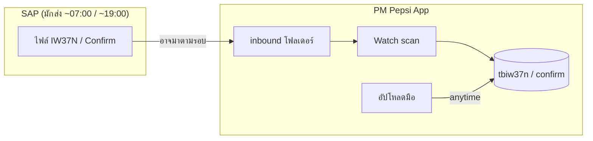

# รอบส่งข้อมูล SAP (07:00 / 19:00) vs เวลาทำงานช่าง (7:00–15:30) — คำอธิบาย

อัปเดต: 2026-05-21 · บริษัท **เป๊ปซี่โคล่า (ไทย) เทรดดิ้ง จำกัด**

เอกสารนี้ตอบ checklist Phase 5 ใน [`WORK-PHASES.md`](../WORK-PHASES.md): *“เอกสารรอบ SAP 07:00/19:00 — อธิบายว่า watch + upload ใช้ได้นอกรอบ”* และแยกความเข้าใจผิดที่พบบ่อยระหว่าง **สองเรื่องคนละเรื่อง**

---

## 1) สรุปหนึ่งย่อหน้า (ถ้างง อ่านแค่นี้)

| หัวข้อ | ความหมาย | เกี่ยวกับอะไรในระบบ |
|--------|----------|---------------------|
| **SAP 07:00 / 19:00** | เวลาที่ **ระบบ SAP มักส่งไฟล์ Excel/CSV** (ใบงาน IW37N, Confirm ฯลฯ) มาที่ฝั่ง PM **วันละ 2 รอบ** | `/integration`, `/iw37n`, โฟลเดอร์ `inbound/`, **watch** |
| **เข้างาน 7:00–15:30 + OT** | กฎ **นับชั่วโมงทำงานของพนักงาน/ช่าง** ของ Pepsi (จันทร์–อาทิตย์) | `/manhours`, `/worktime`, ตาราง `tbmanhours` (WH, OT1, OT1.5, OT1HOL, …) |

**07:00 ในประชุม SAP ≠ 07:00 เข้างาน Pepsi**  
- รอบ **07:00 SAP** = ไฟล์ใบงานจาก SAP อาจมาตอนเช้า  
- **07:00 เข้างาน** = เริ่มนับชั่วโมงปกติ (WH) ของคน

ระบบ PM ใหม่ **ไม่บังคับ** ให้ผู้ใช้รอแค่ 07:00 หรือ 19:00 ของ SAP ถึงจะอัปโหลดหรือใช้งานได้ — อัปโหลดมือและ watch โฟลเดอร์ใช้ได้ **ตลอดเวลา**

---

## 2) รอบ SAP 07:00 และ 19:00 คืออะไร?

จาก [รายงานประชุม ครั้งที่ 2](MEETING-MINUTES.md) (7 พ.ค. 2569):

- ฝั่ง **SAP** มีการ **ส่ง / ดึงข้อมูล** ที่เกี่ยวกับใบสั่งซ่อม (IW37 / IW37N) และการยืนยันงาน (Confirm) เป็นช่วงเวลาประมาณ **07:00** และ **19:00** ในแต่ละวัน
- ในระบบเก่า บาง flow ทำให้ผู้ใช้รู้สึกว่า “ต้องรอรอบ SAP” ถึงจะมีข้อมูลใหม่ — UX ไม่ยืดหยุ่น

**ไฟล์ที่พูดถึง (ตัวอย่าง):**

- IW37N → รายการใบงานจาก SAP → นำเข้า `app.tbiw37n`
- Confirm → สถานะปิดงานจาก SAP → `tbcofirm` / import ยืนยัน

**นี่คือ “สาย Integration” ไม่ใช่ “สายลงเวลาเข้า-ออกงาน”**

---

## 3) ระบบใหม่: watch + อัปโหลดมือ — ใช้ได้นอกรอบ 07:00/19:00

ความต้องการลูกค้า ([LEGACY-ISSUES-CHECKLIST.md](LEGACY-ISSUES-CHECKLIST.md) M.2): **ไม่ผูก UX แค่รอบ SAP** — อัปโหลด/ใช้งานได้ยืดหยุ่น

### 3.1 สองช่องทางนำเข้า (ทำงานได้ทุกเมื่อ)

| ช่องทาง | ทำอะไร | เมื่อไหร่ใช้ได้ |
|---------|--------|----------------|
| **อัปโหลดมือ** | หน้า `/iw37n` หรือ `/integration` → เลือกไฟล์ → ตรวจสอบ (preview) → commit | **24 ชม.** ไม่ผูก 07:00/19:00 |
| **Watch โฟลเดอร์** | วางไฟล์ใน `backend/data/integration/inbound/iw37n` หรือ `inbound/confirm` แล้วรัน scan | **24 ชม.** (ตามที่ตั้ง cron / กด Run scan) |

รายละเอียดเทคนิค: [`parity-pending/15-sap-csv-integration.md`](../parity-pending/15-sap-csv-integration.md)

### 3.2 รอบ 07:00 / 19:00 ยังมีความหมายอย่างไร?

- ยังเป็น **เวลาที่คาดว่าไฟล์จาก SAP จะมา** (แผนงาน IT / ประสาน SAP)
- **ไม่ใช่**เวลาเดียวที่ PM App เปิดให้อัปโหลด
- ถ้า SAP ส่งช้า / ส่งเพิ่มกลางวัน / มีไฟล์แก้ไข — ผู้ใช้ **อัปโหลดมือได้ทันที** ไม่ต้องรอรอบถัดไป
- Watch สแกนโฟลเดอร์ได้บ่อยกว่า 2 ครั้ง/วัน (เช่น ทุก 15 นาที) — ไฟล์ที่วางไว้จะถูกดึงเข้าระบบเมื่อ scan ถัดไป

### 3.3 ภาพรวมง่ายๆ

---

## 4) กฎนับเวลาทำงาน Pepsi (คนละเรื่องกับ SAP)

ข้อมูลจากลูกค้า (สรุปในเอกสารนี้):

| หัวข้อ | กฎ |
|--------|-----|
| **หน่วยนับ** | นับเวลาทำงาน **จันทร์ – อาทิตย์** (สัปดาห์ปฏิทินเต็ม 7 วัน ไม่ใช่แค่จันทร์–ศุกร์) |
| **สัปดาห์ที่ 1** | เริ่มนับ **1 มกราคม** ของทุกปี (ไม่ใช่ ISO week ที่สัปดาห์ 1 อาจเริ่มวันอื่น) |
| **วันจันทร์ – ศุกร์** | **เข้างาน 07:00 – 15:30** = ชั่วโมงปกติ (ในระบบเก็บเป็น **WH**) |
| **หลัง 15:30** (วันธรรมดา) | นับเป็น **OT** (ล่วงเวลา) |
| **เสาร์ – อาทิตย์** | ถือเป็น **OT วันหยุด (holiday)** |

### 4.1 แสดงในระบบ PM (สัปดาห์ Pepsi)

| หน้า | ป้ายสัปดาห์ |
|------|-------------|
| `/reports` | แกนกราฟ KPI — `2026-W01`, `2026-W02`, … |
| `/summary-weekly` | Eng Utilization / รายงานรายสัปดาห์ |
| `/manhours` แท็บรายสัปดาห์ | กราฟ + ตาราง พร้อมคำอธิบายไทย เช่น สัปดาห์ที่ 3/2026 (15–21 ม.ค.) |

**นิยามในโค้ด:** `PM-Pepsi-App/backend/src/lib/pepsi-work-week.ts`  
- สัปดาห์ที่ *n* = วันที่ 1 ม.ค. + (*n*−1)×7 ถึง +6 วัน  
- ตัวอย่าง: 1–7 ม.ค. 2026 = **2026-W01**, 8–14 ม.ค. = **2026-W02**

หมายเหตุ: การแยกประเภท OT ละเอียด (OT1, OT1.5, OT2, OT3 ฯลฯ) ในระบบเก่า/Excel อาจมาจาก HR หรือกฎภายใน — ฟิลด์ใน DB รองรับหลายประเภท (ดู §5)

**ระบบ PM ไม่ได้ “ล็อก” หน้าจอ manhours ให้กรอกได้แค่ 07:00–15:30** — กฎนี้ใช้ตอน **บันทึก/นำเข้าชั่วโมง** และรายงาน ไม่เกี่ยวกับรอบส่งไฟล์ SAP

---

## 5) แมปกับระบบ PM (Manhours / Worktime)

ตาราง `app.tbmanhours` (และหน้า `/manhours`, `/worktime`):

| ฟิลด์ | ความหมายโดยทั่วไป (เทียบ Pepsi) |
|-------|--------------------------------|
| **WH** | ชั่วโมงปกติ — ช่วง **07:00–15:30** วันจันทร์–ศุกร์ |
| **OT1** | OT ล่วงเวลา (หลัง 15:30 ฯลฯ) |
| **OT1.5** (ot15) | OT อัตรา 1.5 |
| **OT1HOL** (ot1hol) | OT วันหยุด — **เสาร์–อาทิตย์** ตามกฎลูกค้า |
| **OT2 / OT3** | OT ประเภทอื่นตามนโยบาย HR |

การนำเข้า: มักมาจาก **Excel `ManHours.xlsx`** (อัปโหลดที่ `/manhours`) หรือกรอกใน Admin — **ยังไม่มี** logic อัตโนมัติใน backend ที่อ่านเวลาเข้า-ออกจากเครื่องสแกนนิ้วแล้วแยก WH/OT ให้ (ต้องยืนยันกับ HR ถ้าต้องการ auto ในอนาคต)

---

## 6) คำถามที่พบบ่อย (FAQ)

**ถาม: ทำไม checklist บอก “watch + upload ใช้ได้นอกรอบ” — งงกับ 07:00 เข้างาน?**  
ตอบ: หมายถึง **นอกรอบ SAP 07:00/19:00** (ไฟล์ใบงาน) ไม่ได้หมายว่าช่างเข้างานนอก 07:00 แล้วระบบจะบล็อก

**ถาม: ไฟล์ SAP มา 19:00 แล้วจะอัปโหลด 20:00 ได้ไหม?**  
ตอบ: ได้ — อัปโหลดมือหรือวางใน inbound แล้ว scan

**ถาม: ช่างทำ OT เสาร์ บันทึกที่ไหน?**  
ตอบ: ช่อง **OT1HOL** (และ OT อื่นตามที่ HR กำหนด) ใน manhours — ไม่เกี่ยวกับแท็บ Integration

**ถาม: 07:00 SAP กับ 07:00 เข้างาน ต้อง sync กันไหม?**  
ตอบ: ไม่จำเป็น — เป็นคนละ process (ข้อมูลใบงาน vs ชั่วโมงคน)

---

## 7) ลิงก์ที่เกี่ยวข้อง

- [MEETING-MINUTES.md](MEETING-MINUTES.md) — วาระ SAP 07:00/19:00, ความยืดหยุ่นช่าง  
- [15-sap-csv-integration.md](../parity-pending/15-sap-csv-integration.md) — watch, inbound, `/integration`  
- [11-manhours-worktime.md](../parity-pending/11-manhours-worktime.md) — API manhours / worktime  
- [WORK-PHASES.md](../WORK-PHASES.md) Phase 5

---

## 8) สิ่งที่ควรยืนยันกับลูกค้า (ถ้าต้องการความชัด 100%)

1. รอบ **07:00 / 19:00** ของ SAP ยังใช้อยู่แน่หรือไม่ — หรือมีรอบเพิ่ม  
2. การแยก **OT1 / OT1.5 / OT2 / OT3** หลัง 15:30 — กฎตายตัวหรือ HR กรอกใน Excel  
3. **เสาร์–อาทิตย์** ทั้งวันเป็น OT1HOL เท่านั้น หรือมี WH บางกรณี  
4. ต้องการให้ระบบ **คำนวณ WH/OT อัตโนมัติ** จากเวลาเข้า-ออกหรือยังใช้ import Excel แบบเดิม
