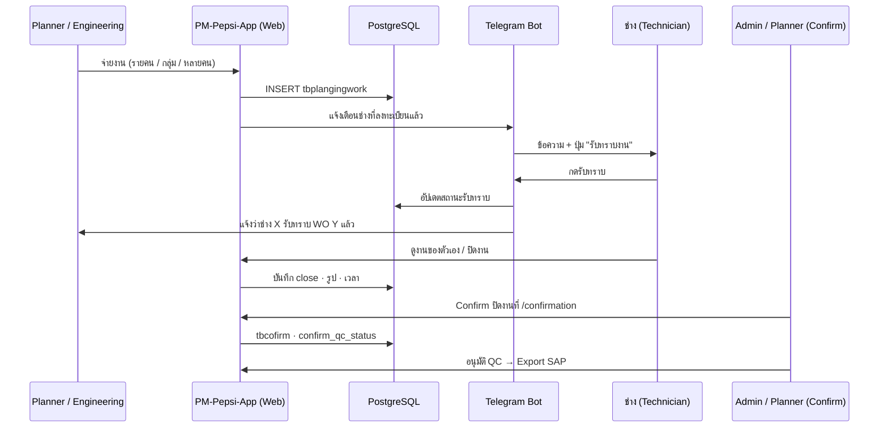
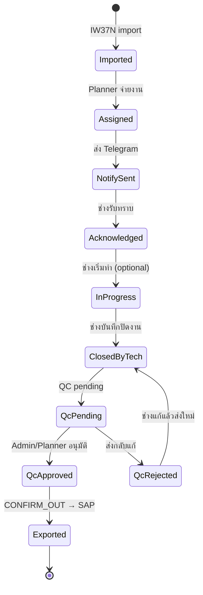

# Flow จ่ายงาน → แจ้งเตือน Telegram → รับทราบ → ปิดงาน → Confirmation

**เวอร์ชันเอกสาร:** 0.3  
**อัปเดต:** 2026-06-09  
**สถานะ:** Phase D–E + T7 ปิดงานย่อ — โค้ดพร้อม · รอ BotFather + UAT  
**Checklist งาน (ใช้ก่อนเขียนโค้ด):** [`TELEGRAM-IMPLEMENTATION-CHECKLIST.md`](TELEGRAM-IMPLEMENTATION-CHECKLIST.md)
**โครงการ:** PM Dashboard & Monitoring — เป๊ปซี่โคล่า (ไทย)

**เอกสารอ้างอิง**

| เอกสาร | ใช้เมื่อ |
|--------|---------|
| [`USER-MANUAL-TH.md`](../USER-MANUAL-TH.md) | หน้าเว็บที่มีอยู่แล้ว |
| [`CONFIRM-QC-FLOW.md`](CONFIRM-QC-FLOW.md) | QC ก่อน export SAP |
| [`PM-PLAN-TEAM-EE-UT.md`](PM-PLAN-TEAM-EE-UT.md) | ทีม A/B/EE/UT |
| [`AUTOMATION-DESIGN.md`](AUTOMATION-DESIGN.md) | ชั้นแจ้งเตือน (Phase 8) |
| [`MEETING-MINUTES.md`](MEETING-MINUTES.md) | วิสัยทัศน์ Web + Telegram |

---

## 1) สรุป flow (ภาพรวม)

```text
Planner/Engineering จ่ายงาน (รายบุคคล / กลุ่ม / หลายคนพร้อมกัน)
        ↓
ระบบบันทึกมอบหมาย (tbplangingwork) + ส่งแจ้งเตือน Telegram ตามรหัสช่างที่ลงทะเบียน
        ↓
ช่างกด "รับทราบงาน" ใน Telegram
        ↓
Telegram แจ้ง Planner ว่าช่างคนไหนรับทราบแล้ว
        ↓
ช่างดูงานของตัวเองบนเว็บ (/planning, /personnel, WO modal)
        ↓
ช่างปิดงานผ่าน Telegram หรือเว็บ (รูป · เวลา · ข้อมูลตามข้อกำหนด)
        ↓
ข้อมูลเข้าระบบ → หน้า Confirmation → Planner/Admin กด Confirm ปิดงาน (+ QC ตามกฎ)
        ↓
Export CONFIRM_OUT กลับ SAP (เมื่อ QC ผ่าน)
```



---

## 2) ผู้เกี่ยวข้อง (Actors)

| บทบาท | หน้าที่ใน flow นี้ | หน้าเว็บหลัก |
|--------|-------------------|--------------|
| **Planner / Engineering** | จ่ายงาน · ติดตามว่าใครรับทราบแล้ว · Confirm ปิดงาน | `/planning`, `/calendar`, `/work-orders`, `/confirmation` |
| **ช่าง (Technician)** | รับทราบงาน · ดูงานของตัวเอง · บันทึกปิดงาน (รูป/เวลา) | `/planning`, `/personnel`, `/personnel/confirm`, WO modal |
| **Admin** | QC · **ตั้งกลุ่ม Telegram แจ้งเตือนเอง** · ผูกบัญชีช่าง | `/confirmation`, `/admin/telegram`, `/admin/users` |
| **Telegram Bot** | ช่องทางแจ้งเตือน + ปุ่มรับทราบ + (อนาคต) ปิดงานย่อ | — |

---

## 3) ขั้นตอนละเอียด

### 3.1 จ่ายงาน (Planner / Engineering)

**ช่องทางจ่ายงานบนเว็บ (มีแล้ว)**

| รูปแบบ | คำอธิบาย | API / หน้า | สถานะโค้ด |
|--------|----------|------------|-----------|
| **รายบุคคล** | มอบหมาย 1 WO → 1 รหัสช่าง (`wkctr`) | `POST /api/v1/planning/assign` mode=`P` · `/planning` | ✅ มีแล้ว |
| **กลุ่ม** | มอบหมาย 1 WO → สมาชิกทั้งกลุ่ม (`idwkctrgroup`) | mode=`G` — expand จาก `tbworkcenter` | ✅ มีแล้ว |
| **หลายคนพร้อมกัน** | 1 WO หลายช่าง — เลือกหลายคน (checkbox) แล้วกดจ่ายครั้งเดียว | `tbplangingwork` รองรับ multi-row ต่อ `(idiw37, wkctr)` | ✅ มีแล้ว — `PlanningMultiAssign` ใน `/planning` dialog + WO modal (`POST …/planning/batch`) |
| **จ่ายจากปฏิทิน/WO** | มอบหมายจาก modal WO แท็บ Planning | `WorkOrderDetailDialog` · `PlanningQuickAssign` | ✅ มีแล้ว |

**เงื่อนไขก่อนจ่าย**

- WO ต้องอยู่สถานะ SAP **CRTD** หรือ **REL** (`tbiw37n.syst`)
- ช่างต้องมีใน `tbworkcenter` และ `workstatus` ใช้งานได้ (ไม่ TERMINATED)

**หลังจ่ายงานสำเร็จ (Phase E — โค้ดพร้อม รอ Bot + UAT)**

1. บันทึก `tbplangingwork` (มี `wkctr`, `wkctrpw`, `pwteam` = P/G)
2. **ใหม่:** สร้าง event `assignment.created` ใน audit log
3. **ใหม่:** คิวแจ้งเตือน Telegram ไปยังช่างแต่ละคนที่ถูกมอบหมาย
4. อัปเดตสถานะ workflow บน WO (ขั้น「จ่ายงานแล้ว」 — อ้างอิง `workflowSteps`)

---

### 3.2 ลงทะเบียน Telegram ↔ รหัสช่าง

**เป้าหมาย:** แต่ละช่างผูก **รหัส work center** ในระบบกับ **Telegram chat** ของตัวเอง

| รายการ | รายละเอียดเบื้องต้น |
|--------|---------------------|
| ฟิลด์ใหม่ (เสนอ) | `tbworkcenter.telegram_chat_id` · `telegram_linked_at` · `telegram_username` (optional) |
| วิธีผูกบัญชี | ช่างเปิดลิงก์ deep link จาก Admin หรือพิมพ์ `/start <token>` ใน Bot |
| ตรวจสอบตัวตน | token ครั้งเดียวออกจาก Admin → Users หรือหน้า Settings ช่าง |
| ยกเลิกการผูก | Admin หรือช่างกด unlink ที่ Settings |

**กฎ**

- 1 รหัสช่าง (`wkctr`) ผูกได้ **1 Telegram** ต่อคน
- ถ้ายังไม่ผูก Telegram → **ไม่ส่งแจ้งเตือน** แต่ยังเห็นงานบนเว็บได้
- Planner ที่ต้องการรับแจ้ง「รับทราบแล้ว」ใช้ **กลุ่ม Telegram ที่ Admin ตั้งเอง** (ดู §3.2.1) หรือแชทส่วนตัว

### 3.2.1 Admin — กลุ่มแจ้งเตือน Telegram (ลูกค้าจัดการเอง)

> **ข้อกำหนดลูกค้า:** สร้าง/แก้/ปิดกลุ่มแจ้งเตือนต่าง ๆ ได้ใน **Admin** ไม่ต้องให้ทีมพัฒนาแก้ config ทุกครั้ง

| รายการ | รายละเอียด |
|--------|------------|
| หน้า | `/admin/telegram` — 「Telegram & การแจ้งเตือน」 |
| สิทธิ์ | `admin.telegram.read` / `admin.telegram.write` |
| กลุ่ม (ตัวอย่าง) | Planner รับทราบ · สรุปรายวัน · แจ้ง QC ค้าง · กลุ่ม custom |
| ผูก master | เลือกได้: ไม่ผูก · `tbwkctrgroup` · ทีม PM (A/B/EE/UT) · รายชื่อ wkctr |
| Chat ID | Admin ใส่หรือดึงหลัง add Bot เข้ากลุ่ม LINE/Telegram |
| ทดสอบ | ปุ่ม「ส่งข้อความทดสอบ」ต่อกลุ่ม |

**แยกจากการผูกรายคน:** ช่างรับงานจ่ายตรง = **DM** จาก `tbworkcenter.telegram_chat_id` (ตั้งที่ Admin → Users หรือ `/start` ใน Bot)

รายละเอียด checklist: [`TELEGRAM-IMPLEMENTATION-CHECKLIST.md`](TELEGRAM-IMPLEMENTATION-CHECKLIST.md) §C

---

### 3.3 แจ้งเตือนช่าง (Telegram)

**เหตุการณ์:** หลัง Planner จ่ายงานสำเร็จ

**ข้อความตัวอย่าง (ช่าง)**

```text
🔧 งานใหม่มอบหมายให้คุณ
WO: 4001565681
ประเภท: ZB02 · Oil Heating Zone
วันที่แผน: 2026-06-10
มอบหมายโดย: PLAN01

[ รับทราบงาน ]   [ เปิดในเว็บ ]
```

| องค์ประกอบ | รายละเอียด |
|-----------|------------|
| ผู้รับ | ช่างทุกคนใน `tbplangingwork` ของ WO นั้นที่มี `telegram_chat_id` |
| ปุ่ม「รับทราบ」 | Inline keyboard → callback → API บันทึก `acknowledged` |
| ปุ่ม「เปิดในเว็บ」 | Deep link ไป `/planning` หรือ `/work-orders/:id` |
| ส่งซ้ำ | ไม่ส่งซ้ำถ้ารับทราบแล้ว · ส่งใหม่เมื่อจ่ายงานเพิ่มคนใหม่ |

---

### 3.4 ช่างกดรับทราบ (Telegram)

| รายการ | รายละเอียด |
|--------|------------|
| การกระทำ | ช่างกดปุ่ม「รับทราบงาน」ใน Telegram |
| บันทึกระบบ | อัปเดตสถานะรับทราบต่อคู่ `(idiw37, wkctr)` |
| ตอบกลับช่าง | ข้อความยืนยัน + เวลารับทราบ |
| Audit | `assignment.acknowledged` — ใคร · WO ไหน · เมื่อไหร่ · ช่องทาง `telegram` |

**สถานะรับทราบ (เสนอ)**

| ค่า | ความหมาย |
|-----|----------|
| `pending` | จ่ายงานแล้ว · ยังไม่กดรับทราบ |
| `acknowledged` | กดรับทราบแล้ว (Telegram หรือเว็บ) |
| `declined` | (อนาคต) ปฏิเสธงานพร้อมเหตุผล |

**ฟิลด์ใหม่ (เสนอ)** บน `tbplangingwork` หรือตาราง `tbplan_assignment_ack`:

- `ack_status`, `ack_at`, `ack_channel` (`telegram` | `web`)

---

### 3.5 แจ้ง Planner ว่าใครรับทราบแล้ว

**เหตุการณ์:** ทุกครั้งที่ช่างกดรับทราบ

**ข้อความตัวอย่าง (Planner)**

```text
✅ ช่างรับทราบงานแล้ว
WO: 4001565681
ช่าง: PAC006 — สมชาย
เวลา: 2026-06-09 08:15

รับทราบแล้ว 2/3 คน (ค้าง: PRO014, UTI003)
```

| รายการ | รายละเอียด |
|--------|------------|
| ผู้รับ | กลุ่ม `ack_to_planner` ที่ **Admin ตั้ง** · และ/หรือ Planner ผู้จ่าย (`wkctrpw`) ถ้ามีแชทส่วนตัว |
| ช่องทาง | Telegram กลุ่ม (ตาม `link_type` / wkctrgroup / pm_team) · แบนเนอร์ in-app |
| สรุปบนเว็บ | แสดง badge ใน WO modal แท็บ Planning: 「รับทราบ 2/3」 |

---

### 3.6 ช่างดูงานของตัวเอง (เว็บ)

**มีแล้วในระบบ**

| หน้า | สิทธิ์ | แสดงอะไร |
|------|--------|----------|
| `/planning` | `planning.read` | WO ที่มอบหมายให้ตัวเอง (open/closed) |
| `/personnel` | `personnel.read` | แดชบอร์ดส่วนตัว · WO ค้าง |
| `/personnel/confirm` | `personnel.confirm.read` | รายการปิดงาน · % confirm |
| `/work-orders/:id` | `work-orders.read` | Modal รายละเอียด WO (Task / Planning / Confirm) |

**เสริมใน flow ใหม่**

- คอลัมน์/ป้าย **สถานะรับทราบ** ในตาราง `/planning`
- ปุ่ม「รับทราบ」บนเว็บ (ทางเลือกแทน Telegram) — บันทึก `ack_channel=web`
- กรอง「งานที่ยังไม่รับทราบ」

---

### 3.7 ช่างปิดงาน (Telegram หรือเว็บ)

**ช่องทางปิดงาน**

| ช่องทาง | ขอบเขตเบื้องต้น | สถานะ |
|---------|-----------------|--------|
| **เว็บ** | ครบตามข้อกำหนด: รูป Before/After · เวลาช่าง · ปิด supervisor · PM manual | ✅ มีแล้ว (WO modal แท็บ Confirm) |
| **Telegram** | ปุ่ม「ปิดงานย่อ」บันทึกเวลา 08:00–ตอนนี้ · อัปรูปหลังทำ PM + Comment ในแชท (หลังรับทราบ) | ✅ T7 + B2 |

**ข้อมูลที่ต้องเข้าระบบ (มีแล้ว)**

| ข้อมูล | ตาราง | หมายเหตุ |
|--------|-------|----------|
| ปิดงาน supervisor | `tbcofirm` | หลังช่างบันทึก |
| เวลาช่าง | `tbwrkclose` | รายคนต่อ WO |
| รูปหลังทำ PM (After) | `tbconfirmimg` (BYTEA WebP, `img_phase=after`) | เก็บใน DB — ไม่รับรูปก่อนทำ PM |
| PM ค่าวัด / comment | `tbwo_pm_reading`, `tbwo_pm_note` | ตามฟอร์มกระดาษ |
| สถานะ QC | `tbiw37n.confirm_qc_status` | `pending` → `approved` / `rejected` |

**ข้อจำกัดที่ยังใช้**

- Mass Confirm สูงสุด **44 WO** ต่อ batch (SAP)
- รูป confirm เก็บใน PostgreSQL ไม่ใช่ดิสก์ — อัปโหลดผ่านเว็บเป็นหลัก

---

### 3.8 Planner Confirm ปิดงาน → Confirmation

```text
ช่างบันทึกปิดงาน (เว็บ/Telegram*)
        ↓
confirm_qc_status = pending
        ↓
Planner/Admin ตรวจที่ /confirmation (คิว QC) หรือ modal WO
        ↓
อนุมัติ QC (approved)
        ↓
นับใน Personnel Confirm · Dashboard · พร้อม Export SAP
        ↓
ดาวน์โหลด CONFIRM_OUT CSV/XLSX → ส่งกลับ SAP
```

\* Telegram ปิดงานย่อ (ถ้ามี) ยังต้อง sync เข้า flow เดียวกับเว็บ

**หน้าที่ Planner ใช้**

| หน้า | งาน |
|------|-----|
| `/confirmation` | ค้นหา WO · ตรวจรูป/เวลา · อนุมัติ QC · Mass Confirm |
| `/confirmation/export` | Preview ก่อนส่ง SAP |
| `/integration` | Export อัตโนมัติ / job log (อนาคต) |

ดูรายละเอียด QC: [`CONFIRM-QC-FLOW.md`](CONFIRM-QC-FLOW.md)

---

## 4) สถานะงาน (State machine ร่าง)



| สถานะ UI (Planner) | เงื่อนไข |
|--------------------|----------|
| จ่ายแล้ว · รอรับทราบ | มี `tbplangingwork` · `ack_status=pending` อย่างน้อย 1 คน |
| รับทราบครบ | ทุก assignee `acknowledged` |
| กำลังทำงาน | (optional) มี `tbwrkclose` เริ่มเวลา |
| รอ Confirm/QC | มี `tbcofirm` · `confirm_qc_status=pending` |
| ปิดงานแล้ว | `approved` + พร้อม export |

---

## 5) แมปกับระบบปัจจุบัน

| ความต้องการใน flow | มีในโค้ดแล้ว | ยังต้องทำ |
|-------------------|-------------|-----------|
| จ่ายงานรายคน | ✅ `assignPlanningWork` mode P | — |
| จ่ายงานกลุ่ม | ✅ mode G | — |
| จ่ายหลายคนต่อ WO | ✅ multi-row `tbplangingwork` + batch UI | ✅ `PlanningAssignDialog` + WO modal |
| ช่างดูงานตัวเอง | ✅ `/planning`, `/personnel` | ป้ายสถานะรับทราบ |
| ปิดงานบนเว็บ | ✅ WO modal · `/personnel/confirm` | — |
| QC + Confirmation | ✅ `CONFIRM-QC-FLOW` | — |
| Export SAP | ✅ `/confirmation` CSV/XLSX | outbound auto (Phase 8) |
| ลงทะเบียน Telegram | ✅ โค้ดพร้อม (099+100) | รอ BotFather + setWebhook + UAT ผูก 1 คน |
| แจ้งเตือนจ่ายงาน | ❌ | notification service |
| รับทราบผ่าน Telegram | ❌ | callback handler + DB |
| แจ้ง Planner รับทราบแล้ว | ❌ | notification ไป `wkctrpw` |
| ปิดงานย่อผ่าน Telegram | ✅ | `c:{idplanw}` → `tbwrkclose` (ไม่บังคับรูปในแชท) |
| อัปรูปหลังทำ PM ในแชท | ✅ | `ia:{idplanw}` → ส่งรูป → `tbconfirmimg` (`after` เท่านั้น — ไม่รับ `before`) |
| ใส่ Comment ในแชท | ✅ | `ic:{idplanw}` → พิมพ์ข้อความ → `tbconfirmcom` |
| ปิดงานเต็ม (PM manual / QC) | เว็บ | ลิงก์ `/work-orders/:id` แท็บ Confirm |

---

## 6) สิทธิ์ (RBAC)

| Permission | ใช้ใน flow |
|------------|------------|
| `planning.assign` | จ่ายงาน → trigger แจ้งเตือน |
| `planning.read` | ช่างดูงานของตัวเอง |
| `work-orders.read` / `.write` | เปิด WO · แก้ทีม |
| `confirmation.read` | ดูสถานะปิดงาน |
| `confirmation.import` | อนุมัติ QC · Confirm |
| `confirmation.export` | ส่งออก SAP |
| `personnel.confirm.read` | ช่างดู % ปิดงาน |
| `admin.users.write` | ผูก/ยกเลิก Telegram ให้ช่าง |
| `admin.telegram.read` / `.write` | จัดการกลุ่มแจ้งเตือน Telegram |

**Telegram Bot** ไม่ใช้ session cookie — ใช้ `chat_id` ที่ผูกกับ `wkctr` + ลงนาม callback ด้วย secret token

---

## 7) องค์ประกอบเทคนิค (ร่าง)

### 7.1 Notification service

```text
Event (assignment.created | assignment.acknowledged | work.closed)
    → notification_queue
    → telegram-sender (Bot API)
    → audit log
```

อ้างอิงชั้น L4 ใน [`AUTOMATION-DESIGN.md`](AUTOMATION-DESIGN.md) · Phase A5 / Phase 8 ใน [`AUTOMATION-PHASES.md`](AUTOMATION-PHASES.md)

### 7.2 API ใหม่ (เสนอ)

| Method | Path | คำอธิบาย |
|--------|------|----------|
| POST | `/api/v1/telegram/webhook` | รับ callback จาก Telegram |
| POST | `/api/v1/personnel/me/telegram/link` | เริ่มผูกบัญชี (ออก token) |
| DELETE | `/api/v1/personnel/me/telegram/link` | ยกเลิกการผูก |
| POST | `/api/v1/planning/assign/:idiw37/:wkctr/ack` | รับทราบจากเว็บ |
| GET | `/api/v1/planning/assign/:idiw37/ack-summary` | สรุปรับทราบ (สำหรับ Planner) |

### 7.3 Environment (เสนอ)

| ตัวแปร | คำอธิบาย |
|--------|----------|
| `TELEGRAM_BOT_TOKEN` | Bot token จาก BotFather |
| `TELEGRAM_BOT_USERNAME` | (ไม่บังคับ) username สำหรับ deep link `t.me/...` |
| `TELEGRAM_WEBHOOK_SECRET` | ตรวจ webhook (`X-Telegram-Bot-Api-Secret-Token`) |
| `TELEGRAM_NOTIFY_ENABLED` | เปิด/ปิดส่งแจ้งเตือน |
| `APP_PUBLIC_URL` | URL สาธารณะของ API (webhook + ลิงก์เว็บ) |

**ลงทะเบียน webhook (ครั้งเดียวหลัง deploy):**

```bash
curl -X POST "https://api.telegram.org/bot<TOKEN>/setWebhook" \
  -d "url=<APP_PUBLIC_URL>/api/v1/telegram/webhook" \
  -d "secret_token=<TELEGRAM_WEBHOOK_SECRET>"
```

---

## 8) ประเด็นเปิด / รอตัดสินใจกับลูกค้า

| # | ประเด็น | ตัวเลือก |
|---|---------|----------|
| 1 | Planner รับแจ้งทางไหน | **กลุ่ม Admin ตั้งเอง** (default) vs แชทส่วนตัวเพิ่ม |
| 2 | ปิดงานผ่าน Telegram ทำได้แค่ไหน | ลิงก์เว็บเท่านั้น vs บันทึกเวลาในแชท vs อัปรูปในแชท |
| 3 | ต้องรับทราบก่อนทำงานหรือไม่ | บังคับ ack ก่อนบันทึกเวลา vs แจ้งเตือนอย่างเดียว |
| 4 | จ่ายงานซ้ำคนเดิม | ส่งแจ้งเตือนซ้ำหรือไม่ (`ON CONFLICT DO NOTHING` ปัจจุบัน) |
| 5 | ภาษาข้อความ Telegram | ไทยเท่านั้น vs ไทย+อังกฤษ |
| 6 | ช่างไม่มี Telegram | แจ้ง SMS/อีเมลในอนาคตหรือพึ่งเว็บอย่างเดียว |

---

## 9) แผนพัฒนาแนะนำ (ลำดับ)

> **Checklist ติ๊กได้:** [`TELEGRAM-IMPLEMENTATION-CHECKLIST.md`](TELEGRAM-IMPLEMENTATION-CHECKLIST.md) — มี `- [ ]` ทุกขั้น + ตารางความคืบหน้า Phase

- [ ] **T0** — ปิดบล็อกเกอร์ §A (จ่ายงานเว็บ + UAT) → ช่างเห็น `/planning`
- [x] **T1** — Migration กลุ่ม Telegram + ack + ผูกรายคน (`099_telegram_notify.sql` — รันบน DB โรงงาน)
- [x] **T2** — Admin `/admin/telegram` — CRUD กลุ่ม + ทดสอบส่ง (ลูกค้าจัดการเอง)
- [x] **T3** — Bot + webhook + ผูกบัญชี Admin/Users (โค้ดพร้อม — รอ D1 BotFather + รัน migration 099+100)
- [x] **T4** — Hook หลัง `planning/assign` → แจ้งช่าง (DM) — โค้ดพร้อม
- [x] **T5** — Callback รับทราบ + แจ้งกลุ่ม Planner — โค้ดพร้อม
- [x] **T6** — UI สรุปรับทราบ `/planning` + WO modal — โค้ดพร้อม
- [x] **T7** — ปิดงานย่อผ่าน Telegram (`telegram-close.ts` · เวลา 08:00–ตอนนี้ · ต้องรับทราบก่อน)
- [ ] **T8** — UAT §H + อัปเดต [`UAT-ROUND-2-TH.md`](UAT-ROUND-2-TH.md)

---

## 10) UAT เช็คลิสต์เบื้องต้น (เมื่อพัฒนาแล้ว)

> รายการเต็ม §H ใน [`TELEGRAM-IMPLEMENTATION-CHECKLIST.md`](TELEGRAM-IMPLEMENTATION-CHECKLIST.md)

- [ ] Admin ผูก Telegram ให้ช่างทดสอบ 1 คน
- [ ] Planner จ่ายงานรายคน → ช่างได้ข้อความ Telegram
- [ ] Planner จ่ายงานกลุ่ม → สมาชิกกลุ่มได้ข้อความ
- [ ] ช่างกดรับทราบ → Planner ได้แจ้งเตือน
- [ ] ช่างเห็นงานที่ `/planning` ตรงกับที่จ่าย
- [ ] ช่างปิดงานบนเว็บ → โผล่ที่ `/confirmation`
- [ ] Planner อนุมัติ QC → export SAP ได้
- [ ] ช่างไม่มี Telegram ยังทำงานบนเว็บได้

---

## 11) แก้ปัญหา: จ่ายงานแล้วช่างไม่เห็นบนปฏิทิน

### อาการ

Planner กดจ่ายงานสำเร็จ แต่ช่างเปิด **ปฏิทินจ่ายงาน** (`/plan-calendar`) แล้วไม่เห็น WO

### สาเหตุที่พบบ่อย (เรียงตามความถี่)

| # | สาเหตุ | วิธีตรวจ | แก้ |
|---|--------|----------|-----|
| 1 | **เดือนปฏิทินไม่ตรงวันแผน WO** | เปิด `/planning` — ถ้ามีรายการแต่ปฏิทินว่าง = เดือนผิด | เปลี่ยนปี/เดือนบน `/plan-calendar` ให้ตรง `bscstart` ของ WO (ข้อมูล SAP มักไม่ใช่เดือนปัจจุบัน) |
| 2 | **จ่ายแบบกลุ่ม (Auto/G) ไม่ลง tbplangingwork** | กดจ่ายกลุ่มแล้ว error หรือ 0 คน | ต้อง map `tbworkcenter.idwkctrgroup` กับ `tbwkctrgroup` — แก้ใน `planning-group.ts` (2026-06-09) |
| 3 | **สับสน「ทีม A/B/EE/UT」กับ「จ่ายช่าง」** | ตั้งทีมที่ `/work-orders` อย่างเดียว | ทีม ≠ มอบหมายช่าง — ต้องจ่ายที่ `/planning` หรือ WO modal แท็บ **Planning** |
| 4 | **ช่างไม่มีสิทธิ์ `planning.read`** | API `/plan-calendar/events` 403 | รัน migration **`098_three_primary_roles.sql`** |
| 5 | **migration 038 ยังไม่รัน** | จ่ายคนที่ 2 ไม่ได้ / error ON CONFLICT | รัน **`038_tbplangingwork_multi_assign.sql`** |
| 6 | **WO ไม่มี `bscstart`** | ไม่โผล่ปฏิทินเลย | ตรวจ import IW37N · คอลัมน์วันแผน |

### SQL ตรวจด่วน (แทน WO `4001565681`)

```sql
-- มอบหมายแล้วหรือยัง
SELECT mp.* FROM app.tbplangingwork mp
JOIN app.tbiw37n i ON i.idiw37 = mp.idiw37
WHERE i.wkorder = '4001565681';

-- ช่าง PAC006 เห็นหรือไม่ (แทนรหัสจริง)
SELECT wc.idwkctr, wc.wkctr,
       EXISTS (
         SELECT 1 FROM app.tbplangingwork mp
         JOIN app.tbiw37n i ON i.idiw37 = mp.idiw37
         WHERE i.wkorder = '4001565681' AND mp.wkctr = wc.wkctr
       ) AS assigned
FROM app.tbworkcenter wc WHERE wc.wkctr = 'PAC006';
```

### หน้าที่ช่างควรใช้

| หน้า | เห็นอะไร |
|------|----------|
| `/plan-calendar` | ปฏิทินงานที่จ่ายให้ตัวเอง (กรองตามเดือน) |
| `/planning` | รายการ WO ที่มอบหมาย (ไม่กรองเดือน) |
| `/work-orders` | ค้นหา WO ทั้งหมด (ไม่ใช่เฉพาะงานจ่ายให้ตัวเอง) |

---

## 12) บันทึกการแก้เอกสาร

| วันที่ | เวอร์ชัน | สรุป |
|--------|---------|------|
| 2026-06-09 | 0.4 | §9–10 ใช้ `- [ ]` ติ๊กได้ · checklist v1.1 |
| 2026-06-09 | 0.3 | §3.2.1 Admin กลุ่ม Telegram · ลิงก์ [`TELEGRAM-IMPLEMENTATION-CHECKLIST.md`](TELEGRAM-IMPLEMENTATION-CHECKLIST.md) |
| 2026-06-09 | 0.2 | §11 แก้ปัญหาจ่ายงานแล้วช่างไม่เห็นปฏิทิน |
| 2026-06-09 | 0.1 | ร่าง flow ตามที่ลูกค้า/ทีมสรุป: จ่ายงาน → Telegram → รับทราบ → ปิดงาน → Confirmation |
