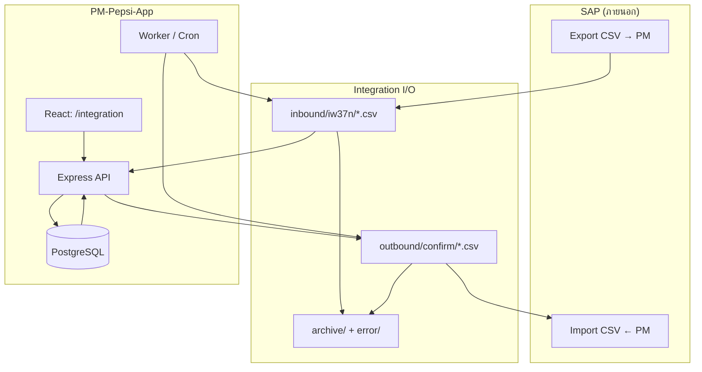
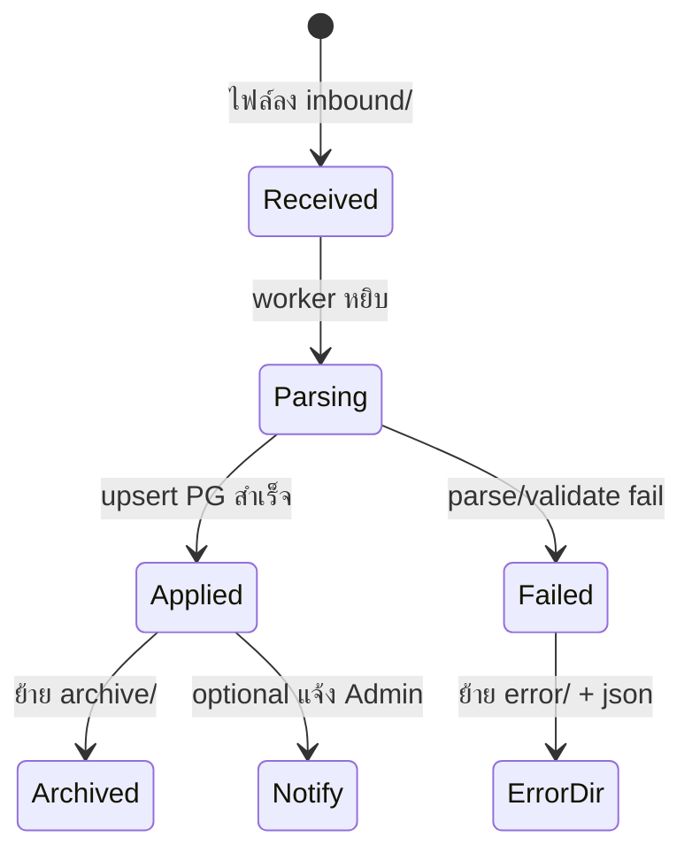

# ลำดับที่ 15 — การเชื่อม SAP ผ่าน CSV (ออกแบบระบบใหม่)

**สถานะ:** ออกแบบ — 2026-05-22  
**บริบท:** SAP ส่งข้อมูลเข้า PM เป็น **ไฟล์ CSV** · PM ส่งข้อมูลกลับ SAP เป็น **ไฟล์ CSV** (นำไป load ใน SAP เอง)  
**ไม่ใช้ SAP API โดยตรง** — ใช้ **สัญญาไฟล์ (file contract)** + job อัตโนมัติ + UI มนุษย์

**อ้างอิงของเดิม:** [`07-iw37n.md`](07-iw37n.md) · [`09-confirmation.md`](09-confirmation.md) · `M_iw37n.php` · `M_Confirm.php` · `M_Export_confirm_excel.php`

---

## 1) หลักการออกแบบ

| หลัก | รายละเอียด |
|------|------------|
| **CSV เป็นสัญญาหลัก** | รองรับ `.csv` (UTF-8, comma หรือ tab) เป็นค่าเริ่มต้นสำหรับ SAP · `.xlsx` เป็นทางเลือก (มี parser แล้ว) |
| **แยก Inbound / Outbound** | โฟลเดอร์และ API คนละทิศ · ไม่ปนไฟล์ |
| **Idempotent** | ไฟล์ซ้ำ = ตรวจ SHA256 + batch id (มี `tbiw37n_import_batch` แล้ว) |
| **รายงานรายแถว** | ทุก import/export ได้ log แถว (inserted/updated/skipped/error) — เทียบ PHP หลัง upload |
| **คน + Auto** | อัปโหลดมือได้ · job สแกนโฟลเดอร์ได้ · export ตามเวลา/cron ได้ |
| **Audit** | ทุก job บันทึก `audit-log` (action เช่น `integration.iw37n.in`, `integration.confirm.out`) |

---

## 2) ภาพรวม Data flow



---

## 3) ประเภทไฟล์ (Message types)

| รหัส | ทิศทาง | ต้นทาง PHP | ตารางหลัก | React วันนี้ |
|------|--------|------------|-----------|--------------|
| **IW37N_IN** | SAP → PM | `M_iw37n` / `iw37n.xlsx` | `tbiw37n` | `/iw37n` import · parser รองรับ CSV แล้ว |
| **CONFIRM_IN** | SAP → PM (ถ้ามี) | `M_Confirm.php` | `tbcofirm` | อัปโหลดมือ + `inbound/confirm` watch ✅ |
| **CONFIRM_OUT** | PM → SAP | `M_Export_confirm*` | `view_exportconfirm` | Export **xlsx** + **CSV** (`GET /api/v1/confirmation/export.csv`) ✅ |
| **IW37N_OUT** | PM → SAP (อนาคต) | — | `view_order`? | ออกแบบไว้ ยังไม่บังคับ phase 1 |

**Phase 1 โฟกัส:** `IW37N_IN` + `CONFIRM_OUT` (ตรง pain ที่ user บอก)

---

## 4) สัญญาไฟล์ CSV

### 4.1 IW37N_IN (นำเข้าใบงานจาก SAP)

- **Encoding:** UTF-8 (BOM ได้) · delimiter: `,` หรือ `\t` (auto-detect เหมือน `iw37n-parser.ts`)
- **Header:** ข้าม **2 แถวแรก** (คง parity PHP)
- **คีย์ upsert:** `wkorder` + `opac`
- **วันที่:** `DD.MM.YYYY` ใน `bscstart` / `actfinish`
- **คู่มือคอลัมน์:** ดู [`07-iw37n.md`](07-iw37n.md) ตาราง index

**ชื่อไฟล์แนะนำ (auto):**

`IW37N_YYYYMMDD_HHmmss.csv` หรือ `iw37n.csv` (ถ้า single drop)

### 4.2 CONFIRM_OUT (ส่งกลับ SAP)

อิงคอลัมน์ `M_Export_confirm_excel.php` (แถวที่ 1 = header):

| คอลัมน์ | ฟิลด์ | รูปแบบ |
|---------|------|--------|
| (ลำดับ) | no | 1..n |
| Comfirmation | (ว่างใน PHP) | |
| Order | wkorder | |
| Operation | opac | |
| SubO, Ca.., Split | (ว่าง) | |
| Wrk Ctr | wkctr | |
| Act.Work | timewk | ตัวเลข |
| unit | unitc | Min |
| Start date Exe. | stdate | `DDMMYYYY` |
| End Date Exe. | endate | `DDMMYYYY` |
| Start Execute | stdate | `HH:mm` |
| End Execute | endate | `HH:mm` |

**กรองข้อมูล (คง PHP):**

- `syst IN ('CRTD','REL')`
- `PAC007` / `PRO005` → ทุกใบ · อื่นๆ → `cwkctr = ช่างที่ login`

**ชื่อไฟล์แนะนำ:**

`CONFIRM_OUT_YYYYMMDD_HHmmss.csv` — SAP team รู้ว่าเป็น batch ไหน

### 4.3 CONFIRM_IN (ถ้า SAP ส่ง confirmation กลับเข้า PM)

- ใช้แมปเดียว `confirmation-import.ts` (คอลัมน์ Row 0,3,6,7…)
- รองรับ CSV: ข้าม 2 แถว · delimiter auto

---

## 5) โครงสร้างโฟลเดอร์ (Production)

```
data/integration/
  inbound/
    iw37n/          # SAP วางไฟล์ หรือ SFTP landing
    confirm/        # optional CONFIRM_IN
  outbound/
    confirm/          # PM สร้างให้ SAP มาเก็บ
    iw37n/            # optional อนาคต
  processing/         # กำลัง parse
  archive/
    inbound/YYYY-MM/
    outbound/YYYY-MM/
  error/              # ไฟล์ + .error.json
```

**Windows dev:** `PM-Pepsi-App/backend/data/integration/...` (gitignore)

---

## 6) สถาปัตยกรรมซอฟต์แวร์

### 6.1 ชั้นบริการ

| ชั้น | หน้าที่ |
|------|--------|
| **Parser** | `iw37n-parser`, `confirmation-import` (+ `csvWriter` ใหม่) |
| **Integration service** | `scanInbound()`, `runIw37nJob()`, `buildConfirmOutCsv()`, `archiveFile()` |
| **API** | upload มือ · trigger job · download outbound · ดูสถานะ batch |
| **Worker** | `node scripts/integration-watch.ts` หรือ cron ทุก N นาที |
| **UI** | `/integration` — ศูนย์รวม SAP CSV |

### 6.2 ตาราง DB (ขยายจากของเดิม)

| ตาราง | ใช้ |
|-------|-----|
| `tbiw37n_import_batch` | มีแล้ว — เพิ่มคอลัมน์ `source` (`manual`/`sap_folder`/`api`) |
| `tbiw37n_import_row` | มีแล้ว |
| **ใหม่** `app.integration_job` | job id, type, file_path, sha256, status, summary json, started_at, finished_at |
| **ใหม่** `app.integration_file` | เก็บ metadata ไฟล์ inbound/outbound |

ไม่ต้อง duplicate ข้อมูลธุรกิจ — ใช้ batch เดิม + job เป็นดัชนี

### 6.3 API ที่แนะนำ (v1)

| Method | Path | งาน |
|--------|------|-----|
| POST | `/api/v1/integration/iw37n/import` | เทียบ `/iw37n/import` (หรือ alias) |
| GET | `/api/v1/integration/iw37n/batches` | รายการ batch |
| GET | `/api/v1/integration/iw37n/batches/:id/report.csv` | log รายแถว (มีแนวใน iw37n แล้ว) |
| GET | `/api/v1/confirmation/export.csv` | CONFIRM_OUT CSV (phase 1 — มีแล้ว) |
| POST | `/api/v1/integration/confirm/export` | facade อนาคต (phase 2) |
| GET | `/api/v1/integration/confirm/export/latest` | ดาวน์โหลดไฟล์ล่าสุด |
| POST | `/api/v1/integration/jobs/run` | Admin: สแกน inbound ทันที |
| GET | `/api/v1/integration/jobs` | ประวัติ job |

**คง route เดิม** `/iw37n`, `/confirmation` ได้ — `/integration` เป็น facade ไม่บังคับเปลี่ยน URL เก่า

---

## 7) UI ระบบใหม่

### 7.1 หน้า `/integration` (ศูนย์ SAP CSV)

แท็บ:

1. **นำเข้า IW37N** — อัปโหลด CSV · ดู batch · ดาวน์โหลด error report  
2. **ส่งออก Confirm → SAP** — ปุ่ม Generate CSV · ตัวอย่าง 20 แถว · ดาวน์โหลด · แสดง scope (ALL/OWN)  
3. **Job & โฟลเดอร์** — สถานะ watch · ไฟล์ใน inbound/outbound · ปุ่ม Run now  
4. **คู่มือสัญญาไฟล์** — ลิงก์ template CSV ตัวอย่าง

### 7.2 หน้าเดิม (ยังใช้ได้)

- `/iw37n` — power user  
- `/confirmation` — ปิดงาน + import confirm มือ  
- Export Confirm → ปุ่ม **Download CSV for SAP** คู่กับ Excel ✅ (`/confirmation`, `/confirmation/export`)

---

## 8) Pipeline อัตโนมัติ (Auto)



| ขั้น | Auto |
|------|------|
| สแกนโฟลเดอร์ | ทุก 5–15 นาที (ตั้งใน Admin Settings) |
| หลัง IW37N_IN สำเร็จ | invalidate calendar / work-orders cache |
| CONFIRM_OUT | cron รายวัน 18:00 หรือ on-demand หลัง Admin กดปิดงานครบ |
| แจ้งเตือน | in-app + (phase 2) email ถ้า job fail |

---

## 9) ความปลอดภัย & สิทธิ์

### 9.1 ตาราง permission (catalog `tbl_permission`)

| รหัส | กลุ่ม | ใช้เมื่อ |
|------|--------|---------|
| `iw37n.read` | iw37n | ดูรายการ/batch · export รายงาน batch |
| `iw37n.import` | iw37n | อัปโหลด IW37N · สแกน `inbound/iw37n` (คู่กับ integration) |
| `iw37n.export` | iw37n | (สงวนอนาคต) |
| `confirmation.read` | confirmation | ดู/ปิดงาน · **export Excel/CSV SAP วันนี้** |
| `confirmation.import` | confirmation | อัปโหลด Confirm · สแกน `inbound/confirm` |
| `confirmation.export` | confirmation | มีใน catalog — **ยังไม่ผูก middleware** (ใช้ `confirmation.read` แทน) |
| `integration.admin` | integration | ศูนย์ `/integration` · รัน watch job แบบเต็ม (migration 075) |

### 9.2 สิทธิ์ที่ API บังคับจริง (React backend)

| งาน | Endpoint | Permission ที่ตรวจ |
|------|----------|-------------------|
| อัปโหลด IW37N | `POST /api/v1/iw37n/import` | `iw37n.import` |
| สแกนโฟลเดอร์ IW37N | `POST /api/v1/integration/jobs/run` | `integration.admin` **หรือ** `iw37n.import` |
| สแกนโฟลเดอร์ Confirm IN | `POST .../integration/jobs/run` | `integration.admin` **หรือ** `confirmation.import` |
| ดูสถานะโฟลเดอร์ / ประวัติ job | `GET /api/v1/integration/status`, `.../jobs` | `integration.admin` **หรือ** `iw37n.read` |
| Export Confirm → SAP | `GET .../confirmation/export`, `.xlsx`, `.csv` | `confirmation.read` |
| อัปโหลด Confirm มือ | `POST /api/v1/confirmation/import` | `confirmation.import` |

**Audit (สำเร็จแล้ว):** `iw37n.import` · `confirmation.import` · `integration.iw37n.in` · `integration.confirm.in` → `tbl_audit_log`

**Advisory lock:** สแกนโฟลเดอร์ทีละ job ต่อ DB (`integration-lock`) — กันซ้ำกับ backup lock คนละ key

### 9.3 บทบาทเริ่มต้น (migration 046 + 075)

| Role | IW37N import | Confirm import | Confirm export (read) | `integration.admin` |
|------|--------------|----------------|------------------------|---------------------|
| **A** Admin | ✅ ทุก perm | ✅ | ✅ | ✅ (075) |
| **U** Planner | ✅ | ❌ (ไม่ในรายการ 046) | ✅ `confirmation.read` | ✅ (075) |
| **H** Manager | ❌ | ❌ | ✅ read/export* | ตาม matrix |
| **W** Technician | ❌ | ❌ | ✅ read + write/close | ❌ |

\* Manager ได้ `.read` / `.export` ผ่านกฎ role H ใน `has-permission.ts`

### 9.4 ขอบเขตข้อมูล (ไม่ใช่ RBAC code)

| งาน | กฎ |
|------|-----|
| **CONFIRM_OUT** | `PAC007` / `PRO005` → ทุกแถวใน `view_exportconfirm` · อื่นๆ → `cwkctr` = wkctr ผู้ login (`listConfirmationExportRows`) |
| **ไฟล์ซ้ำ IW37N** | SHA256 ใน `tbiw37n_import_batch` — ไม่ upsert ซ้ำ |
| **โฟลเดอร์ dev** | `backend/data/integration/` ใน `.gitignore` — ไม่ commit ไฟล์ SAP |

### 9.5 UI / เมนู

| Route | เข้าเมนูเมื่อ | แท็บย่อย |
|-------|--------------|----------|
| `/integration` | `iw37n.read` หรือ `integration.admin` | IW37N · Confirm IN (`confirmation.import`) · Confirm OUT (`confirmation.read`) · Jobs · คู่มือ |
| `/iw37n` | `iw37n.read` | อัปโหลด + watch (ถ้ามี import/admin) |
| `/confirmation` | `confirmation.read` | import ถ้ามี `confirmation.import` |

### 9.6 ช่องว่างที่อาจ tighten ภายหลัง (ไม่บล็อก parity)

| รายการ | สถานะ |
|--------|--------|
| ผูก `confirmation.export` แทน `confirmation.read` ที่ export SAP | แนะนำ production |
| จำกัด `GET /integration/*` เฉพาะ `integration.admin` | เข้มกว่า doc เดิม |
| Grant `confirmation.import` ให้ Planner ถ้า SAP ส่ง Confirm IN จริง | นโยบายธุรกิจ |

---

## 10) แผน implement (แนะนำ)

> Checklist รวม Phase 0–8 (ลูกค้า + UX + parser): [**`../WORK-PHASES.md`**](../WORK-PHASES.md)

| Phase | งาน | ผล |
|-------|-----|-----|
| **1** | `GET .../confirmation/export.csv` — คอลัมน์ตรง SAP · UI ปุ่มดาวน์โหลด | ✅ ทำแล้ว |
| **2** | หน้า `/integration` รวม IW37N + Confirm export | ✅ ทำแล้ว |
| **3** | `integration_job` + worker สแกน `inbound/iw37n` | ✅ ทำแล้ว |
| **4** | CONFIRM_IN จาก CSV ใน inbound (ถ้า SAP ส่งกลับ) | ✅ `inbound/confirm` + `importConfirmFile` |
| **5** | SFTP / email drop (ops) | production hardened |

**ไม่บล็อก parity ปัจจุบัน** — phase 1 ทำได้ทันทีบน API ที่มี

---

## 11) สิ่งที่มีแล้ว vs ต้องทำ

| รายการ | สถานะ |
|--------|--------|
| Parse IW37N จาก CSV | ✅ `iw37n-parser.ts` |
| Import batch + row log | ✅ migration 006, 030 |
| Export IW37N batch report CSV | ✅ `iw37n/batches/:id/export.csv` |
| Export Confirm Excel | ✅ `confirmation/export.xlsx` |
| Export Confirm **CSV for SAP** | ✅ `GET /api/v1/confirmation/export.csv` · `buildConfirmationExportSapCsv` |
| Watch folder job | ✅ scheduler + `POST /integration/jobs/run` + `npm run integration:watch` |
| หน้า `/integration` | ✅ 5 แท็บ · เมนู sidebar |
| CONFIRM_IN watch `inbound/confirm` | ✅ migration 076 · `runInboundIntegrationScan` |

---

## 13) ไฟล์ตัวอย่างจากลูกค้า (`from customer/`)

อัปเดต probe: **2026-05-22** · รายละเอียดเต็ม: [`../customer-requirements/SAP-SAMPLE-PROBE.md`](../customer-requirements/SAP-SAMPLE-PROBE.md) · สารบัญ: [`../customer-requirements/CATALOG.md`](../customer-requirements/CATALOG.md)

### 13.1 ผลตรวจ parser (สรุป)

| ไฟล์ลูกค้า | Detect | ผล parse (2026-05-22) |
|------------|--------|------------------------|
| `SAP data/Data/IW37N ล่าสุด.xlsx` | `sap_alv` | **1163** แถว OK |
| `Test/IW37N (27May).xls` | `legacy` | **1183** แถว OK |
| `AcZB02,ZB05-Done.xlsx` | `sap_alv` | **749 OK** / 137 err (`END_BEFORE_START` ในข้อมูล SAP) |
| `SAP data/Data/Confirm WO.xls` | `sap_alv` | **49 OK** / 0 err — ชุดเล็ก regression (มี banner ALV ไม่ใช่ M_Confirm แบบ skip-2) |

### 13.2 กติกา SAP ALV (IW37N)

- แถว 1–3: banner / ว่าง · แถว 4: header (มักมีคอลัมน์ `S` นำ)
- ข้อมูล: index คอลัมน์ **+2** จาก layout PHP (`Order` อยู่ index 3 ไม่ใช่ 1)
- Auto-detect: ถ้าแถว 1 มีข้อความ `Dynamic List Display` → ใช้ ALV

### 13.3 กติกา SAP ALV (Confirm IN)

- ตรวจ `Dynamic List Display` → `layout: sap_alv` · หาแถว header (`Confirm.` + `Order`) แล้วแมปชื่อคอลัมน์
- Layout `M_Confirm.php` (skip 2 แถว, index 0..19 คงที่) = โหมด **`legacy`** — ใช้เมื่อไม่มี banner ALV
- `AcZB02,ZB05-Done.xlsx` = ชุดใหญ่ ZB02/ZB05 · `Confirm WO.xls` = ชุดเล็ก (~49 แถว) คนละ header แต่ทั้งคู่เป็น **ALV**
- ไฟล์ `AcZB02,ZB05-Done.xlsx` = Confirmation IN **ไม่ใช่ IW37N**

### 13.4 รันตรวจซ้ำ

```powershell
cd PM-Pepsi-App/backend
npx tsx scripts/inspect-iw37n-sample.ts "…/from customer/SAP data/Data/IW37N ล่าสุด.xlsx"
npx tsx scripts/inspect-confirm-sample.ts "…/from customer/AcZB02,ZB05-Done.xlsx"
```

### 13.6 รายงานประชุมลูกค้า (เม.ย.–พ.ค. 2569)

สรุปเต็ม: [`../customer-requirements/MEETING-MINUTES.md`](../customer-requirements/MEETING-MINUTES.md)

| หัวข้อประชุม | ผลต่อ integration |
|--------------|-------------------|
| Import Excel SAP → Scheduling/Tracking | โฟกัส `IW37N_IN` + UI `/integration` |
| รอบส่งข้อมูล SAP **07:00 / 19:00** | Watch folder **ไม่แทน** manual upload — ผู้ใช้ไม่ต้องรอรอบเดียว · คำอธิบายไทย: [`SAP-SCHEDULE-AND-WORK-HOURS.md`](../customer-requirements/SAP-SCHEDULE-AND-WORK-HOURS.md) |
| **Mass Confirm 44** + export กลับ SAP | `CONFIRM_OUT` CSV มีแล้ว · **bulk confirm** ยังต้องทำ |
| ชื่อ IW37 / IW37N | อธิบายลูกค้า = รายงานใบงาน SAP → ไฟล์ใน `inbound/iw37n` |

### 13.5 งานถัดไป (บล็อก UAT ลูกค้า)

| ลำดับ | งาน |
|------|-----|
| 1 | Implement auto-detect + `sap_alv_iw37n` ใน `iw37n-parser.ts` |
| 2 | Implement `sap_alv_confirm` ใน `confirmation-import.ts` |
| 3 | UAT import ผ่าน `/integration` แล้วตรวจ `/calendar`, `/work-orders`, `/summary-weekly` |
| 4 | UX ระบบเก่า (bulk team, ปฏิทินไม่หาย): [`../customer-requirements/LEGACY-ISSUES-CHECKLIST.md`](../customer-requirements/LEGACY-ISSUES-CHECKLIST.md) |

---

## 12) บันทึกการอัปเดต

| วันที่ | สรุป |
|--------|------|
| 2026-05-22 | Parser ALV ใน `iw37n-parser.ts` + `confirmation-import.ts` (รวม Confirm WO.xls 49/49) |
| 2026-05-21 | §13.6 — สรุปรายงานประชุมลูกค้าครั้งที่ 1–2 → `MEETING-MINUTES.md` |
| 2026-05-21 | §13 — probe ไฟล์ `from customer/` · สรุป ALV vs legacy · ลิงก์ `docs/customer-requirements/` |
| 2026-05-22 | ออกแบบระบบใหม่ — SAP CSV inbound/outbound · ศูนย์ integration · auto pipeline |
| 2026-05-21 | Phase 1 — `export.csv` + ปุ่ม **Download CSV for SAP** บน `/confirmation` และ `/confirmation/export` |
| 2026-05-21 | Phase 3 — watch folder: migration 075 · scan `data/integration/inbound/iw37n` · UI บน `/iw37n` |
| 2026-05-21 | Phase 2 — หน้า `/integration` (IW37N · Confirm export · Jobs · คู่มือ) |
| 2026-05-21 | Phase 4 — CONFIRM_IN จาก `inbound/confirm` · แท็บนำเข้า Confirm บน `/integration` |
