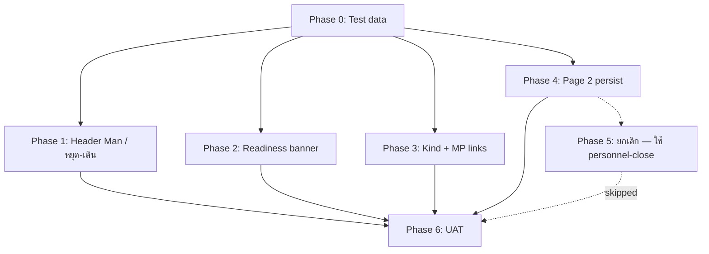

# PM Measurements (`/pm-vibration`) — แผน Phase การปรับปรุง

**อัปเดต:** 2026-06-21  
**สถานะ:** implement Phase 0–4 ✅ · Phase 5 ยกเลิก · **รอ UAT sign-off** [`PM-VIBRATION-UAT-SIGNOFF.md`](PM-VIBRATION-UAT-SIGNOFF.md)  
**อ้างอิง:** [`PM-VIBRATION-UAT-SIGNOFF.md`](PM-VIBRATION-UAT-SIGNOFF.md) · [`PM-VIBRATION-DATA-BINDING-AUDIT.md`](PM-VIBRATION-DATA-BINDING-AUDIT.md) · [`PM-VIBRATION-MNTPLAN-FIELD-BINDING.md`](PM-VIBRATION-MNTPLAN-FIELD-BINDING.md) · [`PM-VIBRATION-PAGE2-SPEC.md`](PM-VIBRATION-PAGE2-SPEC.md) · [`PM-MANUAL-ENTRY-WORK-ORDER-FORM.md`](../customer-requirements/PM-MANUAL-ENTRY-WORK-ORDER-FORM.md) · [`PM-VIBRATION-DST-DB-SPEC.md`](../customer-requirements/PM-VIBRATION-DST-DB-SPEC.md) · [**Design proposal (เสนอลูกค้า)**](../customer-requirements/PM-VIBRATION-DST-DB-DESIGN-PROPOSAL.md)

---

## 1) สรุปเป้าหมาย

ปรับปรุงหน้า http://localhost:5173/pm-vibration ให้:

1. แสดงสถานะความพร้อมข้อมูล (mntplan / tasklist / readings)
2. กรองค่าวัดตาม `kind` ถูกต้อง + ลิงก์ PM จาก Master Plan แม่นขึ้น
3. เก็บฟิลด์ SAP หน้า 2 ตามสเปก PDF
4. ปรับ **Header หน้า 1** ตาม feedback ลูกค้า (เอาออก / เปลี่ยน label และแหล่งข้อมูล)

---

## 2) ข้อกำหนดจากลูกค้า (ยืนยันแล้ว)

### 2.1 เอาออกจากฟอร์ม Header (หน้า 1)

| ฟิลด์ปัจจุบัน | แหล่งเดิม | การทำ |
|---------------|-----------|--------|
| **Work Centre** | `tbiw37n.wkctr` → `woHeader.workCentre` | **ลบออกจาก header grid** · **คงไว้ใน Operation row** (`operationWorkCentre`) |
| **Priority** | `woHeader.priority` (ว่าง) | **ลบออกจาก UI** |
| **End Date** | `tbiw37n.actfinish` → `woHeader.endDate` | **ลบออกจาก UI** |
| **Description** (บล็อกกลาง) | `woHeader.description` (`ostdescription` / zone) | **ลบออกจาก UI** — ตัวอย่าง: `Sheeting & Cutting Unit` |
| **Object list** + **No objects found** | `woHeader.objectList` | **ลบทั้งส่วนออกจาก UI** |

> **ไม่เอาออก:** Description **คู่** Functional Location / Equipment (แถว 1–2) — ยังใช้ `FunctLocDescrip.` / `Equipment descriptn` ตาม §2.3

> **หมายเหตุ:** บล็อกกลางวันนี้แสดง `Description` + `No Permits Found` + `Header Short Text` — หลังแก้เหลือ **Header Short Text** อย่างเดียว (และอาจเอา Permits ออกใน Phase 1 ถ้าลูกค้า confirm)

### 2.1b โครงบล็อกกลาง — ก่อน vs หลัง (จากภาพ markup ลูกค้า)

**ก่อน (โค้ดวันนี้):**
```text
Description: Sheeting & Cutting Unit     ← เอาออก
No Permits Found
Header Short Text: 369039 & P14-NI-EE      ← เปลี่ยนเป็น mntplan
─────────────────
Object list:                               ← เอาออก
No objects found                            ← เอาออก
```

**หลัง (เป้าหมาย):**
```text
Header Short Text: 345969                  ← จาก IW37N MntPlan → mntplan
```

### 2.2 เปลี่ยน label และแหล่งข้อมูล

| เดิม (SAP print) | ใหม่ | แหล่งข้อมูล |
|------------------|------|-------------|
| **Tech Id** (`P14` จาก `idwkctrtype` / `team`) | **Man** | คอลัมน์ **`Man`** ใน Master Plan → publish → `tbtasklist.pmman` · **แสดงตัวเลข headcount** (1, 2) **ไม่ใช่รหัสทีม** |
| **Sys Condi** (hardcode `-`) | **หยุด / เดิน** | คอลัมน์ **`หยุด`** หรือ **`เดิน`** ใน Master Plan → `tbtasklist.machinestatus` |

### 2.3 ฟิลด์ IW37N / MntPlan (ยืนยัน 2026-06-21)

ดูรายละเอียด: [`PM-VIBRATION-MNTPLAN-FIELD-BINDING.md`](PM-VIBRATION-MNTPLAN-FIELD-BINDING.md)

| ฟิลด์ UI | แหล่ง | Gap โค้ด |
|---------|-------|----------|
| **Start Date** | IW37N `Bsc start` → `bscstart` | ✅ ตรงแล้ว |
| **Functional Location** | IW37N `Functional Loc.` → `functionalloc` | ✅ ตรงแล้ว |
| **Description (แถว FL)** | IW37N `FunctLocDescrip.` → `funcdescrip` | ❌ วันนี้ mix equdescrip/ost — ต้องแก้ |
| **Equipment** | IW37N `Equipment` → `equipment` | ✅ ตรงแล้ว |
| **Description (แถว Equipment)** | IW37N `Equipment descriptn` → `equdescrip` | ❌ วันนี้ splitDescription — ต้องแก้ |
| **Header Short Text** | IW37N `MntPlan` → `mntplan` | ❌ วันนี้ใช้ `operationshorttext` |
| **คีย์ join แผน** | `mntplan` = `Maintenance Plan` (MP) | ✅ join tasklist ตรงแล้ว |

### 2.4 Operation · Operation Long Text · Completion (ยืนยัน markup ภาพ)

| ฟิลด์ | แหล่ง | หมายเหตุ |
|-------|-------|----------|
| **Operation** | IW37N `OpAc` → `opac` | ✅ ตรงแล้ว |
| **Operation Text** | MP `days` → `{n}W` + ข้อมูลแผนใต้ `mntplan` | ❌ วันนี้ใช้ IW37N |
| **Operation Long Text** | MP **`PM List`** ทุกแถวใต้ maintenance plan | ❌ วันนี้แสดง machine เป็นหลัก |
| **Completion Date / Duration** | **ช่างกรอก** (บนกระดาษ) | **ไม่ persist แยก** — ใช้ **personnel-close** + **Page 2 auto** แทน (ยืนยันลูกค้า) |

รายละเอียด: [`PM-VIBRATION-MNTPLAN-FIELD-BINDING.md`](PM-VIBRATION-MNTPLAN-FIELD-BINDING.md) §3

**กฎคงที่:** `mntplan` / Maintenance Plan **ไม่เปลี่ยนทุกรอบ** · `wkorder` **เปลี่ยน** เมื่อ SAP ส่ง WO ใหม่

**กฎแสดงผล Sys Condi (หยุด/เดิน):**

| `machinestatus` | แสดง |
|-----------------|------|
| `1` | **หยุด** |
| อื่นๆ / null | **เดิน** |

(สอดคล้อง `WorkOrderTaskListPanel` · `machineStatusMeta`)

**กฎแสดงผล Man:** *(ยืนยันลูกค้า 2026-06-21)*

| แหล่ง | ค่า |
|-------|-----|
| Task แรกของ WO (`taskList.items[0]`) | `pmman` จาก `tbtasklist` — **ตัวเลขจำนวนช่าง** (เช่น `1`, `2`) |
| WO หลาย task | Man + หยุด/เดิน จาก **task แรก** (ไม่ aggregate) |
| Fallback | `—` ถ้าไม่ publish Master Plan |

**Implement:** `formatManValue()` + `buildWoPmFormHeader(firstTask)` ✅

---

## 3) สถานะปัจจุบัน vs เป้าหมาย

| หัวข้อ | วันนี้ | เป้าหมาย |
|--------|--------|----------|
| Status banner | WO เลือกแล้ว / สิทธิ์ write / loading | + mntplan, tasklist count, readings count, publish hint |
| Header grid | WC, Priority, End Date, Tech Id, Sys Condi | เอา 3 ฟิลด์ออก · Man + หยุด/เดิน จาก MP |
| `filterReadingsForTask` | กรองแค่ machine + pmlist | + กรอง `kind` ✅ |
| Vibration ค่าวัด | แกน X/Y/Z · mm/s | **Dst + dB** · ตาราง Time \| Dst \| dB · **ช่าง manual entry** |
| Master Plan → PM link | `suggestsPm3Phase(pmlist)` รวม vibration | แยก current vs vibration Dst/dB · ส่ง machine/pmlist ใน URL (optional) |
| Page 2 | Comments persist · ฟิลด์อื่น local state | persist ครบ §4 สเปก PDF |
| Completion §1.4 | UI local (optional) | **ไม่ persist** · วันที่/ชื่อช่างจาก personnel-close → Page 2 ✅ |

---

## 4) แผน Phase (ลำดับแนะนำ)

```text
Phase 0 ─ ข้อมูลทดสอบ (IW37N + MP publish)
    │
Phase 1 ─ Header: เอาออก + Man / หยุด-เดิน
    │
Phase 2 ─ Data readiness banner
    │
Phase 3 ─ Kind filter + Master Plan PM links
    │
Phase 4 ─ Persist Page 2 (Comments + ฟิลด์ SAP) ✅
    │
Phase 5 ─ ~~Completion persist~~ **ยกเลิก** — personnel-close + Page 2 auto พอ
    │
Phase 6 ─ UAT + sign-off
```

Phases 1–3 ทำคู่ขนานได้บางส่วน แต่ **Phase 0 ควรทำก่อน UAT ทุก phase**

---

## Phase 0 — เตรียมข้อมูลทดสอบ

**เป้าหมาย:** มี WO + Master Plan + tasklist ครบสำหรับ UAT chain

### Checklist

- [x] Import IW37N — **เสร็จ** (1,651 แถว · batch #2 `IW37N ล่าสุด.xls` + batch #3 `Templete IW37N on PM App - ZB02All 1.xlsx`)
- [x] Import Master Plan ครบ 3 ไฟล์ — **เสร็จ** (EE / ME / PK 2026)
- [x] **Publish** Master Plan → `tbtasklist` — **เสร็จ** (EE + ME + PK published · **6,497 แถว** · `pmman` / `machinestatus` ครบ)
- [x] ตรวจ SQL: WO + tasklist join — **ผ่าน** (WO `4000126314` → mntplan `346012` · WO `4001565681` ไม่มีใน DB)
- [x] Login บัญชี `confirmation.write` — **ผ่าน** (ADMIN01 login + modal-detail API ทดสอบแล้ว)

**ตรวจ DB เร็ว:** `node PM-Pepsi-App/backend/scripts/check-phase0-data.mjs`  
**ตรวจ /pm-vibration API:** `npx tsx PM-Pepsi-App/backend/scripts/test-pm-vibration-http.mjs`

### SQL ตรวจเร็ว

```sql
SELECT wkorder, mntplan FROM app.tbiw37n WHERE wkorder = '4001565681';

SELECT machine, pmlist, pmman, machinestatus, mntplan
FROM app.tbtasklist
WHERE TRIM(mntplan) = '<mntplan จาก WO>';
```

---

## Phase 1 — Header หน้า 1: เอาออก + Man / หยุด-เดิน

**เป้าหมาย:** UI ตรง feedback ลูกค้า · ข้อมูล Man และ หยุด/เดิน มาจาก Master Plan (via tasklist)

### Backend

- [x] ขยาย `modal-detail.taskList.items[]` ให้มี `pmman`, `pmday`
- [x] ขยาย `buildWoPmFormHeader()` — `funcdescrip`, `equdescrip`, `mntplan`, Man, หยุด/เดิน
- [x] `getWorkOrderViewRow` — SELECT `i.funcdescrip`
- [x] `woPmFormHeaderSchema` + test `wo-pm-form-header.test.ts`
- [x] **`buildOperationTextFromTask`** — compose จาก MP `{pmday}W - {planLabel}`
- [x] modal-detail — ส่ง `operationLongText[]`, `pmman`, `pmday` ต่อ task
- [x] `WorkOrderPmSapPrintForm` — แสดง numbered PM List ก่อนตาราง R/S/T

### Frontend

- [x] `WorkOrderPmSapPrintForm.tsx` — ลบ WC/Priority/End Date, Description กลาง, Object list, Permits
- [x] แสดง **Man** / **หยุด·เดิน** + **Header Short Text** (= mntplan)
- [x] numbered PM List ก่อนตาราง R/S/T
- [x] i18n `pmVibration.json` + `workOrderModalDetailSchema`

### Checklist UAT Phase 1

- [x] เลือก WO ที่ publish MP แล้ว → Header แสดง **Man** ตรงคอลัมน์ Excel — **4001567009 · Man=1** (Playwright 2026-06-21)
- [x] แถวที่ `หยุด`=1 → แสดง **หยุด** · แถว `เดิน` → แสดง **เดิน**
- [x] ไม่เห็น Work Centre / Priority / End Date ใน header grid
- [x] **ไม่เห็น** Description กลาง (`Sheeting & Cutting Unit` ฯลฯ)
- [x] **ไม่เห็น** Object list / No objects found
- [x] Header Short Text = เลข **mntplan** จาก IW37N — **610000004112** / **346012**
- [x] WO ไม่มี tasklist → Man / หยุด-เดิน แสดง `—` — **4000126314** (banner Phase 2 แยก)

**Sign-off Phase 1:** ✅ **2026-06-21** — UAT อัตโนมัติ `e2e/pm-vibration-phase1-uat.spec.ts` 2/2 ผ่าน

### ไฟล์ที่แตะ

| ไฟล์ |
|------|
| `backend/src/lib/wo-pm-form-header.ts` |
| `backend/src/services/work-orders.ts` |
| `backend/src/schemas/work-orders.ts` |
| `frontend/src/components/pm-vibration/WorkOrderPmSapPrintForm.tsx` |
| `frontend/src/i18n/locales/{th,en}/pmVibration.json` |
| `frontend/src/api/schemas.ts` |

---

## Phase 2 — Data readiness banner

**เป้าหมาย:** ช่างเห็นทันทีว่า WO พร้อมกรอก PM หรือยัง

### Logic แสดง banner

| เงื่อนไข | สถานะ | ข้อความ (ตัวอย่าง) |
|----------|--------|---------------------|
| ไม่เลือก WO | ⚠ | เลือก Work Order ก่อน |
| `mntplan` ว่าง | ⚠ | IW37N ไม่มี Maintenance Plan — ไม่ดึง task ได้ |
| `taskList.items` ว่าง | ⚠ | ยังไม่มี Task List — Publish Master Plan ที่ mntplan ตรงกัน |
| ไม่มี task `current_3phase` / `vibration_dst_db` | ℹ | ไม่มีจุดวัด PM — กรอก manual ได้ |
| `readings.length === 0` | ℹ | ยังไม่มีค่าวัดที่บันทึก |
| ครบ | ✓ | พร้อมบันทึกค่าวัด |

### Backend (optional แต่แนะนำ)

- [x] เพิ่ม `dataReadiness` ใน `modal-detail` response

```typescript
{
  mntplan: string
  tasklistPublished: boolean  // count > 0
  taskCount: number
  currentTaskCount: number
  vibrationTaskCount: number
  readingCount: number
}
```

### Frontend

- [x] ขยาย `PmVibrationStatusBanner.tsx` — ใช้ `dataReadiness` จาก modal-detail
- [x] ผูกข้อมูลจาก `modal-detail` หลังเลือก WO (`PmVibrationPage.tsx`)
- [x] ลิงก์ action: «ไป Publish Master Plan» / «ไป IW37N»
- [x] i18n ข้อความ th/en (`readiness.*`)

### Checklist UAT Phase 2

- [x] WO ไม่มี mntplan → banner เหลือง + ลิงก์ IW37N — **4000126416** (Playwright 2026-06-21)
- [x] WO มี mntplan แต่ไม่ publish → แจ้ง publish MP + ลิงก์ `/master-plan` — **4000126314**
- [x] WO + tasklist + PM tasks → banner ไม่ warning · ✓ หลายข้อ — **4001567009** (readings=0 ใน seed → ℹ ยังไม่มีค่าวัด)
- [x] เปลี่ยน WO → banner อัปเดตทันที — **4001567009 ↔ 4000126314**

**Sign-off Phase 2:** ✅ **2026-06-21** — `e2e/pm-vibration-phase2-uat.spec.ts` 4/4 ผ่าน

### ไฟล์ที่แตะ

| ไฟล์ |
|------|
| `frontend/src/components/pm-vibration/PmVibrationStatusBanner.tsx` |
| `frontend/src/features/pm-vibration/PmVibrationPage.tsx` |
| `backend/src/services/work-orders.ts` (optional readiness object) |
| `frontend/src/i18n/locales/{th,en}/pmVibration.json` |

---

## Phase 3 — กรอง `kind` + ลิงก์ PM จาก Master Plan

**เป้าหมาย:** กราฟไม่ปน current/vibration · ลิงก์จาก MP เปิด PM ถูกประเภท

> **⚠ Vibration (2026-06-21):** ออกแบบ **Dst (Distortion) + dB** · ตาราง **Time \| Dst \| dB** — ดู [`PM-VIBRATION-DST-DB-DESIGN-PROPOSAL.md`](../customer-requirements/PM-VIBRATION-DST-DB-DESIGN-PROPOSAL.md) · **implement 3A.1 ตาม design · confirm ลูกค้าพรุ่งนี้**

### Checklist สรุป Phase 3

| ขั้น | รายการ | สถานะ |
|------|--------|--------|
| 3A | Kind filter | ✅ |
| Design | Dst/dB design proposal | ✅ draft |
| 3A.1 | UI + import Dst/dB | ✅ implement · UAT รอ sign-off |
| Meeting | Confirm Q1–Q6 ลูกค้า | ☐ |
| 3B | Master Plan PM links | ✅ |
| UAT | Phase 3 sign-off | ☐ |

---

### Workflow ช่าง — Manual entry (กระแส + Vibration)

> **หลักการ:** ช่างกรอกเองทุกค่า · ไม่ auto จากเครื่องวัด · กราฟ plot จาก readings ที่บันทึก  
> สิทธิ์: **`confirmation.write`** = กรอก+บันทึก · หัวหน้างาน = ดูอย่างเดียว

#### ภาพรวม (2 ทางเข้า)

```text
                    ┌─────────────────────────────────────┐
                    │  IW37N WO + Master Plan (publish)    │
                    │  → task list พร้อม (machine+pmlist)│
                    └─────────────────┬───────────────────┘
                                      │
              ┌───────────────────────┴───────────────────────┐
              ▼                                               ▼
    /pm-vibration                                    WO modal → แท็บ Task
    (หน้าหลัก PM ค่าวัด)                              (จาก IW37N / scheduling)
              │                                               │
              └───────────────────────┬───────────────────────┘
                                      ▼
                    ช่างเลือก WO → ระบบ prefill task จากแผน
                                      │
              ┌───────────────────────┴───────────────────────┐
              ▼                                               ▼
         Task กระแส 3 เฟส                              Task Vibration
    กรอก R · S · T (A)                          กรอก Dst · dB (+ Time)
              │                                               │
              └───────────────────────┬───────────────────────┘
                                      ▼
                              [ บันทึก ]
                                      ▼
                         tbwo_pm_reading (DB)
                                      ▼
                    ตาราง history + กราฟ (อัปเดตทันที)
```

#### ขั้นตอน — กระแส 3 เฟส

| # | ขั้น | รายละเอียด |
|---|------|------------|
| 1 | Login | บัญชีช่าง · มี `confirmation.write` |
| 2 | เปิด WO | `/pm-vibration` ค้นหา WO **หรือ** WO modal จาก IW37N |
| 3 | ดู Header | อ่านอย่างเดียว — FL, Equipment, mntplan, Man, หยุด/เดิน |
| 4 | เลือก task กระแส | ระบบ prefill เครื่องจักร + รายการ PM (เช่น Main Oil Pump) |
| 5 | กรอกค่า | **Mode A (WO กระดาษ):** วันเวลา 1 ชุด + **R · S · T (A)** ต่อจุด |
| 5b | *(ถ้าทำ trend)* | **Mode B:** ตาราง **Time \| R \| S \| T** · `+ เพิ่มแถวเวลา` |
| 6 | บันทึก | กดบันทึกต่อ task / บันทึกทุกแถว |
| 7 | ดูผล | กราฟ **3 เส้น** R/S/T · แกน X=Time · แกน Y=A |

#### ขั้นตอน — Vibration (Dst / dB)

| # | ขั้น | รายละเอียด |
|---|------|------------|
| 1–3 | เหมือนกระแส | Login · เปิด WO · ดู Header |
| 4 | เลือก task vibration | จุดวัด เช่น Motor Front · Pump Point#1 |
| 5 | กรอกค่า | **Mode A:** วันเวลา + **Dst + dB** (2 ช่อง) |
| 5b | *(ถ้าทำ trend)* | ตาราง **Time \| Dst \| dB** · `+ เพิ่มแถวเวลา` |
| 6 | บันทึก | → `v1`=Dst · `v2`=dB · `v3` ว่าง |
| 7 | ดูผล | กราฟ **2 เส้น** · dual Y-axis (Dst ~05–10 · dB ~30–50) |

#### ตัวอย่างจอ (Vibration · Mode B)

```text
Task: Main Oil Pump · Motor Front
┌────────┬─────┬─────┐
│ Time   │ Dst │ dB  │
├────────┼─────┼─────┤
│ 08:00  │  08 │  45 │  ← ช่างพิมพ์เอง
│ 09:00  │  07 │  42 │
│ 10:00  │  08 │  40 │
└────────┴─────┴─────┘
[ + เพิ่มแถวเวลา ]  [ บันทึก ]

[ กราฟ: เส้น Dst (Yซ้าย) + เส้น dB (Yขวา) ]
```

#### ทางเลือก (ไม่ใช่ flow หลัก)

| ทางเลือก | เมื่อไหร่ใช้ |
|----------|-------------|
| **Import Excel** | bulk / ย้อนหลัง · sheet กระแส หรือ Vibration (Dst/dB) |
| **Master Plan link** | Phase 3B — คลิกจากแผน → เปิด `/pm-vibration` ที่ task นั้น |

#### Checklist implement Workflow ช่าง

> อ้างอิง flow §ด้านบน · implement ส่วน Vibration Dst/dB ใน **Phase 3A.1**

**A — ทางเข้า & เลือก WO**

- [x] `/pm-vibration` — ค้นหา + เลือก WO (`PmVibrationPage.tsx` §index 0)
- [x] WO modal → แท็บ Task — `WorkOrderPmMeasurementBlock` (`WorkOrderTaskListPanel.tsx`)
- [x] Deep link `?wkorder=` อ่าน query เปิด WO (`PmVibrationPage.tsx`)
- [x] Deep link `?machine=&pmlist=` — pre-select trend task · highlight + scroll (`pm-vibration-deep-link.ts`)
- [x] Master Plan PM link ส่ง machine+pmlist ใน URL (`MasterPlanRowLinksMenu.tsx`)

**B — ความพร้อมข้อมูล (ช่างรู้ว่ากรอกได้หรือยัง)**

- [x] Banner readiness — mntplan / tasklist / readings (`PmVibrationStatusBanner.tsx` · Phase 2)
- [x] ลิงก์ไป IW37N / Master Plan จาก banner
- [x] ข้อความชัด: «กรอก manual ได้แม้ยังไม่มี readings» (`PmVibrationStatusBanner` · `readiness.manualOkNoReadings`)

**C — Prefill task (ช่างไม่พิมพ์ machine/pmlist เอง)**

- [x] Task list จาก Master Plan publish → `taskList.items[]`
- [x] ปุ่ม **เติมจาก task** / `fillAllMeasureTasks` (`PmVibrationPage.tsx`)
- [x] Paper form กระแส — แถว prefill จาก `currentTasks` → `paperRows`
- [x] Vibration paper form — แถว prefill **Dst/dB** ต่อ task (`WorkOrderPmSapPrintForm` · `paperVibrationRows`)
- [x] ซ่อน/ไม่เน้นแถว generic — `<details>` ทางเลือกขั้นสูง เมื่อ WO มี task จากแผน

**D — กระแส 3 เฟส · Mode A (WO กระดาษ)**

- [x] Header WO อ่านอย่างเดียว (`WorkOrderPmSapPrintForm.tsx` · Phase 1)
- [x] ตารางหลายจุด — Machine \| R \| S \| T (`WorkOrderPmSapPrintForm.tsx`)
- [x] วันเวลาวัด 1 ชุด + บันทึก batch (`paperSaveMut`)
- [x] ~~Completion block §1.4 persist~~ → **ไม่ทำ** · ใช้ personnel-close + Page 2 auto
- [ ] UAT WO 4001565681 — 3 จุดกระแสตรงกระดาษ *(รอ seed WO ใน DB)*

**E — กระแส 3 เฟส · Mode B (Trend / กราฟ)**

- [x] ตาราง **Time \| R \| S \| T** + เพิ่มแถว (`PmCustomerTrendPanel.tsx` · kind=current)
- [x] บันทึก batch → `postPmReadingsBatch`
- [x] กราฟ 3 เส้น R/S/T หลัง refetch
- [x] ปุ่ม **โหลดจากที่บันทึกแล้ว** — auto-load เมื่อเปลี่ยน task · toast feedback
- [x] ช่างเห็น trend panel ก่อน import Excel (index 4 ก่อน 7)

**F — Vibration · Mode A (จุดเดียว / WO)**

- [x] Task vibration — **2 ช่อง Dst · dB** (ไม่มีช่องที่ 3) · `WorkOrderPmMeasurementBlock`
- [x] Paper form vibration — ตาราง Machine \| Dst \| dB (`WorkOrderPmSapPrintForm`)
- [x] บันทึก `v1`=Dst · `v2`=dB · `v3`=0 (paper save + WO modal)
- [x] ไม่แสดง mm/s · ไม่แสดง X/Y/Z (labels + chart 2 เส้น)

**G — Vibration · Mode B (Trend · Time \| Dst \| dB)**

- [x] ตาราง **Time \| Dst \| dB** (3 คอลัมน์ · ไม่มี Z) · `PmCustomerTrendPanel.tsx`
- [x] บันทึก vibration ใช้แค่ v1+v2 · `v3`=0 (validation ไม่บังคับ v3)
- [x] `+ เพิ่มแถวเวลา` · ลบแถว
- [x] กราฟ **2 เส้น** · dual Y-axis (Dst ~05–10 · dB ~30–50) · `PmMeasurementLineChart.tsx`
- [x] Legend `Dst (Distortion)` · `dB`

**H — WO modal (ช่างจาก scheduling / IW37N)**

- [x] แสดง `WorkOrderPmMeasurementBlock` ต่อ task (`WorkOrderTaskListPanel.tsx`)
- [x] Infer `measurementKind` จาก backend
- [x] Vibration block — Dst/dB + history **Time \| Dst \| dB** + dual-axis chart
- [x] บันทึกแล้ว refetch → ตาราง history + กราฟอัปเดต (`onPmSaved` → `modalQ.refetch`)

**I — บันทึก → กราฟ / history (ทั้ง 2 ประเภท)**

- [x] API `postPmReadingsBatch` → `tbwo_pm_reading`
- [x] หลังบันทึก `modalQ.refetch()` → chart อ่าน readings ใหม่
- [x] Toast/feedback ชัดเมื่อบันทึกสำเร็จต่อ task (`savedTask` · `savedTaskTrend` · paper save)
- [x] kind filter — กระแสไม่ปน vibration (`filterReadingsForTask` · unit test)

**J — RBAC & สิทธิ์ช่าง**

- [x] `confirmation.write` — กรอก+บันทึกได้ (`canWrite` / `manualSaveEnabled`)
- [x] ไม่มีสิทธิ — ช่อง disabled / ไม่มีปุ่มบันทึก
- [x] UAT บัญชี W vs หัวหน้า read-only — `e2e/pm-vibration-rbac.spec.ts` (WC001 write · U override ดูอย่างเดียว)

**K — UX layout (manual เป็นหลัก · Excel เสริม)**

- [x] ลำดับหน้า: WO → Banner → **Guide 4 ขั้น** → Paper → Page2 → Trend กระแส → Trend vibration → Manual bulk → **Import ท้ายสุด** (index 8 · collapsible)
- [x] Import Excel — `<details>` «ทางเลือก — นำเข้า Excel» · ไม่บังฟอร์ม manual
- [x] i18n คำแนะนำ 4 ขั้นสำหรับช่างใหม่ (`PmTechnicianGuide` · `PM-MANUAL-ENTRY` §10)

**L — UAT Workflow ช่าง (E2E)**

- [x] ช่าง login → เลือก WO → กรอกกระแส → บันทึก → กราฟ (`pm-vibration-workflow-technician.spec.ts`)
- [x] ช่างเพิ่มแถว Time/R/S/T → บันทึก → กราฟ trend (same spec)
- [x] ช่างกรอก Vibration Time/Dst/dB → บันทึก → กราฟ 2 เส้น (same spec)
- [x] ช่างไม่ใช้ Excel ก็ปิด WO ได้ครบ — import อยู่ใน `<details>` ปิด
- [x] Playwright `e2e/pm-vibration-workflow-technician.spec.ts`

**Sign-off Workflow ช่าง:** ☐ วันที่ ______ · UAT ______

| ไฟล์หลัก | ขั้น A–L |
|----------|----------|
| `PmVibrationPage.tsx` | A, C, D, K |
| `PmTechnicianGuide.tsx` | K |
| `WorkOrderPmSapPrintForm.tsx` | D |
| `PmCustomerTrendPanel.tsx` | E, G |
| `WorkOrderPmMeasurementBlock.tsx` | F, H |
| `WorkOrderTaskListPanel.tsx` | H |
| `PmMeasurementLineChart.tsx` | E, G |
| `PmVibrationStatusBanner.tsx` | B |

---

### Checklist design — Vibration Dst/dB (ข้อเสนอทีม)

> รายละเอียด wireframe: [`PM-VIBRATION-DST-DB-DESIGN-PROPOSAL.md`](../customer-requirements/PM-VIBRATION-DST-DB-DESIGN-PROPOSAL.md)

**ข้อตกลงเบื้องต้น (ทีม)**

- [x] ยกเลิก vibration **X/Y/Z** · ไม่ใช้ mm/s RMS
- [x] **Dst** = **Distortion** (สมมติฐาน · รอ confirm Q1)
- [x] **dB** — UI ใช้คำว่า **dB** (import รับ `Lev` ได้)
- [x] **1 จุดวัด** = 1 task · แต่ละครั้งวัด = **2 ค่า (Dst + dB)**
- [x] ตาราง trend = **Time \| Dst \| dB** (3 คอลัมน์)
- [x] กระแส 3 เฟส **ไม่เปลี่ยน** — Time \| R \| S \| T
- [x] **ช่างลงข้อมูลเอง (manual)** ทั้งกระแสและ Vibration — กราฟจากค่าที่บันทึก
- [x] กราฟ vibration — **2 เส้น** · dual Y-axis (Dst ~05–10 · dB ~30–50)
- [x] Legend: `Dst (Distortion)` · `dB`

**Workflow ช่าง (manual entry)**

- [x] กระแส 3 เฟส — ช่างกรอก R/S/T (A) · กราฟ 3 เส้น · ไม่ auto จาก SAP
- [x] Vibration — ช่างกรอก **Time \| Dst \| dB** · กราฟ 2 เส้น dual axis
- [x] บันทึกแล้ว → กราฟ/ตาราง history อัปเดตจาก readings ทันที
- [x] WO modal + `/pm-vibration` — UX เน้น paper/trend form · generic bulk + import ใน `<details>`
- [x] Excel import = ทางเลือกเสริม (bulk) · ไม่ใช่ flow หลัก

**โครงข้อมูล (DB)**

- [x] `v1` = **Dst** · `v2` = **dB** · `v3` = **NULL** (vibration) — migration `113_pm_reading_vibration_v3_null.sql` · `pm-reading-values.ts`
- [x] `kind` = **`vibration_dst_db`** · migration **114** (`vibration_3axis` → `vibration_dst_db`)
- [x] 1 task (`machine` + `pmlist`) → หลายแถว `measured_at` + Dst + dB — `tbwo_pm_reading` + index `(idiw37, machine, pmlist, measured_at)`

```text
app.tbwo_pm_reading
├── kind = current_3phase  →  v1=R · v2=S · v3=T  (A)
└── kind = vibration_dst_db  →  v1=Dst · v2=dB · v3=NULL
     คีย์จุดวัด: idiw37 + machine + pmlist + measured_at
```

**UI — โหมดกรอก**

- [x] **Mode A (จุดเดียว / WO กระดาษ)** — วันเวลา 1 ชุด + R/S/T · ตาราง **Dst/dB** แยก (`WorkOrderPmSapPrintForm`)
- [x] **Mode B (Trend / ทำกราฟ)** — ตาราง **Time \| Dst \| dB** · `+ เพิ่มแถว` (`PmCustomerTrendPanel`)
- [x] WO modal (แท็บ Task) — vibration: **2 ช่อง Dst · dB** · history **Time \| Dst \| dB** (`WorkOrderPmMeasurementBlock`)
- [x] `/pm-vibration` — แยก section กระแส vs Vibration (trend index 5/6 · per-task `currentSection` / `vibrationSection`)

**กราฟ (จาก manual entry ช่าง)**

- [x] Vibration — **2 เส้น** · dual Y-axis (Dst ~05–10 · dB ~30–50)
- [x] แกน X = **Time** (ค่าที่ช่างกรอก)
- [x] แกน Y ซ้าย = **Dst** · แกน Y ขวา = **dB**
- [x] หลังช่างกดบันทึก → กราฟ plot readings ใหม่ทันที (`modalQ.refetch`)
- [x] กระแส 3 เฟส — กราฟ 3 เส้น R/S/T จากค่าที่ช่างกรอก
- [x] ไม่ปนเส้น R/S/T กับ Dst/dB (`filterReadingsForTask` + kind)
- [x] Warning/Alarm — **optional · ผูก dB** · เส้นบนแกน Y ขวา (`PmMeasurementLineChart` y1) · ช่องกรอก paper / trend / WO modal · รอ confirm Q5

**Excel ↔ แอป**

- [x] Excel wide (หลายคอลัมน์/วัน) → แอป tall (1 task · หลายแถว Time) — `parseVibrationWideSheet` · ต้องเลือก WO บนจอก่อน import
- [x] เซลล์ `Dst 08 dB 45` → split Dst=08, dB=45 — `parseDstDbCell`
- [x] เซลล์ `Dst:07 dB Lev:37` → import ได้ · UI แสดง dB
- [x] Template import: F=**Dst** · G=**dB** · H ว่าง — sheet «Vibration (Dst/dB)»
- [x] คอลัมน์วันที่ Excel D/M/Y → `measured_at` + Time (Mode B) — `parseMeasuredAt` + base date สำหรับ HH:mm

---

### Checklist confirm ลูกค้า — Vibration Dst/dB (meeting พรุ่งนี้)

> นำ design proposal ไป walkthrough แล้ว tick คำตอบ

- [ ] **Q1** — **Dst = Distortion** ถูกไหม? หน่วยคืออะไร? Warning/Alarm ผูก **dB**?
- [x] **Q2** — UI ใช้ **dB** *(ตัดสินแล้วฝั่งทีม · import รับ Lev ได้)*
- [x] **Q3** — 1 จุดวัด = **Dst + dB** · 1 คอลัมน์ Excel = 1 task *(เสนอ: ใช่)*
- [ ] **Q4** — แถวไม่มีวันที่ (PC-50) = การวัดครั้งที่ 2 หรือคนละจุด?
- [ ] **Q5** — ต้องการ **Warning/Alarm** บนจอไหม? *(เสนอ: optional · ผูก dB)*
- [ ] **Q6** — ตาราง **Time \| Dst \| dB** ตรงความต้องการไหม? *(เสนอ: ใช่)*
- [ ] **Q7** — Time ใช้ **HH:mm ในวัน** หรือ **datetime เต็ม** (วัน+เวลา)?
- [x] **Q8** — rename `kind` → **`vibration_dst_db`** · migration `114_pm_reading_kind_vibration_dst_db.sql`

**ผล meeting**

- [ ] ☐ ลูกค้าตกลง design ตาม proposal
- [ ] ☐ ลูกค้าขอแก้ไข (ระบุ): ________________________________
- [ ] ☐ เริ่ม implement 3A.1 หลัง meeting → **✅ implement แล้ว** (UAT + sign-off Q1–Q7 ยังเปิด)

**Sign-off Dst/dB design:** ☐ วันที่ ______ · ผู้ confirm ______

---

### 3A — Kind filter

- [x] `filterReadingsForTask(readings, machine, pmlist, kind?)` — เพิ่ม parameter `kind`
- [x] อัปเดต callers:
  - [x] `WorkOrderPmMeasurementBlock.tsx`
  - [x] `PmCustomerTrendPanel.tsx`
- [x] Unit test `pm-measurement-chart.test.ts`

### 3A.1 — Vibration Dst/dB ✅ implement (UAT + confirm Q1–Q7 ยังเปิด)

**Design / Spec**

- [x] Design proposal — [`PM-VIBRATION-DST-DB-DESIGN-PROPOSAL.md`](../customer-requirements/PM-VIBRATION-DST-DB-DESIGN-PROPOSAL.md)
- [x] Spec — [`PM-VIBRATION-DST-DB-SPEC.md`](../customer-requirements/PM-VIBRATION-DST-DB-SPEC.md)
- [x] [`PM-MEASUREMENTS-3PHASE-CURRENT.md`](../customer-requirements/PM-MEASUREMENTS-3PHASE-CURRENT.md) §2
- [x] [`PM-MANUAL-ENTRY-WORK-ORDER-FORM.md`](../customer-requirements/PM-MANUAL-ENTRY-WORK-ORDER-FORM.md) §3

**Backend**

- [x] `pm-measurement-kind.ts` — labels **Dst (Distortion)** · **dB** · ไม่ส่ง label ช่องที่ 3
- [x] `pm-measurement-kind.ts` — regex infer: `dst`, `db`, `lev`, `vibrat`, `สั่น` (เลิก `[xyz]` + mm/s เป็นหลัก)
- [x] `pm-readings-import.ts` — parser `Dst 08 dB 45` / `Dst:07 dB Lev:37` / ตัวเลขล้วน F+G
- [x] `pm-readings-import.ts` — template sheet «Vibration (Dst/dB)» · F=Dst · G=dB · H ว่าง
- [x] wide sheet `Vibration Record 2019` → tall (`parseVibrationWideSheet` + WO จากจอ)
- [x] บันทึก DB: `v1`=Dst · `v2`=dB · `v3`=NULL (`113` + `normalizePmReadingV3ForWrite`)
- [x] Unit test `pm-reading-values.test.ts` · infer kind (partial)

**Frontend — ช่องกรอก & ตาราง**

- [x] `WorkOrderPmMeasurementBlock.tsx` — vibration: **2 ช่อง** (Dst · dB) ไม่แสดงช่องที่ 3
- [x] `WorkOrderPmMeasurementBlock.tsx` — history table **Time \| Dst \| dB**
- [x] `PmCustomerTrendPanel.tsx` — ตาราง **Time \| Dst \| dB** (3 คอลัมน์ · ไม่มีคอลัมน์ Z)
- [x] `PmCustomerTrendPanel.tsx` — บันทึก vibration ใช้แค่ v1+v2 (v3=null)
- [x] `PmCustomerTrendPanel.tsx` — ปุ่ม `+ เพิ่มแถวเวลา` · `โหลดจากที่บันทึกแล้ว`
- [x] `PmVibrationPage.tsx` — แยก section กระแส 3 เฟส vs Vibration (Dst/dB)

**Frontend — กราฟ & i18n**

- [x] `PmMeasurementLineChart` — vibration: **2 เส้น** Dst + dB
- [x] Dual Y-axis — Dst scale ซ้าย · dB scale ขวา
- [x] i18n `pmVibration.json` — `dst`, `db`, `dstDistortion`, `vibrationDstDbTitle`
- [x] ลบ/ไม่ใช้ `axisX/Y/Z` · `mm/s` สำหรับ vibration (UI)
- [x] Warning/Alarm บนกราฟ — optional · ผูก **dB** (แกน Y ขวา) · รอ confirm Q5

**Optional (หลัง meeting)**

- [x] rename `kind` → `vibration_dst_db` + migration ข้อมูลเก่า (Q8)

### 3B — Master Plan PM links

**สถานะ:** ✅ implement แล้ว

- [x] แยก `suggestsPm3Phase` เป็น:
  - [x] `suggestsPmCurrent3Phase(pmlist, mpoint?)` — กระแส R/S/T
  - [x] `suggestsPmVibrationDstDb(pmlist, mpoint?)` — vibration **Dst/dB**
- [x] ใช้ `inferPmMeasurementKind` logic เดียวกับ backend (`pm-measurement-kind.ts`)
- [x] เพิ่ม `mpoint` ใน `extractMasterPlanLinkKeys`
- [x] Row links API response: `pmMeasurements.current3Phase` · `pmMeasurements.vibrationDstDb`
- [x] `MasterPlanRowLinksMenu.tsx` — แยกเมนู «PM กระแส 3 เฟส» / «PM Vibration (Dst/dB)»
- [x] Deep link: `/pm-vibration?wkorder=&machine=&pmlist=`
- [x] หน้า PM อ่าน query `machine` / `pmlist` pre-select task — ✅ `/pm-vibration` · highlight+scroll · trend panel
- [x] Unit test `master-plan-row-links.test.ts` แยก current vs vibration

### Checklist UAT Phase 3

**3A — Kind filter**

- [x] Task กระแส — กราฟแสดงเฉพาะ readings `kind=current_3phase` (unit test)

**3A.1 — Dst/dB · Manual entry ช่าง** *(implement ✅ · UAT รอ sign-off)*

- [x] ช่าง (`confirmation.write`) กรอก Time + Dst + dB แล้วบันทึกได้ — `PmCustomerTrendPanel` · e2e workflow
- [x] ไม่บังคับ Excel — กรอกบนจอเป็นหลัก (import = ทางเลือกใน `<details>`)
- [x] กระแส 3 เฟส — ช่างกรอก R/S/T บนจอ (flow เดิม · ตรวจคู่ vibration)

**3A.1 — Dst/dB · UI**

- [x] WO modal — task vibration: **2 ช่อง Dst · dB** (`WorkOrderPmMeasurementBlock`)
- [x] ตาราง trend — header **Time \| Dst \| dB** (3 คอลัมน์)
- [x] Mode B — `+ เพิ่มแถว` · กรอก 08:00 / Dst 08 / dB 45 → บันทึกได้
- [x] บันทึก Dst=08, dB=45 → reload → ค่าคงอยู่ · `v3` null (`113` + API)
- [x] `/pm-vibration` — แยก section กระแส vs vibration (index 5/6 · per-task)

**3A.1 — Dst/dB · กราฟ**

- [x] ช่างบันทึก 2–3 แถว Time/Dst/dB → กราฟ **2 เส้น** (`PmMeasurementLineChart` · e2e)
- [x] Dual Y-axis — Dst ~05–10 (ซ้าย) · dB ~30–50 (ขวา)
- [x] Legend **Dst (Distortion)** · **dB**
- [x] ไม่ปน R/S/T (`filterReadingsForTask` + kind)

**3A.1 — Dst/dB · Import**

- [x] ดาวน์โหลด template — sheet **Vibration Dst dB** · F=Dst · G=dB · H ว่าง
- [x] Import `Dst 08 dB 45` (combined cell) — `parseDstDbCell` · unit test
- [x] Import F=08 G=45 (ตัวเลขล้วน) — unit test
- [x] Import `Dst:07 dB Lev:37` → dB=37 · UI แสดง dB

**3A.1 — หลัง meeting**

- [ ] ปรับ label/threshold ตาม Q1/Q5 *(รอลูกค้า)*
- [x] `kind` → `vibration_dst_db` — migration **114** (Q8)

**3B — Master Plan links** *(implement ✅ · UAT รอ)*

- [x] MP row กระแส → ลิงก์ **PM กระแส 3 เฟส** · unrelated → ไม่แสดง
- [x] MP row vibration → ลิงก์ **PM Vibration (Dst/dB)** แยกจากกระแส
- [x] Deep link `/pm-vibration?wkorder=&machine=&pmlist=` · pre-select task

**Playwright**

- [x] `e2e/pm-vibration-workflow-technician.spec.ts` — กระแส paper/trend + vibration Time/Dst/dB · ไม่บังคับ Excel

**Sign-off Phase 3:** ☐ วันที่ ______ · UAT ______

### ไฟล์ที่แตะ

| ไฟล์ | Phase |
|------|-------|
| `frontend/src/lib/pm-measurement-chart.ts` | 3A ✅ |
| `backend/src/lib/pm-measurement-kind.ts` | 3A.1 · 3B |
| `backend/src/lib/pm-readings-import.ts` | 3A.1 |
| `backend/src/lib/master-plan-row-links.ts` | 3B |
| `backend/src/services/master-plan.ts` | 3B |
| `frontend/src/features/master-plan/MasterPlanRowLinksMenu.tsx` | 3B |
| `frontend/src/features/pm-vibration/PmVibrationPage.tsx` | 3A.1 · 3B |
| `frontend/src/components/scheduling/WorkOrderPmMeasurementBlock.tsx` | 3A.1 |
| `frontend/src/components/pm-vibration/PmCustomerTrendPanel.tsx` | 3A.1 |
| `frontend/src/i18n/locales/{th,en}/pmVibration.json` | 3A.1 |
| `frontend/src/components/scheduling/PmMeasurementLineChart.tsx` | 3A.1 |
| `frontend/src/lib/pm-measurement-chart.test.ts` | 3A ✅ · 3A.1 |
| `PM-Pepsi-App/backend/scripts/inspect-vibration-record-2019.mjs` | อ้างอิง Excel |
| `frontend/src/lib/pm-vibration-deep-link.ts` | A · 3B |

---

## Phase 4 — หน้า 2 Comments and Findings

**เป้าหมาย:** ฟิลด์ตามสเปกลูกค้า + persist · ดูรายละเอียด [`PM-VIBRATION-PAGE2-SPEC.md`](PM-VIBRATION-PAGE2-SPEC.md)

### ฟิลด์ (ยืนยัน markup ภาพ)

| ฟิลด์ | การทำ | Persist / แหล่ง |
|-------|--------|-----------------|
| **Comments** | ช่างกรอกเอง | `tbwo_pm_note_entry` ✅ มีแล้ว |
| **Activity Report** | **Auto** Tech ID (`wkctr`) ช่างที่ปิดงาน | personnel-close + assign/ack |
| **Completed by** | **Auto** ชื่อช่างที่ปิดงาน | personnel-close |
| **Date** | **Auto** วันที่ช่างปิดงาน | personnel-close |
| **Subsequent Notification** | **เอาออก** | — |
| **Signature** | **Auto** `RECEIVED by {Planner}` | หลัง Confirm Approve/Reject |
| **Equipment Y/N** | ช่างเลือก | `tbwo_pm_page2` |

**เงื่อนไขช่าง:** ต้อง **assign + ack** ก่อนปิดงาน (`close-wo-access.ts`)

### DB (แนะนำ)

ตาราง `app.tbwo_pm_page2` — ดู schema ใน [`PM-VIBRATION-PAGE2-SPEC.md`](PM-VIBRATION-PAGE2-SPEC.md) §6

### Backend

- [x] Migration `tbwo_pm_page2` — `115_wo_pm_page2.sql`
- [x] `GET modal-detail` → `page2Form` (activity wkctr, completed by, date, signature, equipment)
- [x] Hook personnel-close → snapshot Page 2 ตอนช่างปิด
- [x] Hook confirm QC approve/reject → อัปเดต `signature_planner_name`
- [x] Reuse `resolveCloseWoAccess()` ก่อน close (มีแล้วใน personnel-close route)

### Frontend

- [x] `WorkOrderPmSapPage2Form.tsx`:
  - [x] ลบ **Subsequent Notification**
  - [x] Activity Report / Completed by / Date → **read-only auto**
  - [x] Signature → `RECEIVED by {name}` read-only
  - [x] Comments thread คง manual
  - [x] Equipment Y/N → save (`PUT pm-page2`)

### Checklist UAT Phase 4

> **Walkthrough + sign-off:** [`PM-VIBRATION-UAT-SIGNOFF.md`](PM-VIBRATION-UAT-SIGNOFF.md) §2

| ID | รายการ | Dev | ลูกค้า |
|----|--------|:---:|:------:|
| 4.1 | ช่างไม่ assign → ปิดงานไม่ได้ · ไม่มีค่า auto | logic ✅ | ☐ |
| 4.2 | assign แต่ไม่ ack → ปิดงานไม่ได้ | logic ✅ | ☐ |
| 4.3 | assign + ack → close → Activity / Completed by / Date | hook ✅ | ☐ |
| 4.4 | Planner Approve → Signature `RECEIVED by {ชื่อ}` | hook ✅ | ☐ |
| 4.5 | Planner Reject → Signature text (optional) | hook ✅ | ☐ |
| 4.6 | Equipment Y/N persist หลัง refresh | API ✅ | ☐ |
| 4.7 | ไม่มี Subsequent Notification | UI ✅ | ☑ |
| 4.8 | Comments กรอกได้ · reload อยู่ | ✅ | ☑ |

**Unit tests Phase 4:** `wo-pm-page2` · `close-wo-access` · `work-orders-modal-detail` — **16/16 passed** (2026-06-21)

### ไฟล์ที่แตะ

| ไฟล์ |
|------|
| `database/migrations/115_wo_pm_page2.sql` (ใหม่) |
| `backend/src/services/wo-pm-execution-data.ts` |
| `backend/src/routes/work-orders.ts` หรือ `pm-readings.ts` |
| `frontend/src/components/pm-vibration/WorkOrderPmSapPage2Form.tsx` |
| `frontend/src/lib/api-public.ts` |

---

## Phase 5 — Completion block *(ยกเลิก — ไม่ persist)*

**ตัดสินใจลูกค้า (2026-06-21):** **personnel-close + Page 2 auto ก็พอ** — ไม่สร้าง `tbwo_pm_completion` / API แยก

### แหล่งข้อมูลแทนบล็อก Completion บนกระดาษ

| ฟิลด์กระดาษ §1.4 | ในแอป |
|------------------|--------|
| Completion Date | Page 2 **Date** (auto จาก `cendate` personnel-close) |
| Duration | **personnel-close** (start/end ใน Confirmation) |
| Completed by | Page 2 **Completed by** + **Activity Report** (wkctr) |
| Completed Y/N | Page 2 **Equipment Y/N** (manual persist `tbwo_pm_page2`) |

### บล็อก Completion หน้า 1 (`WorkOrderPmSapPrintForm`)

- UI ยังมีได้เป็น **local state** (ช่วยกรอก/อ้างอิงกระดาษ) — **refresh แล้วไม่เก็บ**
- ไม่ implement migration / API Phase 5

### รายการ confirm อื่น (Phase 5 เดิม)

- [x] ~~Persist Completion block?~~ → **ไม่** · personnel-close + Page 2
- [x] ~~เอา Work Centre ออกจาก Operation row?~~ → **ไม่เอาออก** · คง `operationWorkCentre` ใน Operation row (เอาแค่ header grid)
- [x] ~~Signature = text หรือ upload รูป?~~ → **text เท่านั้น** · ดึงชื่อ Planner จาก `tbworkcenter` แสดง `RECEIVED by {ชื่อ}` หลัง Approve/Reject (ไม่ upload รูป)
- [x] ~~`Man` ตัวเลขหรือรหัสช่าง?~~ → **ตัวเลข headcount** จาก `pmman` (1, 2)
- [x] ~~WO หลาย task — Man / หยุด-เดิน?~~ → **task แรก** (`items[0]`)

### ~~ถ้า implement~~ *(ไม่ทำ)*

- [x] ~~Migration `tbwo_pm_completion`~~ — **ยกเลิก**
- [x] ~~API save/load คู่กับ Page 1~~ — **ยกเลิก**

---

## Phase 6 — UAT รวม + Sign-off

> **เอกสาร sign-off:** [`PM-VIBRATION-UAT-SIGNOFF.md`](PM-VIBRATION-UAT-SIGNOFF.md) §3–§4

### Checklist UAT ครบ flow

| ID | รายการ | Pass |
|----|--------|:----:|
| 6.1 | Master Plan import → publish | ☐ |
| 6.2 | IW37N import WO | ☐ |
| 6.3 | Master Plan row links → `/pm-vibration?wkorder=` | ☐ |
| 6.4 | Banner แสดงสถานะถูกต้องทุกขั้น | ☐ |
| 6.5 | Header: ไม่มี WC/Priority/End Date · มี Man · หยุด/เดิน · WC ใน Operation row | ☐ |
| 6.6 | กระแส 3 เฟส → บันทึก → กราฟ R/S/T | ☐ |
| 6.7 | Vibration Dst/dB → dual-axis chart | ☐ |
| 6.8 | Page 2 ครบ (Phase 4 sign-off) | ☐ |
| 6.9 | personnel-close + Page 2 auto (ไม่ persist Completion หน้า 1) | ☐ |
| 6.10 | Excel import/export | ☐ |
| 6.11 | RBAC: W เขียน · H read-only | ☐ |

### Sign-off

| | Phase 4 Page 2 | Phase 6 E2E |
|--|----------------|-------------|
| ผล | ☐ Pass ☐ Fail | ☐ Pass ☐ Fail |
| ลงชื่อ | | |
| วันที่ | | |

---

## 5) รายการรอข้อกำหนดเพิ่มเติมจากลูกค้า

> **ช่องว่างสำหรับ spec รอบถัดไป** — อัปเดตเมื่อได้รับเอกสาร

| # | หัวข้อ | คำถาม / ต้องการ clarify |
|---|--------|-------------------------|
| R1 | PDF `Image_20260621_0001.pdf` | วางใน repo หรือส่งใหม่ — cross-check layout ทีละ pixel |
| R2 | Work Centre ใน Operation row | ✅ **คงไว้** — เอาออกแค่ header grid |
| R3 | Man column | ✅ **ตัวเลข headcount** (`pmman` 1, 2) ไม่ใช่ P14 |
| R4 | หยุด/เดิน · WO หลาย task | ✅ ใช้ **`machinestatus` จาก task แรก** |
| R5 | ~~Signature~~ | ✅ **text** — `RECEIVED by {ชื่อ Planner}` อัตโนมัติหลัง Approve/Reject · ไม่ upload รูป |
| R6 | ~~Subsequent Notification~~ | ✅ เอาออก |
| R7 | Completion §1.4 (หน้า 1) | ✅ **ไม่ persist** — personnel-close + Page 2 auto |
| R8 | Deep link MP → PM | ส่ง machine+pmlist ใน URL หรือแค่ wkorder |
| R9 | No Permits Found | เอาออกพร้อม Description block หรือไม่ |
| R10 | **Dst** = Distortion + หน่วย | → Phase 3 **Q1** |
| R11 | UI label **dB** | → Phase 3 **Q2** ✅ ทีม |
| R12 | 1 จุด = Dst+dB · ตาราง Time\|Dst\|dB | → Phase 3 **Q3, Q6** |
| R13 | แถวไม่มีวันที่ PC-50 | → Phase 3 **Q4** |
| R14 | Warning/Alarm vibration | → Phase 3 **Q5** |
| R15 | รูปแบบ Time (HH:mm vs datetime) | → Phase 3 **Q7** |
| R16 | `kind` enum migration | → Phase 3 **Q8** |

---

## 6) สรุป dependency



| Phase | ขึ้นกับ | ประมาณ effort |
|-------|---------|---------------|
| 0 | — | 0.5 วัน (setup) |
| 1 | MP publish + tasklist | 1 วัน |
| 2 | modal-detail | 0.5–1 วัน |
| 3 | row-links + chart | 1 วัน |
| 4 | migration + API | 1–1.5 วัน |
| 5 | รอ spec | TBD |
| 6 | 0–4 | 0.5 วัน |

---

## 7) Definition of Done (ทั้งโครงการ)

- [ ] Header ตรง feedback ลูกค้า (เอาออก 3 ฟิลด์ · Man · หยุด/เดิน)
- [ ] Banner แจ้ง mntplan / tasklist / readings
- [ ] กราฟกรอง `kind` ถูกต้อง
- [ ] Master Plan ลิงก์ PM แม่นตามประเภทการวัด
- [ ] Page 2 persist ครบ §4 ตาม [`PM-VIBRATION-PAGE2-SPEC.md`](PM-VIBRATION-PAGE2-SPEC.md)
- [ ] Unit tests ผ่าน (wo-pm-form-header, pm-measurement-chart, master-plan-row-links)
- [ ] UAT WO 4001565681 ผ่าน
- [ ] อัปเดต [`PM-VIBRATION-DATA-BINDING-AUDIT.md`](PM-VIBRATION-DATA-BINDING-AUDIT.md) เมื่อ implement เสร็จ

---

## 8) ไฟล์อ้างอิง

| เอกสาร / โค้ด |
|---------------|
| [`PM-VIBRATION-UAT-SIGNOFF.md`](PM-VIBRATION-UAT-SIGNOFF.md) |
| [`PM-VIBRATION-PAGE2-SPEC.md`](PM-VIBRATION-PAGE2-SPEC.md) |
| [`PM-VIBRATION-DATA-BINDING-AUDIT.md`](PM-VIBRATION-DATA-BINDING-AUDIT.md) |
| [`PM-MANUAL-ENTRY-WORK-ORDER-FORM.md`](../customer-requirements/PM-MANUAL-ENTRY-WORK-ORDER-FORM.md) |
| [`PM-MEASUREMENTS-3PHASE-CURRENT.md`](../customer-requirements/PM-MEASUREMENTS-3PHASE-CURRENT.md) |
| `WorkOrderPmSapPrintForm.tsx` · `WorkOrderPmSapPage2Form.tsx` |
| `wo-pm-form-header.ts` · `master-plan-row-links.ts` |
| `master-plan-tasklist.ts` (คอลัมน์ Man, หยุด, เดิน) |

---

*เอกสารนี้เป็นแผน implement — อัปเดตเมื่อได้ spec เพิ่มจากลูกค้า (§5)*
