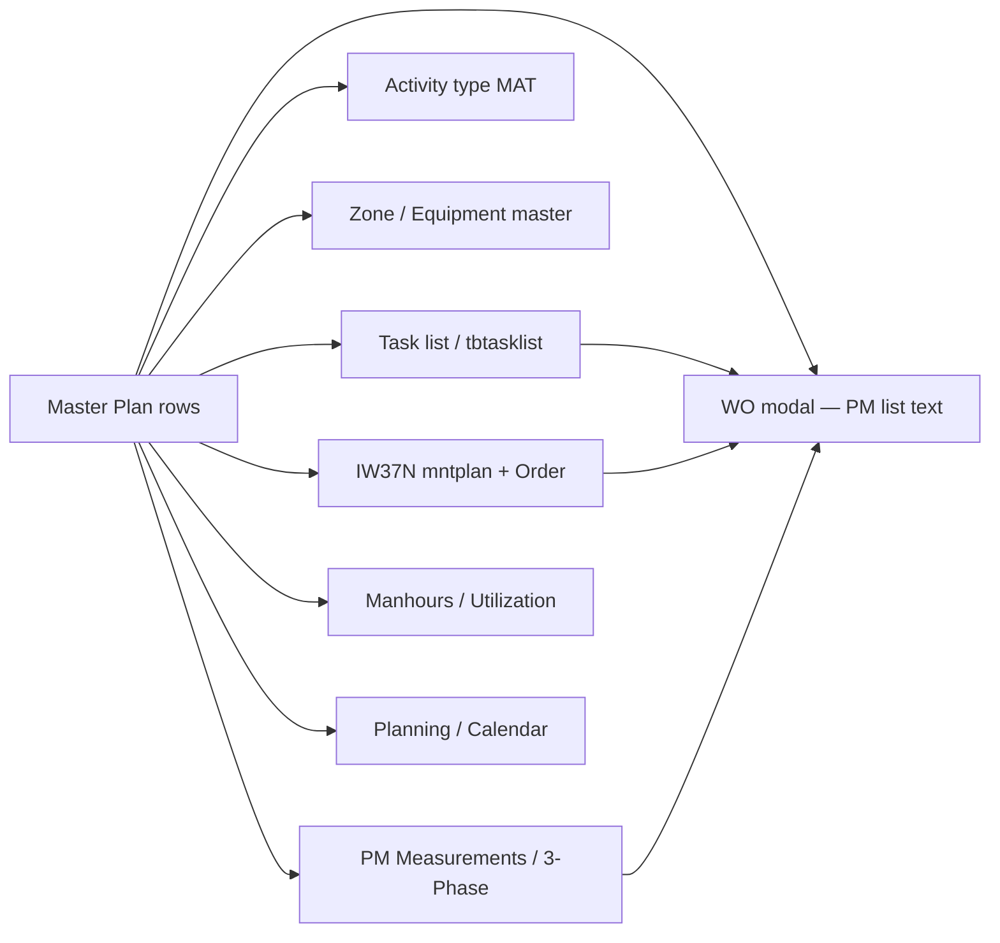

# Master Plan — สเปกการศึกษาและออกแบบ

**วันที่:** 9 มิ.ย. 2026  
**สถานะ:** ✅ **Phase 1 เสร็จแล้ว** (9 มิ.ย. 2026) · Phase 2 รอ implement  
**หน้า UI:** `/master-data` (ชื่อแสดง **Master Plan**)  
**ไฟล์อ้างอิงลูกค้า (`docs from customer/`):**

| ไฟล์ | รหัส | Sheets | แถวข้อมูล (parse) | แถว import ได้เข้า `tbtasklist` |
|------|------|--------|------------------|--------------------------------|
| `01-MASTER PM PROCESS EE 2026.xlsx` | EE | 15 | ~2,718 | ~2,632 |
| `02-MASTER PM PROCESS ME 2026.xlsx` | ME | 16 | ~2,336 | ~2,275 |
| `03-MASTER PM PACKING 2026.xlsx` | PK | 37 | ~6,183 | ~4,735 |

### ความหมายทางธุรกิจ (ยืนยันจากลูกค้า — 9 มิ.ย. 2026)

Workbook ทั้ง 3 ไม่ใช่แค่ “ไฟล์ Excel คนละชุด” แต่เป็น **แผน PM แยกตามพื้นที่งาน × สาขาช่าง**:

| ไฟล์ | สาขาช่าง (Craft) | พื้นที่ / แผนก | ใครใช้ |
|------|------------------|----------------|--------|
| `01-MASTER PM PROCESS EE 2026.xlsx` | **Electrical (EE)** | **ฝั่งหน้าเตา / Process** — ไลน์ผลิต process (SCHAAF, BCP, STAX, Frypack, Pellet, …) | ช่างไฟฟ้าแผนก Process |
| `02-MASTER PM PROCESS ME 2026.xlsx` | **Mechanical (ME)** | **ฝั่งหน้าเตา / Process** — ไลน์เดียวกันกับ EE แต่ **งาน PM คนละชุด** (ลูก/จ lubrication ฯลฯ) | ช่างเครื่องกลแผนก Process |
| `03-MASTER PM PACKING 2026.xlsx` | **Packing (PK)** — มี EE/ME/OP ใน Craft ต่อแถว | **ห้องแพ็คขนม / แผนก Packing** — PK1–PK6, Distribution, Air Leak, Transfer, Packing Hall | ช่างแผนก Packing |

**ข้อสำคัญสำหรับออกแบบ:**

1. **EE กับ ME คู่กันใน Process** — sheet ชื่อใกล้เคียงกัน (เช่น SCHAAF#1, BCP, STAX) แต่ **แถว PM list / legacy / task ต่างกัน** ตามสาขาช่าง · ระบบต้องไม่รวมเป็น workbook เดียว
2. **PK เป็นพื้นที่คนละแผนก** — โครงคอลัมน์ต่าง (Frequency / Type / Craft) · ลิงก์ flow ไป WO/IW37N ของ **โซนแพ็ค** ไม่ใช่ไลน์หน้าเตา
3. **Legacy ใน Excel** (เช่น `SE0-MI-EE`, `PK1-HI-ME`) = รหัส work center / craft ต่อ zone — ใช้จับคู่กับ WO, manhours, และสิทธิ์ช่าง
4. **UI ที่เสนอ:** แท็บระดับบนบนหน้า Master Plan แยก 3 ชุดตามตารางด้านบน พร้อมคำอธิบายสั้น (Process · Electrical / Process · Mechanical / Packing)

```text
                    ┌──────────────── Process (หน้าเตา) ────────────────┐
                    │  EE workbook          ME workbook                  │
                    │  (งานไฟฟ้า)            (งานเครื่องกล)               │
                    └──────────────────────────┬──────────────────────────┘
                                               │  zone / machine / mntplan
                                               ▼
                                         IW37N · WO · Calendar
                    ┌──────────────── Packing (ห้องแพ็ค) ────────────────┐
                    │  PK workbook (EE+ME+OP ตาม Craft ต่อแถว)           │
                    └──────────────────────────┬──────────────────────────┘
                                               ▼
                                         IW37N · WO · Calendar
```

---

## 1) บริบทและเป้าหมาย

### ลูกค้าต้องการ

1. เอกสาร Master Plan 3 ชุด (EE / ME / Packing) เป็น **แหล่งความจริง** ของแผน PM ประจำปี
2. แสดงในระบบ **เหมือนต้นฉบับ Excel ทุกประการ** (โครง sheet, คอลัมน์, การ merge/fill-down ของ Zone / Machine List)
3. **แก้ไขได้** โดยผู้มีสิทธิ์ — และมี **log การแก้ไข** ตรวจย้อนหลังได้
4. Master Plan **เชื่อมโยง flow อื่น** ในระบบ (ไม่ใช่เก็บอย่างเดียว)

### สถานะปัจจุบันใน PM Pepsi App (อัปเดต 9 มิ.ย. 2026)

| ส่วน | พฤติกรรมวันนี้ | หมายเหตุ |
|------|----------------|----------|
| หน้า `/master-plan` | แผน PM EE/ME/PK แยกจาก SAP master | migration `109` route split |
| หน้า `/master-data` | ตารางอ้างอิง SAP (~17 กลุ่ม) · ลิงก์ไป Master Plan | ไม่มีแท็บ PM master แล้ว |
| **Master Plan EE/ME/PK** | อ่านจาก DB · แท็บ sheet ตรง Excel · header ต่อ sheet · fill-down | Phase 1 ✅ |
| แก้ไข + changelog | PATCH เซลล์ · แผง Change history · `tb_master_plan_change` | Phase 2 ✅ |
| ลิงก์ WO / IW37N / PM3 | คอลัมน์ Links ต่อแถว | Phase 3 ✅ |
| Import / Export / Publish | draft import · export `.xlsx` · publish → `tbtasklist` | Phase 4 ✅ code · รอ UAT ลูกค้า |
| API | ดู §7 | สิทธิ์ `master-data.read` / `.write` |
| Seed / verify | `npm run seed:master-plan` · `npm run verify:master-plan` | ต้องรันบน env ใหม่ |

**โค้ดหลัก Phase 1:**

| ชั้น | ไฟล์ |
|------|------|
| DB | `database/migrations/108_master_plan_tables.sql` |
| Parse | `PM-Pepsi-App/backend/src/lib/master-plan-parse.ts` |
| Display | `PM-Pepsi-App/backend/src/lib/master-plan-display.ts` |
| Service | `PM-Pepsi-App/backend/src/services/master-plan.ts` |
| API | `PM-Pepsi-App/backend/src/routes/master-plan.ts` |
| UI | `PM-Pepsi-App/frontend/src/features/master-plan/*` |

**Legacy (ยังอยู่ใน repo แต่ไม่ใช้บนหน้า Master Plan แล้ว):** `PmMasterProcessPanel.tsx`, `pm-master-process.ts` — อัปโหลด Excel ชั่วคราว + import tasklist

### สถานะก่อน Phase 1 (อ้างอิง)

เดิมใช้ `PmMasterProcessPanel` — อัปโหลด Excel ชั่วคราว · preview แบบ flat · import เข้า `tbtasklist` โดย skip sheet สรุป · ไม่ persist ใน DB

### ข้อกำหนดที่ล็อกแล้ว (ลูกค้า — 9 มิ.ย. 2026)

> **ความเหมือนต้นฉบับ** และ **sheet แยกตามต้นฉบับเลย — ปรับหรือเปลี่ยนไปจากเดิมไม่ได้**

| หัวข้อ | บังคับ | ความหมายในระบบ |
|--------|--------|----------------|
| ชื่อ sheet | ✅ ตรง Excel ทุกตัว | ไม่ rename · ไม่รวม sheet · ไม่ซ่อน (รวม `Total Master plan`, `legend`, `PK1 (Production)` ฯลฯ) |
| ลำดับ sheet | ✅ ตาม workbook | ลำดับแท็บ UI = `SheetNames` ในไฟล์ลูกค้า |
| Header ต่อ sheet | ✅ ตาม sheet นั้น | ไม่ normalize เป็นคอลัมน์กลาง · EE/ME/PK แต่ละ sheet ต่างกันได้ |
| แถว / fill-down | ✅ ตาม Excel | Zone / Machine List ว่าง = แสดงค่าจากแถวบน |
| โครง workbook | ✅ 3 ไฟล์คงที่ | Process EE · Process ME · Packing — ไม่รวมเป็นไฟล์เดียว |
| แก้ไขในระบบ | ✅ ค่าในเซลล์เท่านั้น | แก้ PM list, days, mntplan ฯลฯ ได้ + log · **ห้าม** เพิ่ม/ลบ sheet หรือเปลี่ยนชื่อคอลัมน์ใน UI |
| อัปเดตโครงใหม่ | ✅ ผ่าน import Excel อย่างเป็นทางการจากลูกค้า | ไม่ให้ dev/ผู้ใช้ “ออกแบบ sheet ใหม่” ในแอป |

**ผลต่อ parser ปัจจุบัน:** `SKIP_SHEETS` (`Total Master plan`, `legend`) และ preview แบบ flat **ต้องเลิกใช้** — Phase 1 ต้องแสดงทุก sheet ตามไฟล์

---

## 2) โครงสร้างเอกสารลูกค้า (จากการวิเคราะห์)

### 2.1 รูปแบบร่วม (Process — EE / ME)

- **1 workbook = 1 สาขาช่างในแผนก Process** (EE หรือ ME) · **พื้นที่เดียวกัน (หน้าเตา)** แต่ **รายการ PM คนละชุด**
- หลาย **sheet ตามไลน์/โซน process** (เช่น SCHAAF#1, BCP, STAX, Frypack, Pellet, RBS, …)
- แถว 1–2: **หัวเรื่อง** (เช่น `SCHAAF EE MASTER PLAN`, `Update : 16/03/2022`, จำนวน Maintenance plan)
- แถว header: ชุดคอลัมน์ **ไม่เหมือนกันทุก sheet** แต่มี core:
  - `Zone`, `Machine List`, `Maintenance plan` / `SAP Code` / `Mant`
  - `Task list`, `Legacy`, `M/C`, `PM list`, `days` / `freq (day)`
  - บาง sheet เพิ่ม: `หยุด`, `เดิน`, `Min`, `Man`, `Man hour`, `Act Code`, `%run hr.`, `Measurement point`, `Grease / Lube / SP`, `freq Hour`, `New Hour`
- **Fill-down:** Zone และ Machine List ว่างในแถวถัดไป → ใช้ค่าจากแถวบน (เหมือน merge cell ใน Excel)
- **Summary sheets:** `Total Master plan`, `Total Master plan (AM/PR)` — สรุปจำนวน Maintenance plan ต่อไลน์ (ไม่ใช่รายการ PM รายแถว)

### 2.2 รูปแบบ Packing (PK — แผนก Packing / ห้องแพ็ค)

- **1 workbook = แผน PM ทั้งหมดฝั่งแพ็ค** · ไม่ใช่ process หน้าเตา
- **37 sheets** — แยกตาม PK1–PK6, Distribution Conv., Air Leak, Transfer Conv., STAX, Packing Hall, Case zone, …
- Header หลักเพิ่ม: **`Frequency`**, **`Type`**, **`Craft`** (Q/H/Y/N × I/C/R … + OP/ME/EE)
- มี sheet ซ้ำชื่อใกล้เคียง (`PK1` vs `PK1 (Production)`) — **เก็บทั้งคู่** ตามต้นฉบับ ไม่เลือก canonical
- มี `legend`, `PK6 (Stopped)`, `New Standard defined` — **แสดงเป็น sheet ตามไฟล์** (read-only หรือแก้เฉพาะเซลล์ข้อมูล ตามประเภท sheet)

### 2.3 ความแตกต่างสำคัญ vs `tbtasklist`

| คอลัมน์ Excel | ใน `tbtasklist` วันนี้ | หมายเหตุ |
|---------------|------------------------|----------|
| Frequency, Type, Craft (PK) | ไม่มีตรง · บางส่วน map `mat`/`plan` | ต้องคอลัมน์ใหม่หรือ JSON |
| Act Code | ไม่มี | ลิงก์ Activity type (MAT) |
| Machine List vs M/C | มี `machine` อย่างเดียว | Excel แยก “รายการเครื่องในไลน์” vs “เครื่องที่ทำ PM” |
| Sheet name | ไม่มี | ต้องเก็บเพื่อแสดงแท็บ |
| Title / Update date | ไม่มี | metadata ต่อ sheet |
| Man hour | มี `manhour` | บาง sheet คำนวณ Min×Man |

---

## 3) การเชื่อม flow อื่น (Master Plan เป็น hub)



| ฟิลด์ Master Plan | Flow ปลายทาง | พฤติกรรมที่เสนอ |
|-------------------|--------------|-----------------|
| `mntplan` / SAP Code | IW37N, Calendar | ลิงก์ค้นหา WO ที่ MntPlan ตรง · badge จำนวน |
| `tasklist` | Task list tab | เปิดแถวที่ตรง key |
| `legacy` | Work center type | แสดง craft/discipline |
| `zone` | Zone master | validate FK · ลิงก์แก้ zone |
| `machine` / `machine_list` | Equipment | ลิงก์ equipment ถ้ามีใน master |
| `pmlist` | WO Task tab | ข้อความงานช่าง · trigger PM 3-phase ถ้ามี “กระแส/3 เฟส” |
| `mpoint`, `%run hr`, freq hour | PM Measurements | ลิงก์ template / measurement point |
| `pmmin`, `pmman`, man hour | Manhours reports | อ้างอิงเวลามาตรฐาน |
| `Frequency/Type/Craft` (PK) | Planning filter | กรอง ZB / ประเภทงาน |
| `Act Code` | Activity type | ลิงก์ MAT code |

**หลักการ:** Master Plan เป็น **แหล่งอ้างอิง** · `tbtasklist` / IW37N เป็น **ข้อมูลปฏิบัติการ** — มีขั้น **Publish/Sync** ชัดเจน (ไม่ silent overwrite)

---

## 4) ทางเลือกสถาปัตยกรรม

### ข้อจำกัดจากลูกค้า → ตัดสินใจแล้ว

- **โครง sheet เป็นสัญญา (contract)** — seed จากไฟล์ลูกค้า 3 ชุด · UI/API ไม่เบี่ยงเบน
- **ความเหมือนต้นฉบับ** = โครง + ข้อมูล + fill-down + แท็บ/คอลัมน์ตรงไฟล์ · **Export `.xlsx` ต้อง round-trip ได้ 100%** หลัง Phase 4
- บนจอ: grid ต่อ sheet ที่ header/ลำดับคอลัมน์ตรง Excel (merge/สี — ใกล้เคียงที่สุดใน Phase 1–2, export เป็นของจริง 100%)

### ทางเลือก A — โมเดลแถว + metadata ต่อ sheet (**แนะนำ — ปรับให้ strict fidelity**)

เก็บ workbook เป็น relational + JSON สำหรับคอลัมน์เสริม

**Pros:** query ได้ · audit รายแถว · ลิงก์ FK · sync tasklist · **ล็อก `column_schema_json` ต่อ sheet ตาม Excel**  
**Cons:** สี/merge บนจอต้องจำลองหรือใช้ spreadsheet view — export เป็นช่องทาง pixel-perfect

### ทางเลือก B — Spreadsheet engine ทั้ง sheet

**Pros:** ใกล้ Excel บนจอ  
**Cons:** แพง · audit/link ยาก · ยังต้อง export ตรงต้นฉบับอยู่ดี

### ทางเลือก C — Hybrid (**เลือกใช้**)

- **Canonical:** ทางเลือก A — แถว + schema ต่อ sheet (ห้ามรวม header)
- **Presentation:** แท็บ sheet 1:1 · grid header ตาม sheet · fill-down
- **Round-trip:** Export `.xlsx` จาก DB ให้ตรง template ลูกค้า · Re-import = version ใหม่

~~**คำแนะนำ:** เริ่ม **ทางเลือก A + export ภายหลัง**~~ → **ทางเลือก C โดย export เป็น deliverable บังคับ ไม่ใช่ nice-to-have**

---

## 5) โมเดลข้อมูลที่เสนอ (Phase 1)

```sql
-- Workbook ต่อสาขา + ปี
app.tb_master_plan_workbook (
  id, discipline,  -- 'EE' | 'ME' | 'PK'
  plan_year,       -- 2026
  source_filename,
  version_no,      -- 1, 2, 3 …
  status,          -- draft | published
  imported_at, imported_by,
  published_at, published_by,
  notes
)

-- Sheet ใน workbook
app.tb_master_plan_sheet (
  id, workbook_id,
  sheet_name, sort_order,
  title_text,        -- แถว 1 เช่น "SCHAAF EE MASTER PLAN"
  subtitle_text,     -- maintenance plan count, update date
  sheet_kind,        -- detail | summary | legend | reference (จากชื่อ/รูปแบบ sheet — ไม่ใช้เพื่อซ่อน)
  column_schema_json -- ลำดับ/ชื่อ header **ตรง Excel sheet นี้เท่านั้น** — immutable หลัง seed
)

-- แถวข้อมูล (1 แถว Excel = 1 record)
app.tb_master_plan_row (
  id, sheet_id,
  row_index,         -- ลำดับใน sheet
  zone, machine_list,
  mntplan, tasklist, legacy, machine, pmlist,
  pmday, machinestatus_stop, machinestatus_run,
  pmmin, pmman, manhour,
  freqhour, runhr_pct, mpoint,
  gls, act_code,
  frequency, type_code, craft,   -- PK
  extra_json,        -- คอลัมน์ที่ sheet นั้นมีเพิ่ม
  is_active,
  source_row_hash     -- detect change ตอน re-import
)

-- ประวัติแก้ไข (แสดงบนหน้า Master Plan)
app.tb_master_plan_change (
  id, row_id,
  change_type,       -- create | update | delete | import | publish
  field_name,        -- null = ทั้งแถว
  before_json, after_json,
  changed_by, changed_at,
  comment
)
```

**Audit ซ้อน:** ยังเขียน `app.tbl_audit_log` (`action=master-plan.update`, `resource=master-plan-row`, `resource_id=<uuid>`) เพื่อให้ Admin Audit Hub เห็นรวม

**Publish → `tbtasklist`:** ตาราง mapping หรือ batch job ที่ upsert ตาม unique key ปัจจุบัน `(idwkctrtype, idzone, mntplan, tasklist, machine, pmlist)` — แยกปุ่ม **Publish to Task list** ไม่ auto ตอน save

---

## 6) UI/UX บนหน้า Master Plan

### 6.1 โครงหน้า

```
[ Master Plan ]     ปี: 2026     v3 (Published)     [ Import ] [ Export ] [ Publish… ]

Process (หน้าเตา)                         Packing (ห้องแพ็ค)
[ Electrical · EE ] [ Mechanical · ME ]   [ Packing · PK ]
        ↓                    ↓                      ↓
แท็บ sheet: SCHAAF#1 | BCP | STAX | …     แท็บ: PK1 | Distribution | …

┌─ SCHAAF EE MASTER PLAN ─────────────────── Update: 16/03/2022 ─┐
│ Zone │ Machine List │ SAP Code │ Task list │ … │ PM list │ days │
│ SE0  │ Batch Mixer  │ 6100…    │ 100912    │ … │ ตรวจเช็ค… │ 30  │
│      │ Agitator     │          │           │ … │ …        │ 30  │  ← fill-down Zone
└─────────────────────────────────────────────────────────────────┘

[ แก้ไขแถว ]  [ ประวัติการแก้ไข ]  [ ลิงก์: IW37N · WO · PM 3-Phase ]
```

### 6.2 การแสดง “เหมือนต้นฉบับ” (บังคับ)

| องค์ประกอบ Excel | วิธีในระบบ | UAT |
|------------------|------------|-----|
| แท็บ sheet | ครบทุก sheet · ชื่อและลำดับตรงไฟล์ | เทียบ `SheetNames` ทีละ workbook |
| หัวเรื่อง sheet | Banner แถว 1–2 ตาม sheet | ข้อความตรง เช่น `SCHAAF EE MASTER PLAN`, Update date |
| Header คอลัมน์ | ต่อ sheet — ไม่ใช้ header กลาง | ชื่อคอลัมน์ตรง Excel sheet นั้น |
| Fill-down Zone / Machine List | แสดงค่าซ้ำ visually | เทียบแถวที่เซลล์ว่างใน Excel |
| Summary / legend sheet | แสดงเป็น sheet แยก | `Total Master plan`, `legend` ฯลฯ ไม่ skip |
| สี / merge / ความกว้าง | จำลองบนจอเท่าที่ทำได้ Phase 1–2 | **Export `.xlsx` = 100% ต้นฉบับ** (Phase 4) |

### 6.3 การแก้ไขและ log

- สิทธิ์: `master-data.write` (เดิม) หรือแยก `master-plan.write` ในอนาคต
- **แก้ได้:** ค่าในเซลล์ข้อมูล (PM list, days, mntplan, Min/Man ฯลฯ) ภายใน sheet ที่มีอยู่
- **แก้ไม่ได้ใน UI:** เพิ่ม/ลบ sheet · เปลี่ยนชื่อ sheet · เปลี่ยนชื่อ/ลำดับคอลัมน์ · รวม sheet
- ทุก mutation → `tb_master_plan_change` + `tbl_audit_log`
- Panel **ประวัติการแก้ไข:** filter ตาม sheet / ผู้แก้ / วันที่ · แสดง before/after
- Import Excel ใหม่จากลูกค้า → version ใหม่ + diff preview (โครง sheet ต้องตรงชุดเดิม หรือ reject พร้อมรายงานความต่าง)

### 6.4 สิ่งที่ย้าย/เลิกจาก UI ปัจจุบัน

- แท็บ MASTER PM EE/ME/PK แบบ “เลือกไฟล์แล้วหาย” → แทนที่ด้วย Master Plan ถาวร
- แท็บ **Task list** ยังอยู่ — เป็น **ผลหลัง Publish** ไม่ใช่ที่แก้ master โดยตรง (หรือแก้ได้แต่มีป้ายเตือน “ไม่ sync กับ Master Plan”)

---

## 7) API

### มีแล้ว

| Method | Path | หน้าที่ | Phase |
|--------|------|---------|-------|
| GET | `/api/v1/master-plan/:discipline` | workbook published + รายการ sheets | 1 |
| GET | `/api/v1/master-plan/sheets/:sheetId/rows` | แถว + column schema + fill-down (`?offset&limit&discipline`) | 1 |
| PATCH | `/api/v1/master-plan/rows/:rowId` | แก้แถว | 2 |
| GET | `/api/v1/master-plan/rows/:rowId/changes` | log แถว | 2 |
| GET | `/api/v1/master-plan/changes` | log ทั้ง sheet/workbook | 2 |
| GET | `/api/v1/master-plan/rows/:rowId/links` | ลิงก์ IW37N/WO/equipment/PM3 | 3 |
| POST | `/api/v1/master-plan/import` | อัป Excel → version draft + diff | 4 |
| GET | `/api/v1/master-plan/:discipline/export` | export `.xlsx` (`?status=published\|draft`) | 4 |
| GET | `/api/v1/master-plan/:discipline/status` | draft/published + sync badge | 4 |
| POST | `/api/v1/master-plan/publish` | promote draft + sync → `tbtasklist` | 4 |

---

## 8) แผนงานเป็นช่วง (Implementation phases)

| Phase | ขอบเขต | ผลลัพธ์ UAT | สถานะ |
|-------|--------|-------------|--------|
| **0 — Design** | สเปก + ข้อกำหนดล็อก | ลงนาม scope | ✅ |
| **1 — Read-only fidelity** | Migration + seed + UI sheet tabs + grid + fill-down | ลูกค้าเทียบ Excel | ✅ code + verify · รอ UAT ลูกค้าบนจอ |
| **1.5 — UX แยกหน้า** | `/master-plan` vs `/master-data` · sheet picker · polish | ไม่เห็น 17 แท็บ SAP บนหน้าแผน | ✅ code · รอ UAT |
| **2 — Edit + changelog** | PATCH row + change panel + permissions | แก้แล้วเห็น log | ✅ code · รอ UAT |
| **3 — Links** | ลิงก์ IW37N/WO/PM3/equipment | คลิกจากแถวไป flow จริง | ✅ code · รอ UAT |
| **4 — Publish & version** | Publish tasklist · import diff · export xlsx | วงจรอัปเดตแผนประจำปี | ✅ code · รอ UAT |

---

## 9) ความเสี่ยงและประเด็นที่เหลือ

1. **~23% แถว PK ไม่ผ่าน filter tasklist ปัจจุบัน** — Master Plan เก็บครบทุกแถวตาม Excel แม้ publish tasklist ไม่ได้ทันที  
2. **Performance:** PK 37 sheet · ~6k แถว — virtual scroll ต่อ sheet  
3. **Conflict:** แก้ Master Plan vs แก้ Task list โดยตรง — สถานะ sync (in sync / diverged)  
4. **Export fidelity:** เก็บ `layout_json` (merge, title rows) ต่อ sheet ตั้งแต่ seed เพื่อ export 100%

---

## 10) เกณฑ์ยอมรับ (Acceptance — Phase 1 read-only)

- [x] EE: แท็บ sheet **15 ชื่อ · ลำดับ** ตรง `01-MASTER PM PROCESS EE 2026.xlsx` — `verify:master-plan` ผ่าน
- [x] ME: **16 sheet** ตรงไฟล์ ME (รวม legend, Total Master plan)
- [x] PK: **37 sheet** ตรงไฟล์ PK (รวม `PK1` และ `PK1 (Production)` แยกกัน)
- [x] แต่ละ sheet: header คอลัมน์ตรงต้นฉบับ sheet นั้น (ไม่ใช้ header กลาง)
- [x] Fill-down Zone / Machine List — logic ใน `master-plan-display.ts`
- [x] จำนวนแถวข้อมูลต่อ sheet ตรงไฟล์
- [x] ไม่มี sheet ที่ระบบสร้างเองหรือ rename
- [ ] ลูกค้า UAT บนจอ: เทียบ Excel side-by-side (manual)

---

## 11) i18n และ fidelity (สิ่งที่ไม่แปล)

- **UI chrome** (ปุ่ม เมนู ตัวกรอง changelog คำอธิบายหน้า) — แปล EN/TH ผ่าน `i18next` (`masterPlan.*`, `masterPlanPage.*`)
- **ชื่อคอลัมน์ Excel** — จาก `column_headers_json` ต่อ sheet · แสดงบนจอตรงต้นฉบับ · **ห้ามแปลใน DB หรือ frontend**
- **ค่าเซลล์** — รวมข้อความ **PM list ภาษาไทย** · แสดงตามที่ parse/seed จากไฟล์ลูกค้า · ไม่ผ่าน i18n
- **ชื่อ sheet** — ตรง Excel (รวม PK1 vs PK1 (Production))

---

## 12) สรุปข้อกำหนดที่ล็อก (ไม่เปิดเจรจาแล้ว)

| หัวข้อ | สถานะ |
|--------|--------|
| ความหมาย EE / ME / PK (Process vs Packing) | ✅ ล็อก |
| Sheet แยกตามต้นฉบับ — ห้ามปรับโครง | ✅ ล็อก |
| ความเหมือนต้นฉบับ (โครง + ข้อมูล + fill-down) | ✅ ล็อก |
| Export Excel round-trip 100% | ✅ บังคับ Phase 4 |
| แก้ค่าในเซลล์ + log | ✅ ใน scope Phase 2 |
| PK1 vs PK1 (Production) | ✅ เก็บทั้งคู่ตามไฟล์ |
| Phase 1 read-only implement | ✅ เสร็จ 9 มิ.ย. 2026 |
| Phase 1.5–4 implement | ✅ code 9 มิ.ย. 2026 · รอ UAT ลูกค้า |

**แผน implement:** [`docs/superpowers/plans/2026-06-09-master-plan-phase1.md`](../plans/2026-06-09-master-plan-phase1.md) · **Checklist UX Phase 1.5–4:** [`docs/superpowers/plans/2026-06-09-master-plan-ux-phase2-checklist.md`](../plans/2026-06-09-master-plan-ux-phase2-checklist.md)

---

## 13) ข้อความตอบลูกค้า (สรุป phase — copy ได้)

> ใช้ตอบลูกค้า / สรุปใน meeting — อัปเดต 9 มิ.ย. 2026

**ภาษาไทย (สั้น):**

สวัสดีครับ/ค่ะ — อัปเดต Master Plan ใน PM App ดังนี้ครับ/ค่ะ

- **Phase 1 (เสร็จแล้ว):** เปิดเมนู **Master Plan** แล้วดูแผน PM ปี 2026 ทั้ง **EE / ME / Packing** ตามไฟล์ Excel ต้นฉบับ — ชื่อ sheet · คอลัมน์ · fill-down Zone/Machine List ตรงไฟล์
- **Phase 1.5 (เสร็จแล้ว):** แยกหน้า **Master Plan** ออกจาก **Master Data (SAP)** — หน้าแผนไม่ปนกับ Equipment / Material / Task list อีกต่อไป
- **Phase 2 (เสร็จแล้ว):** แก้ค่าในเซลล์ (เช่น PM list, days, Min) บนแอปได้ · มี **ประวัติการแก้ไข** บันทึก who / when / before / after
- **Phase 3 (เสร็จแล้ว):** คลิก **ลิงก์** จากแถวไป IW37N / ใบงาน / PM กระแส 3 เฟส ได้โดยตรง
- **Phase 4 (เสร็จแล้ว):** **นำเข้า Excel ใหม่** (draft) · **ส่งออก Excel** · **เผยแพร่ไป Task list** — สำหรับอัปเดตแผนประจำปี

ขั้นถัดไป: ขอให้ทีมลูกค้า **UAT บนจอ** เทียบ Excel จริง (checklist ใน `UAT-ITEM5-EXCEL-CUSTOMER-FILES.md` §4.4) แล้วแจ้ง feedback ครับ/ค่ะ

**English (short):**

Master Plan is live at **Master Plan** menu (`/master-plan`) for EE, ME, and Packing 2026 workbooks — sheet layout and cell data match your Excel files. We split Master Plan from SAP reference masters, added in-app cell editing with audit log, row links to IW37N/WO/PM 3-phase, and the annual update cycle (import draft → export → publish to task list). Please run side-by-side UAT against your files and share feedback.

---

## เอกสารที่เกี่ยวข้อง

- [`docs/superpowers/plans/2026-06-09-master-plan-phase1.md`](../plans/2026-06-09-master-plan-phase1.md) — แผน + สถานะ implement Phase 1  
- [`docs/FLOW-WORK-REVIEW.md`](../../FLOW-WORK-REVIEW.md) — flow WO / planning  
- [`docs/customer-requirements/UAT-ITEM5-EXCEL-CUSTOMER-FILES.md`](../../customer-requirements/UAT-ITEM5-EXCEL-CUSTOMER-FILES.md)  
- [`docs/USER-MANUAL-TH.md`](../../USER-MANUAL-TH.md) §6.4 — คู่มือผู้ใช้ Master Plan  
- DB: `database/migrations/108_master_plan_tables.sql`, `107_master_plan_menu_title.sql`  
- Legacy import: `frontend/src/lib/pm-master-process.ts`, `PmMasterProcessPanel.tsx`
