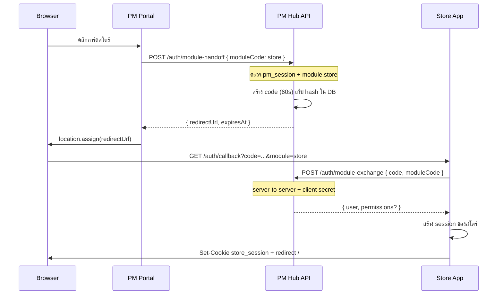

# Module Handoff — สโตร์อะไหล่ & แจ้งซ่อม (เมื่อมี URL จริง)

**วันที่:** 2026-06-09  
**สถานะ:** สเปก implement — รอ URL จริงจากลูกค้า / ทีมสโตร์·แจ้งซ่อม  
**อ้างอิง:** [`2026-06-09-unified-portal-multi-module-design.md`](2026-06-09-unified-portal-multi-module-design.md) · migration **102** · checklist [`PRE-UAT-UI-PHASES.md`](../../customer-requirements/PRE-UAT-UI-PHASES.md) §U4f

**Hub รอบแรก:** PM-Pepsi-App backend (`pm_session` cookie · HMAC JWT)  
**ปลายทาง:** แอปสโตร์ / แจ้งซ่อม deploy แยก (คนละ origin)

---

## 1) ปัญหาที่ handoff แก้

| ข้อจำกัด | ผลกระทบ |
|----------|---------|
| Cookie `pm_session` เป็น **SameSite=Lax · path=/** ของ origin PM | แอป `https://store.factory.local` **อ่าน cookie PM ไม่ได้** |
| ไม่แชร์ session store ข้ามแอป | ต้อง login ซ้ำถ้า redirect ตรงไป `base_url` |
| สิทธิ์ module อยู่ที่ Hub RBAC | แอปปลายทางต้องรู้ว่า user คนนี้คือใคร และมีสิทธิ์เข้า module นั้นจริง |

**เป้าหมาย:** คลิกการ์ดสโตร์/แจ้งซ่อมบน `/portal` → เข้าแอปปลายทาง **โดยไม่พิมพ์รหัสผ่านซ้ำ** · ใช้เวลา ≤ 2 วินาที · ปลอดภัย one-time code

---

## 2) สถานะปัจจุบัน (M0 — ทำแล้ว)

```text
GET /api/v1/portal/modules
  → store/repair: base_url = '' → ready = false → การ์ด disabled + "เร็วๆ นี้"

PortalPage.openModule (external)
  → window.location.assign(entryUrl)   ← ใช้ได้เฉพาะ same_origin / trusted direct URL
  → ยังไม่เรียก module-handoff
```

| ฟิลด์ DB (`tbl_app_module`) | PM | store | repair |
|-----------------------------|-----|-------|--------|
| `base_url` | `''` | `''` (รอ URL) | `''` |
| `handoff_mode` | `same_origin` | `code_exchange` | `code_exchange` |
| `entry_path` | `NULL` → resolve ตาม role | `NULL` → default `/auth/callback` |

**เมื่อลูกค้าให้ URL จริง:** อัปเดต `base_url` + เปิด API handoff (M1) — **ห้าม** redirect ตรงไป `base_url` ถ้า `handoff_mode = code_exchange`

---

## 3) โหมด handoff ที่รองรับ

| `handoff_mode` | ใช้กับ | พฤติกรรม |
|----------------|--------|----------|
| `same_origin` | `pm` | `navigate(entryUrl)` ใน SPA เดียว — ไม่ต้อง handoff |
| `code_exchange` | `store`, `repair` | Hub ออก one-time code → redirect callback ปลายทาง → ปลายทางแลก user กับ Hub |
| `none` | (legacy) | ถือว่าไม่พร้อม — เหมือน `base_url` ว่าง |

**ไม่แนะนำใน production:** shared cookie ข้าม subdomain (`Domain=.factory.local`) — ต้อง HTTPS ทุกแอป · cookie policy ซับซ้อน · แอป PHP/.NET เก่าควบคุมยาก → ใช้ `code_exchange` เป็นค่าเริ่มต้น

---

## 4) Flow มาตรฐาน (`code_exchange`)



### 4.1 URL redirect ที่ Hub สร้าง

```text
{base_url}{entry_path}?code={opaque}&module={module_code}
```

| พารามิเตอร์ | ตัวอย่าง |
|-------------|----------|
| `base_url` | `https://store.pepsi-factory.local` (ไม่มี slash ท้าย) |
| `entry_path` | `/auth/callback` (default ถ้า NULL) |
| `code` | 32+ byte random, base64url |
| `module` | `store` \| `repair` |

**ตัวอย่างเต็ม:**

```text
https://store.pepsi-factory.local/auth/callback?code=K7x...&module=store
```

### 4.2 ทำไม exchange เป็น server-to-server

- `code` ไม่ควรส่งต่อจาก browser ไป Hub โดยตรง (เห็นใน DevTools / log)
- แอปปลายทาง: หน้า callback รับ `code` จาก query → **backend ปลายทาง** เรียก Hub
- หน้า callback แสดง skeleton / “กำลังเข้าสู่ระบบ…” ระหว่างแลก

---

## 5) ข้อมูล & migration (ร่าง 103)

### 5.1 อัปเดต module เมื่อมี URL

```sql
-- รันหลังลูกค้ายืนยัน URL (ตัวอย่าง)
UPDATE app.tbl_app_module SET
  base_url   = 'https://store.pepsi-factory.local',
  entry_path = '/auth/callback',
  handoff_mode = 'code_exchange',
  is_active  = true
WHERE module_code = 'store';

UPDATE app.tbl_app_module SET
  base_url   = 'https://repair.pepsi-factory.local',
  entry_path = '/auth/callback',
  handoff_mode = 'code_exchange'
WHERE module_code = 'repair';
```

หลังอัปเดต: `GET /portal/modules` → `ready: true`, `external: true`, `handoff: code_exchange`  
**อย่า**ใส่ `code` ใน `entryUrl` ของ response — frontend ต้องเรียก handoff ก่อนเสมอ

### 5.2 ตาราง one-time code (migration 103 ร่าง)

```sql
CREATE TABLE IF NOT EXISTS app.tbl_module_handoff_code (
  id              bigserial PRIMARY KEY,
  code_hash       char(64) NOT NULL UNIQUE,     -- SHA-256(hex) ของ code จริง
  module_code     varchar(32) NOT NULL REFERENCES app.tbl_app_module(module_code),
  subject_type    varchar(16) NOT NULL,         -- workcenter | member
  subject_id      text NOT NULL,                -- idwkctr หรือ memId
  username        text NOT NULL,
  userst          varchar(8) NOT NULL,
  issued_at       timestamptz NOT NULL DEFAULT now(),
  expires_at      timestamptz NOT NULL,
  consumed_at     timestamptz,
  consumed_by     text,                         -- client_id ของแอปปลายทาง
  issued_ip       inet,
  target_base_url text NOT NULL
);

CREATE INDEX IF NOT EXISTS idx_handoff_expires
  ON app.tbl_module_handoff_code (expires_at)
  WHERE consumed_at IS NULL;
```

**นโยบาย:**
- เก็บเฉพาะ **hash** ของ code (เหมือน password)
- ใช้ได้ **ครั้งเดียว** · TTL default **60 วินาที** (env `MODULE_HANDOFF_TTL_SEC`)
- ผูกกับ user ที่ออก code — exchange ต้องได้ user เดิม
- job ลบแถวหมดอายุ (cron หรือ lazy delete ตอน issue)

---

## 6) API Hub (PM backend)

### 6.1 `POST /api/v1/auth/module-handoff`

**Auth:** ต้องมี `pm_session` (เหมือน route อื่น)  
**Permission:** `module.{moduleCode}` ตาม module ที่ขอ

**Request:**

```json
{ "moduleCode": "store" }
```

**Response 200:**

```json
{
  "redirectUrl": "https://store.pepsi-factory.local/auth/callback?code=...&module=store",
  "expiresAt": "2026-06-09T12:34:56.000Z",
  "moduleCode": "store"
}
```

**ข้อผิดพลาด:**

| HTTP | `error` | เหตุผล |
|------|---------|--------|
| 401 | — | ไม่มี session |
| 403 | `HANDOFF_FORBIDDEN` | ไม่มีสิทธิ์ module |
| 404 | `MODULE_NOT_FOUND` | module ไม่ active |
| 409 | `MODULE_NOT_READY` | `base_url` ว่าง หรือ `handoff_mode = none` |
| 429 | `HANDOFF_RATE_LIMIT` | ออก code บ่อยเกิน (แนะนำ 10/นาที/user) |

**Audit:** `auth.module_handoff` · `status: ok|denied` · `resourceId: moduleCode`

### 6.2 `POST /api/v1/auth/module-exchange`

**Auth:** **ไม่ใช้** cookie ผู้ใช้ — ใช้ **client credential** แอปปลายทาง

```http
Authorization: Bearer {MODULE_CLIENT_SECRET}
Content-Type: application/json

{ "code": "...", "moduleCode": "store" }
```

หรือ header `X-Module-Client: store` + `X-Module-Secret: ...` (เลือกแบบใดแบบหนึ่งให้คงที่)

**Response 200:**

```json
{
  "user": {
    "idwkctr": "1081",
    "memId": null,
    "username": "PAC006",
    "userst": "W",
    "accountType": "workcenter",
    "fullnameTh": "ชื่อ นามสกุล",
    "fullnameEng": "Name Surname",
    "wkctr": "PAC006",
    "plnt": "1081"
  },
  "hubPermissions": ["module.store"],
  "handoffAt": "2026-06-09T12:34:30.000Z"
}
```

**หมายเหตุ:** `hubPermissions` ส่งเฉพาะ permission กลุ่ม `portal` / `module.*` — สิทธิ์ละเอียดในสโตร์ (เช่น เบิกได้เฉพาะคลัง X) เป็นหน้าที่ **แอปปลายทาง** map จาก `username` / `wkctr` ในฐานข้อมูลของตัวเอง

**ข้อผิดพลาด:**

| HTTP | `error` |
|------|---------|
| 401 | `EXCHANGE_UNAUTHORIZED` — secret ผิด |
| 400 | `HANDOFF_CODE_INVALID` |
| 410 | `HANDOFF_CODE_EXPIRED` |
| 409 | `HANDOFF_CODE_CONSUMED` |
| 403 | `MODULE_MISMATCH` — code ออกให้ store แต่ส่ง repair |

**Audit:** `auth.module_exchange` · `actorId: subject_id`

### 6.3 เปลี่ยน `GET /api/v1/portal/modules` (พฤติกรรม)

| ฟิลด์ | PM | store/repair (พร้อม URL) |
|-------|-----|---------------------------|
| `entryUrl` | path ใน PM | **อย่า**ใส่ `base_url` ตรงๆ — ใส่ `''` หรือ path placeholder |
| `ready` | `true` | `true` เมื่อ `base_url` ไม่ว่าง |
| `handoff` | `same_origin` | `code_exchange` |

Frontend ใช้ `handoff === 'code_exchange'` เป็นสัญญาณเรียก `module-handoff` ไม่ใช่ `entryUrl`

---

## 7) Frontend (PM Portal)

### 7.1 `openModule` (แก้เมื่อ M1)

```text
pm + same_origin     → navigate (เดิม + deferred path)
code_exchange + ready → POST module-handoff → location.assign(redirectUrl)
!ready               → toast comingSoon
error                → toast + ไม่ redirect
```

**ไฟล์:** `PortalPage.tsx` · เพิ่ม `requestModuleHandoff(moduleCode)` ใน `portal-api.ts`

**UX ระหว่าง handoff:** ปุ่มการ์ด `disabled` + spinner สั้นๆ กัน double-click

### 7.2 Auto-skip เมื่อ module เดียว + external

ถ้า user มีแค่ `module.store` และ `autoRedirect` ชี้ external — ต้อง handoff เหมือนคลิกการ์ด (ไม่ `assign(base_url)` ตรง)

---

## 8) สัญญาแอปปลายทาง (สโตร์ / แจ้งซ่อม)

ทีมแอปปลายทางต้องทำขั้นต่ำ:

| # | งาน | รายละเอียด |
|---|-----|------------|
| 1 | `GET {entry_path}` | หน้า callback อ่าน `code`, `module` จาก query |
| 2 | Backend exchange | เรียก Hub `POST .../module-exchange` ด้วย client secret |
| 3 | Session ท้องถิ่น | สร้าง cookie/session ของแอปตัวเอง (ชื่ออิสระ เช่น `store_session`) |
| 4 | Redirect หลังสำเร็จ | ไป `entry_path` หลักของแอป (เช่น `/` หรือ `/issues`) |
| 5 | ลิงก์กลับ Hub | Topbar “Portal” → `https://pm.../portal` (เปิด PM · user login อยู่แล้ว) |
| 6 | ล้มเหลว | แสดงข้อความ + ปุ่ม “กลับ Portal” / login เอง |

**ไม่บังคับรอบแรก:** sync user อัตโนมัติจาก Hub — ถ้ามี user ในฐานข้อมูลสโตร์แล้ว map ด้วย `username` หรือ `wkctr`

### 8.1 ตัวอย่าง pseudo (Store backend)

```typescript
// GET /auth/callback → HTML หรือ API route
const { code, module } = query
const hub = await fetch(`${PM_HUB_URL}/api/v1/auth/module-exchange`, {
  method: 'POST',
  headers: {
    'Content-Type': 'application/json',
    Authorization: `Bearer ${STORE_MODULE_CLIENT_SECRET}`,
  },
  body: JSON.stringify({ code, moduleCode: module }),
})
if (!hub.ok) redirect('/login?error=handoff')
const { user } = await hub.json()
const session = await createStoreSession(user)
setCookie(res, 'store_session', session)
redirect('/')
```

---

## 9) Configuration & secrets

### 9.1 Hub (PM `.env`)

```env
MODULE_HANDOFF_TTL_SEC=60
MODULE_HANDOFF_RATE_PER_MIN=10
# client_id:secret คู่ละแอป (rotate ได้ทีละแอป)
MODULE_HANDOFF_CLIENTS=store:CHANGE_ME_store_secret,repair:CHANGE_ME_repair_secret
```

### 9.2 แอปปลายทาง

```env
PM_HUB_URL=https://pm.pepsi-factory.local
MODULE_CLIENT_ID=store
MODULE_CLIENT_SECRET=CHANGE_ME_store_secret   # ตรงกับ Hub
MODULE_CODE=store                             # ตรวจใน callback
```

### 9.3 ลงทะเบียน URL ใน production

| module | ตัวอย่าง `base_url` | หมายเหตุ |
|--------|---------------------|----------|
| store | `https://store.pepsi-factory.local` | Tailscale / internal DNS |
| repair | `https://repair.pepsi-factory.local` | แยก deploy |

**Allowlist (แนะนำ):** Hub ตรวจว่า `base_url` ขึ้นต้นด้วยโดเมนที่อนุญาต (`MODULE_HANDOFF_ALLOWED_ORIGINS`) ก่อนออก redirect

---

## 10) ความปลอดภัย

| หัวข้อ | นโยบาย |
|--------|--------|
| Code entropy | ≥ 128 bit random (`crypto.randomBytes(16)` ขึ้นไป) |
| Storage | เก็บ SHA-256 เท่านั้น |
| TTL | 60s default · ไม่เกิน 120s |
| Replay | `consumed_at` ตั้งทันทีหลัง exchange สำเร็จ |
| Binding | code ผูก `subject_id` + `module_code` |
| Transport | Hub + ปลายทาง HTTPS เท่านั้นใน production |
| Secret | แยก secret ต่อแอป · rotate ผ่าน env ไม่ commit |
| Impersonation | ห้าม handoff ถ้า session เป็น impersonation (หรือ audit พิเศษ) |
| Logging | ไม่ log `code` เต็ม — log แค่ 4 ตัวท้าย |

---

## 11) แผน implement

| Phase | งาน | ไฟล์ / หมายเหตุ |
|-------|-----|------------------|
| **M1a** | migration 103 + service handoff/exchange | `backend/src/services/module-handoff.ts` |
| **M1b** | routes ใน `auth.ts` หรือ `portal.ts` | Zod schemas |
| **M1c** | ปรับ `portal-modules.ts` — `entryUrl` ไม่ leak `base_url` เมื่อ `code_exchange` | |
| **M1d** | Frontend `requestModuleHandoff` + `openModule` | `portal-api.ts`, `PortalPage.tsx` |
| **M2** | แอปสโตร์ทำ callback + session | repo แยก |
| **M3** | แอปแจ้งซ่อม | เหมือน M2 |
| **M4** | Admin UI แก้ `base_url` (optional) | หรือ SQL + runbook |

**ไม่บล็อก Pre-UAT PM:** จนกว่าจะมี URL จริง การ์ด store/repair ยัง `ready: false` ได้

---

## 12) ทดสอบ (checklist)

- [ ] User มี `module.store` → handoff ได้ → เข้าสโตร์ session
- [ ] User ไม่มีสิทธิ์ → 403 ไม่ออก code
- [ ] Code หมดอายุ → 410
- [ ] ใช้ code ซ้ำ → 409
- [ ] Secret ผิด → 401
- [ ] `module` query ไม่ตรง → 403
- [ ] Rate limit handoff
- [ ] Audit log ครบทั้ง issue + exchange
- [ ] Portal double-click ไม่สร้าง 2 tab พร้อม code 2 ตัว (disable UI)
- [ ] Dark/light หน้า callback ปลายทาง (ทีมปลายทาง)

---

## 13) Rollback

1. `UPDATE tbl_app_module SET base_url = '' WHERE module_code IN ('store','repair');` → การ์ดกลับเป็น “เร็วๆ นี้”
2. ปิด route handoff ด้วย feature flag `MODULE_HANDOFF_ENABLED=false` (แนะนำเพิ่มใน M1)
3. ลบ client secret ที่แอปปลายทาง

---

## 14) การยืนยันจากลูกค้า / ทีม (2026-06-09)

| หัวข้อ | การตัดสินใจ |
|--------|-------------|
| **สิทธิ์ module** | Admin จัดการที่ **Admin → บทบาท & สิทธิ์** — กลุ่ม **Portal** (`portal.view`, `module.pm`, `module.store`, `module.repair`) |
| **Identity ข้ามแอป** | **username / wkctr เดียวกับ PM** — แอปสโตร์/แจ้งซ่อม lookup จากค่าที่ Hub ส่งใน `module-exchange` |
| **สิทธิ์ละเอียดในสโตร์** | ยังเปิด (role ใน DB สโตร์ vs hubPermissions เท่านั้น) |

### 14.1 Admin — กลุ่มสิทธิ์ Portal

| `perm_code` | ความหมาย | ค่าเริ่มต้น (migration 102) |
|-------------|----------|------------------------------|
| `portal.view` | เห็นหน้า `/portal` | A, U, W |
| `module.pm` | การ์ด PM Maintenance | A, U, W |
| `module.store` | การ์ดสโตร์อะไหล่ | A, U |
| `module.repair` | การ์ดแจ้งซ่อม | A |

การ์ดบน Portal = มีสิทธิ์ `module.{code}` ที่ตรง `tbl_app_module.perm_code` · ไม่ต้องสร้างตาราง user แยกใน Hub

### 14.2 Identity — map user ปลายทาง (username / wkctr)

Hub ส่งใน `module-exchange` (subset ของ `AuthUser`):

| ฟิลด์ | ใช้ map ในแอปสโตร์/แจ้งซ่อม |
|-------|------------------------------|
| `username` | **คีย์หลัก** — ตรง `tbworkcenter.username` / login PM |
| `wkctr` | **คีย์รอง** — รหัสศูนย์งานช่าง |
| `idwkctr` | อ้างอิงภายใน PM (เก็บ audit) |
| `userst` | role code PM (A/U/W) — อาจ map เป็น role สโตร์ถ้าต้องการ |
| `accountType` | `workcenter` \| `member` |
| `memId` | เมื่อ login แบบ member |

**แนะนำ lookup ปลายทาง (workcenter):**

```sql
SELECT * FROM store_user
 WHERE username = $1 OR wkctr = $2
 LIMIT 1;
```

ถ้าไม่พบแถว → **provision ครั้งแรก** จาก payload Hub (ชื่อไทย/อังกฤษ) หรือปฏิเสธพร้อมข้อความ “ติดต่อ Admin” — เลือกนโยบายตอน M2

**Member:** ใช้ `memId` + `username` แทน `wkctr` ถ้า `accountType = member`

### 14.3 ยังต้อง confirm ก่อน M2

1. **URL จริง** สโตร์และแจ้งซ่อม (รวม Tailscale hostname)
2. **Provision อัตโนมัติ** ถ้ายังไม่มีแถวใน DB สโตร์
3. **กลับ Portal** — same tab หรือ tab ใหม่
4. **Session TTL** สโตร์เท่า PM (8 ชม.) หรือสั้นกว่า

---

## 15) สรุปสำหรับทีม

1. เมื่อมี URL → อัปเดต `tbl_app_module.base_url` + deploy M1 ที่ Hub  
2. Portal **ต้อง**เรียก `POST module-handoff` — ไม่ redirect ตรงไป `base_url`  
3. แอปสโตร์/แจ้งซ่อม implement **callback + server-side exchange** ตาม §8  
4. แชร์ **client secret** ผ่าน env / vault — ไม่ใส่ใน frontend  
5. PM UAT ไม่กระทบจนกว่าจะเปิด `base_url` และทดสอบ handoff จริง

---

## บันทึก

| วันที่ | เหตุการณ์ |
|--------|-----------|
| 2026-06-09 | สร้างสเปก handoff ละเอียด — คู่กับ portal M0 และ migration 102 |
