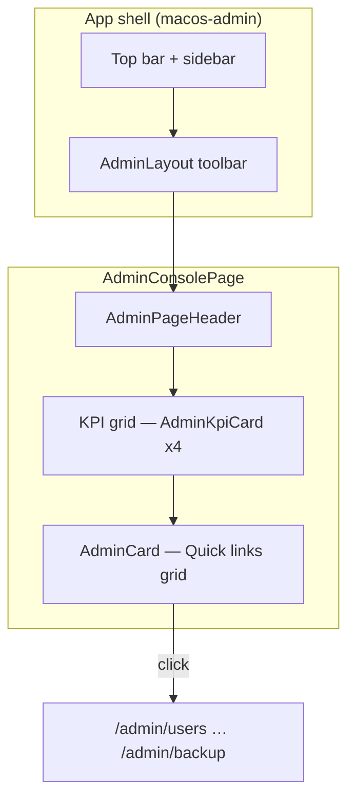

# Pepsi PM — Design System (skill-theme)

> **เป้าหมาย:** UI ที่ทันสมัย ใช้งานง่าย รู้สึกเป็นมืออาชีพระดับสากล — มีมิติแสงเงา ลื่นไหลด้วย animation ชัดเจน  
> **โปรเจกต์:** Preventive Maintenance Web · เป๊ปซี่โคล่า (ไทย) เทรดดิ้ง · offline บน Windows Server  
> **ผู้ใช้เอกสาร:** นักพัฒนา Frontend, AI agent, ผู้ review UI

---

## สรุปหนึ่งบรรทัด

| ด้าน | ทำอย่างไร |
|------|-----------|
| **โทนแบรนด์** | ขาว · ส้ม · ฟ้า · เขียว (Pepsi) — ไม่ใช้สีม่วง/indigo เป็นหลัก |
| **ความลึก** | Glass + shadow หลายชั้น — การ์ด/ปุ่ม hover แล้ว “ลอย” เล็กน้อย |
| **ความเร็วรู้สึก** | Animation นุ่ม (Framer Motion + CSS) — ไม่กระตุก |
| **ผู้ใช้ปรับได้** | Light / Dark / System · Cozy / Compact · สี/โลโก้จาก Admin Branding |

---

## 1) หลักการออกแบบ (อ่านก่อนลงมือ)

### 1.1 สามคำที่ต้องรู้สึกได้ทุกหน้า

1. **ชัด (Clear)** — ผู้ใช้รู้ทันทีว่าอะไรสำคัญ สถานะอะไร ปุ่มไหนกดได้  
2. **นุ่ม (Soft)** — มุมโค้ง เงาเบา แสงไล่ระดับ ไม่ flat แบบตาราง Excel  
3. **มีชีวิต (Alive)** — hover, เปลี่ยนหน้า, โหลดข้อมูล มี motion เล็กน้อยที่สม่ำเสมอ

### 1.2 สิ่งที่ห้ามทำ

- พื้นหลังดำสนิท `#000000` ใน dark mode (ใช้ slate เช่น `#0f172a`, `#09090b`)  
- ใช้สีเดียวกันทั้ง “ปุ่มหลัก” และ “ข้อผิดพลาด”  
- Animation ช้าเกิน 500ms หรือ bounce แรงเกินไป  
- Layout แน่นเกินไปโดยไม่มีทางเลือก Compact  
- Hard-code สีใน component — ใช้ **CSS variables** / token เสมอ

### 1.3 อ้างอิงสากล + แบรนด์ลูกค้า

หลักการด้านล่างเป็น **มาตรฐาน UI สมัยใหม่ (Apple / Material แนว glass)**  
**สีจริง** ต้องมาจากบรีฟ Pepsi ใน [`skills.md`](skills.md) § สีและโลโก้ — ไม่แทนที่ด้วย Indigo/Violet

---

## 2) สี (Pepsi + สถานะระบบ)

### 2.1 พาเลตต์แบรนด์ (หลัก)

| ชื่อ | บทบาทใน UI | ใช้เมื่อ |
|------|------------|----------|
| **ขาว** | พื้นผิว, พื้นหลังการ์ด, ช่องว่าง | Light mode, ความสะอาด, อ่านง่าย |
| **ฟ้า (Pepsi Blue)** | Primary — ลิงก์, โฟกัส, แถบหัว, ปุ่มหลัก | การกระทำหลัก, นำทาง |
| **ส้ม** | Accent / Warning | รอดำเนินการ, แจ้งเตือน, ไฮไลต์ |
| **เขียว** | Success | สำเร็จ, สุขภาพระบบ OK, อนุมัติ |
| **แดง (โลโก้)** | Danger / แบรนด์ | ข้อผิดพลาด, หยุด, โลโก้ Pepsi |

> โลโก้: วงกลม แดงบน น้ำเงินล่าง แถบขาวกลาง — ปรับได้จาก Admin Branding

### 2.2 สีสถานะ (ห้ามสลับความหมาย)

| สถานะ | สีที่ใช้ | ตัวอย่างในแอป |
|--------|---------|----------------|
| Success | เขียว | Health OK, migration ครบ, บันทึกสำเร็จ |
| Warning | ส้ม | Pending migration, คำเตือน |
| Danger | แดง | Error, ลบ, login ล้มเหลว |
| Info | ฟ้าอ่อน | รายละเอียดเสริม, KPI ทั่วไป |

ในโค้ด Admin ใช้ `data-tone="success|warning|danger|info"` บน `.admin-kpi-card`

### 2.3 ตัวแปร CSS (แนะนำ)

กำหนดที่ `:root` / `.macos-admin` / `[data-theme="dark"]` — อ่านจาก Branding API ได้

```css
/* ตัวอย่าง token — ค่าจริงมาจาก branding หรือ --brand-pepsi-* */
--app-bg, --app-surface, --app-text, --app-text-muted
--app-primary      /* ฟ้า */
--app-accent       /* แดง/ส้ม ตามบรีฟ */
--admin-primary, --admin-success, --admin-warning, --admin-danger, --admin-info
```

---

## 3) แสง เงา และความลึก (เล่นแสงเงา)

### 3.1 ระดับความสูง (Elevation)

| ระดับ | องค์ประกอบ | Shadow แนวทาง |
|-------|-------------|----------------|
| 0 | พื้นหลังหน้า | ไม่มี หรือ gradient อ่อน |
| 1 | การ์ด, แถบ toolbar | `0 1px 2px` + `0 8px 30px` opacity ~8–12% |
| 2 | Hover การ์ด, popover | เพิ่ม blur + ยก `translateY(-2px)` |
| 3 | Modal, dialog | เงาเข้มขึ้น + backdrop blur |

**Glass:** `backdrop-filter: blur(12px–18px)` + พื้นผิวโปร่ง `color-mix(surface 88–94%, transparent)`

### 3.2 แสง (Lighting)

- **Light mode:** พื้นที่โปร่ง ไล่สี radial อ่อน (ฟ้า/ส้ม/เขียว ~9–14% opacity)  
- **Dark mode:** โทน cinematic `#0f172a` — ขอบการ์ดใส primary 10–14%  
- **Hover:** เงาปน accent ขององค์ประกอบนั้น (เขียวเมื่อ success ฯลฯ)

### 3.3 Checklist ก่อนส่งงาน

- [x] การ์ดมีขอบ + shadow ไม่ flat — `.admin-card` / `.app-card`  
- [x] ปุ่ม primary มี inset highlight บางๆ — `.admin-toolbar-primary`  
- [x] Focus ring เห็นชัด (keyboard) — `.app-card:focus-visible`  
- [ ] Dark mode อ่านตัวอักษร contrast พอ (WCAG เป้า AA ถ้าเป็นไปได้) — ทดสอบมือ

---

## 4) Layout และระยะห่าง

### 4.1 Grid & การจัดวาง

- ใช้ **CSS Grid / Flex** — responsive `sm` / `md` / `lg`  
- หัวหน้า + เนื้อหา + action แยกชั้น (`AdminPageHeader` + `admin-page-content`)  
- ตาราง: sticky header, hover แถว, ไม่แน่นจนอ่านยาก

### 4.2 Spacing scale (8px base)

| Token | px | ใช้ |
|-------|-----|-----|
| xs | 4 | ช่องว่างใน badge |
| sm | 8 | ระหว่างไอคอนกับข้อความ |
| md | 16 | padding การ์ด (compact) |
| lg | 24 | padding การ์ด (cozy) |
| xl | 32 | ระหว่าง section |

### 4.3 Density (ผู้ใช้เลือกได้)

| โหมด | ความรู้สึก | class / storage |
|------|------------|-----------------|
| **Cozy** | โปร่ง อ่านสบาย | `admin-density-cozy` (ค่าเริ่มต้น) |
| **Compact** | ข้อมูลแน่น สำหรับ power user | `admin-density-compact` · `sessionStorage` |

สลับได้ที่แถบ Admin (`AdminDensityToggle`)

### 4.4 Typography

- หัวข้อหน้า: `text-2xl font-semibold tracking-tight`  
- หัวการ์ด: `text-base` / `text-lg`  
- คำอธิบาย: `text-sm` สี muted  
- ตัวเลข KPI: `text-2xl` tabular-nums

---

## 5) Animation และ micro-interaction

### 5.1 หลักการ motion

- **เร็วพอ:** 160–320ms สำหรับ hover/press · 280–400ms สำหรับเข้าหน้า  
- **Easing:** `cubic-bezier(0.22, 1, 0.36, 1)` (ease-out นุ่ม)  
- **ลด motion:** เคารพ `prefers-reduced-motion` (ปิด scale/slide)

### 5.2 รายการที่ควรมี

| เหตุการณ์ | พฤติกรรม |
|----------|----------|
| Hover การ์ด/ลิงก์ | ยกเล็กน้อย + เงาเข้มขึ้น · scale ~1.02 |
| กดปุ่ม | `scale(0.97–0.98)` ชั่วคราว |
| เปลี่ยนหน้า Admin | fade + slide-up (`AdminPageRoot`, `AdminLayout` outlet) |
| โหลดรายการ | skeleton หรือ stagger การ์ด (Console KPI) |
| Modal | fade backdrop + scale content เล็กน้อย |

**ไลบรารี:** `framer-motion` สำหรับหน้า/ลิงก์สำคัญ · CSS transition สำหรับปุ่ม/การ์ดทั่วไป

### 5.3 ตัวอย่าง Framer (แนวทาง)

```tsx
// เข้าหน้า
initial={{ opacity: 0, y: 14 }}
animate={{ opacity: 1, y: 0, transition: { duration: 0.38, ease: [0.22, 1, 0.36, 1] } }}

// Quick link hover
whileHover={{ scale: 1.02, y: -2 }}
whileTap={{ scale: 0.98 }}
```

---

## 6) คอมโพเนนต์มาตรฐาน

### 6.1 ปุ่ม

| ชนิด | ลักษณะ |
|------|--------|
| **Primary** | พื้น gradient primary, ขาว, shadow accent |
| **Secondary** | outline / tonal, ขอบ primary อ่อน |
| **Ghost** | ไม่มีพื้น · hover พื้นอ่อน |

Toolbar Admin: class `admin-toolbar-btn`

### 6.2 การ์ด

- Wrapper: `AdminCard` หรือ `className="admin-card"`  
- KPI: `AdminKpiCard` + `tone`  
- ทางลัด: `AdminQuickLink` (motion + glass)

### 6.3 โครงหน้า Admin

```
AdminPageRoot (motion + density)
  └ AdminPageHeader (glass toolbar)
  └ admin-page-content
       └ admin-card / grid / table
```

CSS หลัก: [`PM-Pepsi-App/frontend/src/index.css`](PM-Pepsi-App/frontend/src/index.css) บล็อก `.macos-admin`, `.admin-layout-shell`, `.admin-card`

---

## 7) การปรับแต่งโดยผู้ใช้ (Theme Provider)

| ฟีเจอร์ | ที่อยู่ในแอป |
|---------|-------------|
| Light / Dark / System | `ThemeToggle` + `ThemeProvider` |
| สี + โลโก้ + favicon | Admin → Branding |
| Cozy / Compact | Admin toolbar → `AdminDensityToggle` |
| Accent 6 สี (spec admin) | Branding color keys — ผูก CSS vars |

ทุกค่าควรไหลผ่าน **CSS variables** ไม่ hard-code ใน TSX

---

## 8) Tech stack (repo นี้)

| เทคโนโลยี | หมายเหตุ |
|-----------|----------|
| React 19 + Vite | ไม่ใช่ Next.js |
| TypeScript | strict |
| Tailwind CSS 4 | + CSS variables ใน `index.css` |
| Framer Motion | หน้า Admin, quick links |
| Lucide React | ไอคอน |
| shadcn/ui | `Card`, `Button`, `Dialog` ฯลฯ |

**คุณภาพโค้ด:** แยก presentation / logic · component เล็ก reusable · type-safe props

---

## 9) แผน implement ต่อ (ทีม / AI)

1. หน้าใหม่: ใช้ `AdminPageHeader` + `admin-card` + `admin-page-content`  
2. หน้าเก่าที่ยัง `app-surface`: migrate ทีละโมดูล  
3. สีสถานะ: ใช้ `data-tone` / Badge สม่ำเสมอ  
4. ทดสอบ: Light + Dark + Compact + จอ 1366px (ลูกค้า onsite)  
5. อ้างอิง checklist UI ใน [`docs/parity-pending/14-administrator.md`](docs/parity-pending/14-administrator.md)

---

## 10) Prompt สั้นสำหรับ AI (คัดลอกได้)

```
ออกแบบ/แก้ UI ตาม skill-theme.md:
- โทน Pepsi: ขาว ส้ม ฟ้า เขียว (ไม่ใช้ indigo เป็นหลัก)
- Glass + shadow หลายชั้น, dark #0f172a
- Framer Motion: hover lift, page fade/slide, ปุ่มกด scale ลง
- CSS variables, Cozy/Compact, สีสถานะแยกชัด
- ใช้ AdminCard / AdminPageHeader / admin-page-content ใน /admin/*
```

---

## 11) Wireframe — หน้า Admin Console (อ้างอิง implementation)

ใช้เป็นแบบมาตรฐานสำหรับหน้า hub อื่นๆ (Health, Settings ฯลฯ): **หัว glass → KPI grid → การ์ดเนื้อหา**

### 11.1 โครงสร้าง (ASCII)

```
┌─────────────────────────────────────────────────────────────────────────┐
│ macOS TopBar / Sidebar (macos-admin)                                    │
├─────────────────────────────────────────────────────────────────────────┤
│ Breadcrumb: หน้าแรก / Admin / Console    [Cozy|Compact] [Theme] [Tour]  │  ← admin-layout-glass
├─────────────────────────────────────────────────────────────────────────┤
│ Admin Console                                                           │  ← AdminPageHeader
│ ศูนย์กลางผู้ดูแลระบบ — KPI และทางลัด 12 โมดูล                          │     (glass + shadow)
├─────────────────────────────────────────────────────────────────────────┤
│  ┌──────────┐ ┌──────────┐ ┌──────────┐ ┌──────────┐                    │
│  │ DB 12ms  │ │ Migr 8/9 │ │ Modules  │ │ Tour 12  │                    │  ← AdminKpiCard
│  │  (info)  │ │ (warn/ok)│ │   10/12  │ │ (success)│                    │     stagger motion
│  └──────────┘ └──────────┘ └──────────┘ └──────────┘                    │
│  ┌─────────────────────────────────────────────────────────────────┐   │
│  │ ทางลัด · ⌘K command palette                                      │   │  ← AdminCard
│  │  ┌─────────────┐ ┌─────────────┐ ┌─────────────┐                 │   │     + AdminQuickLink
│  │  │ ◉ Users     │ │ ◉ Roles     │ │ ◉ Branding  │  ...            │   │       (hover lift)
│  │  └─────────────┘ └─────────────┘ └─────────────┘                 │   │
│  └─────────────────────────────────────────────────────────────────┘   │
└─────────────────────────────────────────────────────────────────────────┘
     ▲ liquid-glass-bg (radial ฟ้า/แดง/เขียวอ่อน) + admin-page-content padding
```

### 11.2 Flow (Mermaid)



### 11.3 ไฟล์อ้างอิง

| ส่วน UI | ไฟล์ |
|---------|------|
| หน้า Console | [`AdminConsolePage.tsx`](PM-Pepsi-App/frontend/src/features/admin/AdminConsolePage.tsx) |
| Layout + outlet motion | [`AdminLayout.tsx`](PM-Pepsi-App/frontend/src/features/admin/AdminLayout.tsx) |
| รายการ 12 โมดูล | [`admin-sections.ts`](PM-Pepsi-App/frontend/src/lib/admin-sections.ts) |

**ถ่าย screenshot จริง:** รัน frontend + login admin → เปิด `http://localhost:5173/admin` (หรือ path ตาม router) → สลับ Light/Dark และ Compact เพื่อเก็บคู่ “ก่อน/หลัง” ในส่วน §12

---

## 12) ตารางสี (Token map จากโค้ดจริง)

ค่าเริ่มต้นมาจาก [`index.css`](PM-Pepsi-App/frontend/src/index.css) (`:root` + `.macos-admin`)  
**สรุปฉบับเต็ม (รวม `--sb-menu-*`):** [`docs/customer-requirements/UI-DESIGN-TOKENS.md`](docs/customer-requirements/UI-DESIGN-TOKENS.md)  
**Admin Branding** สามารถ override `--app-primary`, `--app-accent`, `--app-bg` ผ่าน API → ThemeProvider

### 12.1 แบรนด์ Pepsi (คงที่)

| Token | Hex | ใช้ |
|-------|-----|-----|
| `--brand-pepsi-red` | `#E31837` | โลโก้, `--app-primary`, `--admin-accent` |
| `--brand-pepsi-blue` | `#004C97` | `--app-accent`, `--admin-primary` |
| `--brand-pepsi-white` | `#FFFFFF` | พื้นผิว, แถบกลางโลโก้ |
| `--brand-pepsi-orange` | → `--sys-orange-light` | ส้ม · `--admin-warning` |
| `--brand-pepsi-green` | → `--sys-green-light` | เขียว · `--admin-success` |

### 12.2 สีระบบ macOS (ส้ม / เขียว / ฟ้า / แดง UI)

| Token | Light | Dark | บทบาทใน Admin |
|-------|-------|------|----------------|
| `--sys-orange-light` / `-dark` | `#FF9500` | `#FF9F0A` | `--admin-warning`, ส้ม |
| `--sys-green-light` / `-dark` | `#34C759` | `#30D158` | `--admin-success`, เขียว |
| `--sys-blue-light` / `-dark` | `#007AFF` | `#0A84FF` | `--admin-info` |
| `--sys-red-light` / `-dark` | `#FF3B30` | `#FF453A` | `--admin-danger` |

### 12.3 แอปทั่วไป (`:root`)

| Token | Light | หมายเหตุ |
|-------|-------|----------|
| `--app-bg` | `#F6F6F6` | พื้นหลังแอป |
| `--app-surface` | `#FFFFFF` | การ์ดเดิม (legacy) |
| `--app-text` | `#18181B` | ไม่ใช้ดำสนิท |
| `--app-text-muted` | `#71717A` | คำอธิบาย |
| `--app-primary` | → Pepsi red | ปุ่มหลักแอปหลัก |
| `--app-accent` | → Pepsi blue | ลิงก์ / ไฮไลต์ |
| `--app-sidebar` | `#EAEAEA` (Light) | พื้น Sidebar แอปหลัก — ไม่ใช่สีน้ำเงินเต็มแผง |
| `--app-sidebar-fg` | `#1F2937` (Light) | ข้อความเมนู Sidebar |

### 12.4 โซน Admin (`.macos-admin`)

| Token | Light | Dark |
|-------|-------|------|
| `--admin-bg` | `#F6F6F6` | `#0F172A` |
| `--admin-surface` | `#FFFFFF` | `#1C1C1E` |
| `--admin-text` | `#1F2937` | `rgba(255,255,255,0.92)` |
| `--admin-text-muted` | `#6B7280` | `rgba(255,255,255,0.64)` |
| `--admin-primary` | Pepsi blue | blue (mixed dark) |
| `--admin-accent` | Pepsi red | red (mixed dark) |
| `--admin-shadow` | 10px 28px ~10% text | 18px 46px ~65% black |

### 12.5 Preset ใน Admin Branding UI

| Preset | primary | accent | หมายเหตุ |
|--------|---------|--------|----------|
| Pepsi (default) | `#FF3B30` | `#007AFF` | ใกล้ sys-red / sys-blue |
| Liquid Glass Light | `#007AFF` | `#30D158` | ทดลองโทน glass |
| Liquid Glass Dark | `#0A84FF` | `#FF9F0A` | ทดลองโทนมืด |

ไฟล์: [`branding-constants.ts`](PM-Pepsi-App/frontend/src/features/admin/branding/branding-constants.ts)

### 12.6 Shadow / motion tokens (แนะนำเพิ่มใน CSS)

| ชื่อ | ค่าที่ใช้อยู่ | ใช้กับ |
|------|-------------|--------|
| การ์ดพื้น | `0 8px 30px` + 1px 2px | `.admin-card` |
| การ์ด hover | `translateY(-2px)` + เงา accent | `.admin-card:hover` |
| เข้าหน้า | `duration 0.38`, ease `[0.22,1,0.36,1]` | `AdminPageRoot` |
| Quick link | spring stiffness 420 | `AdminQuickLink` |

---

## 13) ก่อน / หลัง (Admin UI refresh)

### 13.1 สรุปการเปลี่ยน

| หัวข้อ | ก่อน (legacy) | หลัง (skill-theme) |
|--------|----------------|-------------------|
| หัวหน้า | `PageHeader` + `app-surface` แบน | `AdminPageHeader` + glass `.admin-page-header` |
| การ์ด | `app-surface border-zinc-200/80` | `.admin-card` + blur + hover lift |
| พื้นหลัง Admin | สีเทาเรียบ | `liquid-glass-bg` + radial ฟ้า/แดง/เขียว |
| Dark mode | `#121212` บางจุด | `#0F172A` cinematic |
| Animation | ส่วนใหญ่ไม่มี | Framer: หน้า, KPI stagger, quick link |
| Density | padding ตายตัว | Cozy / Compact + sessionStorage |
| Toolbar | ไม่มี | Theme + Density + ทัวร์ Admin |
| สีสถานะ KPI | border zinc เอง | `data-tone` + glow ตาม success/warn/… |

### 13.2 หน้าที่ migrate แล้ว (ตรวจใน repo)

| หน้า | AdminPageHeader / PageHeader | admin-card / app-card | admin-page-content / app-page-content |
|------|-----------------|------------|-------------------|
| Console | ✅ | ✅ | ✅ |
| Users, Roles, Menu, Master | ✅ | ✅ | บางหน้า ✅ |
| Audit, Backup, Security, Health | ✅ | ✅ | ✅ |
| Settings, Branding, About, Announcements | ✅ | ✅ | ✅ |
| แอปหลัก (Home, …) | ✅ `PageHeader` + stripe | ✅ `app-card` / `app-table-shell` | ✅ `app-page-content` |

### 13.3 Checklist เก็บ screenshot (ทีม QA)

1. เปิด `/admin` — **Light + Cozy** → บันทึก `docs/assets/admin-console-light.png`  
2. สลับ **Dark + Compact** → `admin-console-dark-compact.png`  
3. Hover การ์ดทางลัด — เห็น lift + เงา  
4. กด「ทัวร์ Admin」— overlay ทำงาน  
5. เปรียบเทียบกับหน้าแอปหลักที่ยังใช้ `app-surface` (ถ้ามี) เป็น “ก่อน”

> โฟลเดอร์ `docs/assets/` ยังไม่บังคับใน repo — สร้างเมื่อมีภาพจริงจากลูกค้า/ทีม

### 13.4 ทิศทางหลัง feedback ลูกค้า (2026-05)

ลูกค้าไม่ชอบ UI แบบ **gradient หลายสี / glass โปร่ง** — ต้องการโทน **Pepsi corporate**:

| หลีกเลี่ยง | ใช้แทน |
|-----------|--------|
| พื้นหลังชมพู-ม่วง-เขียวปน | พื้น `#EEF2F7` เรียบ + การ์ดขาว |
| แถบไล่สีม่วงใต้ header | แถบสามสี `AdminPepsiStripe` (น้ำเงิน·ขาว·แดง) |
| การ์ด glass โปร่ง | การ์ดขาว + ขอบ `#DCE3ED` + เงาเบา |
| KPI ไม่แยกสี | ขอบบน 3px ตาม tone (ฟ้า/เขียว/ส้ม/แดง) |
| Quick link ไอคอนฟ้าอ่อนๆ | ไอคอนกล่องน้ำเงิน Pepsi + แถบซ้ายเมื่อ hover |

Implementation: `admin-theme-prototype`, `AdminPepsiStripe`, `AdminPageHeader` + `PepsiBrandMark`

### 13.5 งาน UI ถัดไป

- [x] นำชุด token/CSS Admin ไปหน้าแอปหลักนอก `/admin` — `app-theme-corporate`, `app-page-header`, `app-card`, `PepsiStripe` + `PageHeader` + `applyTheme` bg `#EEF2F7`
- [x] Sidebar Light = พื้น `#EAEAEA` + ตัวอักษรเข้ม (ไม่ใช่ Pepsi blue เต็มแผง) — `apply-theme.ts` + `.app-sidebar`
- [x] Migrate แอปหลัก → `app-page-content` + `app-card` / `app-table-shell` (ทุก `*Page` นอก `/admin`)
- [x] Accent 6 สีตาม spec `14-administrator` — `ColorPickerCard` + `SemanticColorCard` (primary/accent/success/warning/danger/info) → CSS vars ทั้งแอป
- [x] `prefers-reduced-motion` global — `index.css` ปิด transform/animation หนัก
- [ ] Screenshot ใหม่หลัง refresh ตาม §13.3 (ทีม QA / ลูกค้า)

---

## 14) ลิงก์เอกสารที่เกี่ยวข้อง

| เอกสาร | เนื้อหา |
|--------|---------|
| [`skills.md`](skills.md) | บรีฟลูกค้า, deploy, พอร์ต PG |
| [`docs/parity-pending/14-administrator.md`](docs/parity-pending/14-administrator.md) | Checklist ฟีเจอร์ Admin |
| [`PM-Pepsi-App/frontend/src/index.css`](PM-Pepsi-App/frontend/src/index.css) | CSS จริงทั้งหมด |

---

*อัปเดต: รอบ 2 — wireframe Console, token map, ก่อน/หลัง · สอดคล้อง `PM-Pepsi-App/frontend`*
